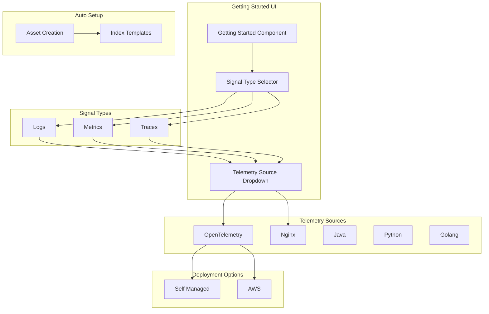

---
tags:
  - dashboards-observability
---
# Observability Getting Started Workflows

## Summary

The Getting Started workflows in OpenSearch Dashboards Observability provide guided onboarding for setting up observability pipelines. The workflows are organized around three signal types (Logs, Metrics, Traces) with support for multiple telemetry sources including OpenTelemetry, Nginx, Java, Python, and Golang.

## Details

### Architecture

### Components

| Component | Description |
|-----------|-------------|
| `getting_started_routes.ts` | Defines TutorialId types and component/version/signal maps |
| Signal Type Tabs | UI tabs for Logs, Metrics, Traces navigation |
| Telemetry Source Dropdown | Dropdown with icons for selecting data source |
| `createAllTemplatesSettled` | Server-side function for batch index template creation |
| `createIndexTemplate` | Server-side function for individual index template creation |
| Getting Started UI | Interactive wizard for selecting and configuring workflows |

### Supported Workflows

| Signal Type | Telemetry Sources | Deployment Options |
|-------------|-------------------|-------------------|
| Logs | OpenTelemetry, Nginx, Java, Python, Golang | Self Managed, AWS |
| Metrics | OpenTelemetry, Nginx | Self Managed, AWS |
| Traces | OpenTelemetry, Java, Python, Golang | Self Managed, AWS |

### Configuration

| Setting | Description | Default |
|---------|-------------|---------|
| Signal Type | Primary data type selection | Logs |
| Telemetry Source | Data source for the signal | OpenTelemetry |
| Deployment Mode | Self-managed or AWS | Self Managed |

### Usage Example

1. Navigate to **Observability** > **Getting Started**
2. Select signal type: **Logs**, **Metrics**, or **Traces**
3. Choose telemetry source from dropdown (e.g., OpenTelemetry, Nginx)
4. For OTEL: Select **Self Managed** or **AWS** tab
5. Follow setup instructions - index templates are created automatically

## Limitations

- Telemetry source options vary by signal type
- AWS deployment option only available for OpenTelemetry workflows
- Index patterns must match the actual indices created by data ingestion pipelines

## Change History

- **v2.18.0** (2024-11-12): Major restructure - reorganized into Logs/Metrics/Traces signal types, added telemetry source dropdown with icons, Self Managed/AWS tabs for OTEL, auto index template creation, UI polish
- **v2.17.0** (2024-10-22): Fixed index pattern mismatches - CSV workflow now uses `logs-*` pattern, removed unused `otel-metrics*` from OTel workflow
- **v2.16.0** (2024-08-06): Initial implementation - added Observability Overview and Getting Started pages with three data collection methods (Configure collectors, Upload CSV/JSON, Sample datasets), replaced OTel Services dashboards with getting started dashboards

## References

### Documentation
- [Observability Documentation](https://docs.opensearch.org/2.18/observing-your-data/)
- [OpenTelemetry Collector](https://opentelemetry.io/docs/collector/)

### Pull Requests
| Version | PR | Description | Related Issue |
|---------|-----|-------------|---------------|
| v2.18.0 | [#2194](https://github.com/opensearch-project/dashboards-observability/pull/2194) | GettingStarted Rework - signal-based organization |   |
| v2.18.0 | [#2205](https://github.com/opensearch-project/dashboards-observability/pull/2205) | GettingStarted Fit and Finish - UI polish |   |
| v2.18.0 | [#2200](https://github.com/opensearch-project/dashboards-observability/pull/2200) | Auto trigger schema setup |   |
| v2.17.0 | [#2016](https://github.com/opensearch-project/dashboards-observability/pull/2016) | Update ndjson so workflow matches patterns created |   |
| v2.16.0 | [#1957](https://github.com/opensearch-project/dashboards-observability/pull/1957) | Observability Overview and GettingStarted pages | [#1929](https://github.com/opensearch-project/dashboards-observability/issues/1929) |
| v2.16.0 | [#1963](https://github.com/opensearch-project/dashboards-observability/pull/1963) | Replace dashboards with getting started dashboards | [opensearch-catalog#170](https://github.com/opensearch-project/opensearch-catalog/issues/170) |
