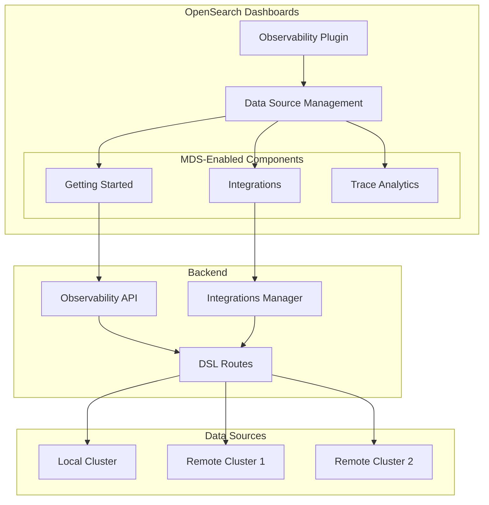
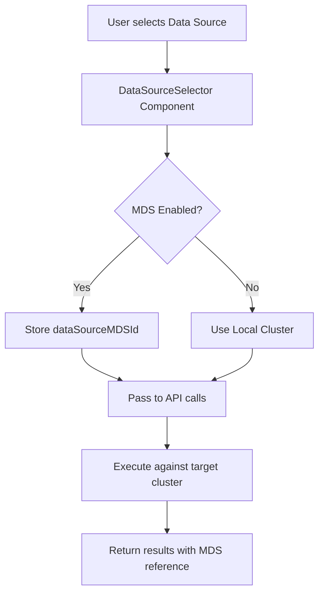

---
tags:
  - domain/observability
  - component/dashboards
  - dashboards
  - observability
---
# Observability Multi-Data Source Support

## Summary

Multi-Data Source (MDS) support for the Observability plugin enables users to work with observability data from multiple OpenSearch clusters through a single OpenSearch Dashboards instance. This feature allows users to select target data sources when using Getting Started workflows, Integrations, and other Observability features, providing a unified interface for managing observability across distributed environments.

## Details

### Architecture



### Data Flow



### Components

| Component | Description |
|-----------|-------------|
| `DataSourceSelector` | UI component for selecting target data source |
| `DataSourceMenu` | Menu component for data source selection in headers |
| `dataSourceMDSId` | State parameter tracking selected MDS ID |
| `dataSourceMDSLabel` | State parameter for displaying data source name |
| `featureFlagStatus` | Plugin-level flag tracking MDS enablement |
| `IntegrationInstanceBuilder` | Builder class updated to include MDS references |
| `IntegrationsManager` | Manager class with MDS-aware instance creation |

### Configuration

| Setting | Description | Default |
|---------|-------------|---------|
| `data_source.enabled` | Enables multiple data source support in Dashboards | `false` |

### API Endpoints

#### Create Assets with MDS Support

```
POST /api/observability/gettingStarted/createAssets
```

Request:
```json
{
  "mdsId": "data-source-uuid",
  "mdsLabel": "Production Cluster",
  "tutorialId": "nginx"
}
```

Response:
```json
{
  "message": "Objects loaded successfully"
}
```

#### DSL Routes with MDS Support

```
POST /api/observability/dsl/integrations/refresh?dataSourceMDSId={id}
POST /api/observability/dsl/integrations/mapping?dataSourceMDSId={id}
```

#### Integration Instance Creation

```
POST /api/integrations/repository/{templateName}/instances
```

Request:
```json
{
  "dataSourceMDSId": "data-source-uuid",
  "dataSourceMDSLabel": "Production Cluster",
  "name": "my-integration",
  "indexPattern": "ss4o_logs-nginx-*"
}
```

### Usage Example

#### Selecting Data Source in Getting Started

```typescript
// Data source selection handler
const onSelectedDataSourceChange = (e: any) => {
  const dataSourceId = e[0] ? e[0].id : undefined;
  const dataSourceLabel = e[0] ? e[0].label : '';
  setSelectedDataSourceId(dataSourceId);
  setSelectedDataSourceLabel(dataSourceLabel);
};

// Render data source menu when MDS is enabled
{dataSourceEnabled && (
  <DataSourceMenu
    setMenuMountPoint={setActionMenu}
    componentType={'DataSourceSelectable'}
    componentConfig={{
      savedObjects: savedObjectsMDSClient.client,
      notifications,
      fullWidth: true,
      onSelectedDataSources: onSelectedDataSourceChange,
      dataSourceFilter: dataSourceFilterFn,
    }}
  />
)}
```

#### Creating Integration with MDS

```typescript
await addIntegrationRequest({
  addSample: true,
  templateName: integration.name,
  integration,
  setToast,
  dataSourceMDSId,
  dataSourceMDSLabel,
});
```

### Integration Instance Structure

When MDS is enabled, integration instances include a `references` field:

```json
{
  "name": "nginx-integration",
  "templateName": "nginx",
  "dataSource": "ss4o_logs-nginx-*",
  "creationDate": "2024-08-19T17:39:48Z",
  "assets": [...],
  "references": [
    {
      "id": "data-source-uuid",
      "name": "Production Cluster",
      "type": "data-source"
    }
  ]
}
```

## Limitations

- When MDS is enabled, certain Observability plugins are deregistered:
  - Applications
  - Operational Panels (dashboards)
  - Logs Explorer
- S3 data source registration is disabled when MDS feature flag is enabled
- Integration assets cannot be automatically migrated between data sources
- Some visualization types may not fully support MDS

## Change History

- **v2.18.0** (2024-10-22): Bug fixes for MDS including plugin de-registration improvements, error code handling, remote cluster call fixes, and MDS label handling
- **v2.17.0** (2024-09-17): Initial MDS support for Getting Started, Integrations, and plugin deregistration


## References

### Documentation
- [Multiple Data Sources Documentation](https://docs.opensearch.org/2.17/dashboards/management/multi-data-sources/): Official configuration guide

### Blog Posts
- [Multiple Data Sources Blog](https://opensearch.org/blog/multiple-data-source/): Feature announcement and overview

### Pull Requests
| Version | PR | Description | Related Issue |
|---------|-----|-------------|---------------|
| v2.18.0 | [#2213](https://github.com/opensearch-project/dashboards-observability/pull/2213) | Fix missing else condition for MDS remote cluster calls |   |
| v2.18.0 | [#2222](https://github.com/opensearch-project/dashboards-observability/pull/2222) | MDS plugin de-registration and error code changes |   |
| v2.18.0 | [#2225](https://github.com/opensearch-project/dashboards-observability/pull/2225) | Fixes span to logs redirection, updates MDS label when undefined |   |
| v2.17.0 | [#2048](https://github.com/opensearch-project/dashboards-observability/pull/2048) | Multi-data Source Support for Getting Started |   |
| v2.17.0 | [#2051](https://github.com/opensearch-project/dashboards-observability/pull/2051) | MDS support in Integrations | [#1440](https://github.com/opensearch-project/dashboards-observability/issues/1440) |
| v2.17.0 | [#2097](https://github.com/opensearch-project/dashboards-observability/pull/2097) | Deregister plugins in MDS mode |   |
| v2.17.0 | [#2140](https://github.com/opensearch-project/dashboards-observability/pull/2140) | Support for absent local cluster |   |

### Issues (Design / RFC)
- [Issue #1440](https://github.com/opensearch-project/dashboards-observability/issues/1440): Original feature request
