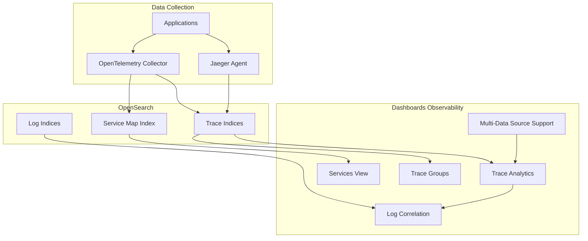
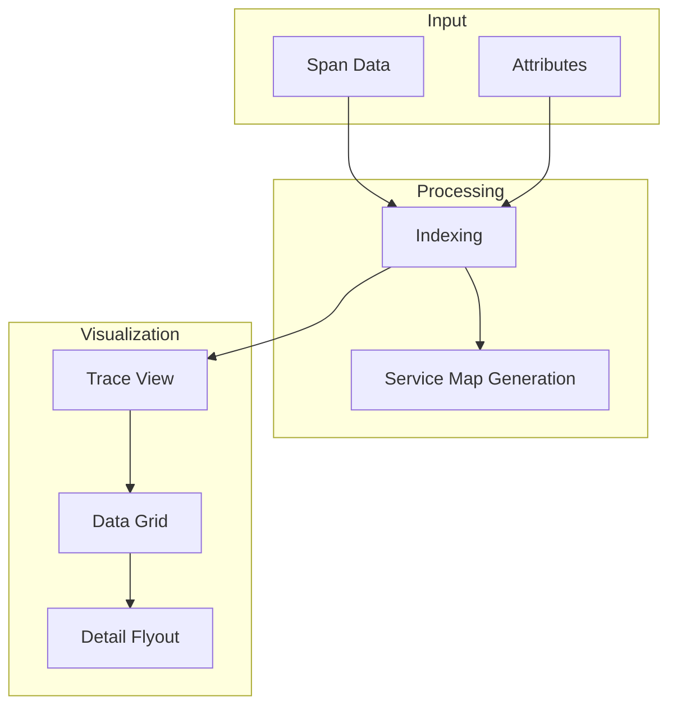

---
tags:
  - dashboards-observability
---
# Trace Analytics

## Summary

Trace Analytics is a feature in OpenSearch Dashboards Observability plugin that enables visualization and analysis of distributed traces from applications instrumented with OpenTelemetry or Jaeger. It helps identify performance bottlenecks, troubleshoot errors, and understand request flows across microservices by providing trace visualization, service maps, and correlation with logs.

## Details

### Architecture



### Data Flow



### Components

| Component | Description |
|-----------|-------------|
| Trace Analytics | Main interface for viewing and filtering traces |
| Services View | Service dependency visualization with metrics |
| Trace Groups | Grouping of traces by operation patterns |
| Service Map | Visual representation of service dependencies |
| Custom Logs Correlation | Configurable log source for trace-log correlation |
| Data Grid Table | Paginated traces table with column customization |
| Multi-Data Source Support | Connect to multiple OpenSearch clusters |
| Application Analytics | Integrated traces/spans view within app analytics |
| Custom Index Flyout | Configuration panel for custom span/service indices |
| Data Schema Picker | Mode selector for Jaeger, Data Prepper, or Custom source |

### Configuration

| Setting | Description | Default |
|---------|-------------|---------|
| Custom Log Source | User-defined log index for correlation | None |
| Database Selector | Database name for integration setup | `default` |
| Spans Limit | Maximum spans displayed in trace view | 3000 |
| Trace Data Source | OTEL, Jaeger, or Custom format | OTEL |
| MDS ID | Multi-Data Source identifier | Local cluster |
| `observability:traceAnalyticsSpanIndices` | Custom span indices (supports wildcards and CCS) | Empty |
| `observability:traceAnalyticsServiceIndices` | Custom service indices (supports wildcards and CCS) | Empty |
| `observability:traceAnalyticsServiceMapMaxNodes` | Maximum nodes in service map queries | 500 |
| `observability:traceAnalyticsServiceMapMaxEdges` | Maximum edges in service map queries | 1000 |
| `TRACE_CUSTOM_MODE_DEFAULT_SETTING` | Enable custom source as default landing page | `false` |

### Usage Example

#### Viewing Traces
```
1. Navigate to Observability → Trace Analytics
2. Use filters to narrow down traces by:
   - Service name
   - Operation name
   - Time range
   - Latency threshold
3. Click on a trace to view the span waterfall
```

#### Direct URL Navigation
```
# Navigate directly to traces view
http://host:port/app/observability-traces#/traces

# Navigate to services view
http://host:port/app/observability-traces#/services
```

#### Multi-Data Source Usage
```
1. Configure data sources in Dashboards Management
2. Select data source from dropdown in Trace Analytics
3. View traces from the selected cluster
```

## Limitations

- Custom logs correlation requires manual configuration
- Discover may show errors when loading data from specific indexes using PPL
- Sorting is disabled on attribute fields in the data grid
- Maximum 10,000 spans can be retrieved for pagination
- Service map generation requires proper span relationships

## Change History

- **v3.2.0** (2026-02-18): User-configurable service map max nodes and max edges settings, bug fixes for traces error display (nested status.code handling) and metrics visualization rendering in local cluster instances
- **v3.1.0** (2026-01-21): Merged custom source mode into default Data Prepper mode, span flyout support for new Data Prepper format with nested field flattening, unified experience with cross-cluster search, custom indices, data grid, and dynamic filters
- **v3.0.0** (2025-02-25): Custom logs correlation, data grid migration, OTEL attributes support, service view optimizations, Amazon Network Firewall integration, trace-to-logs correlation improvements
- **v2.19.0** (2025-01-09): Gantt chart rework with minimap/zoom, service map focus filtering, query optimization (reduced bucket requirements), custom mode default setting, numerous MDS and UI bug fixes
- **v2.17.0** (2024-09-17): Custom source support (experimental) for custom span/service indices with CCS support, landing page changed to Traces, Multi-Data Source bug fixes, URL routing fixes, breadcrumb navigation improvements


## References

### Documentation
- [Trace Analytics Documentation](https://docs.opensearch.org/latest/observing-your-data/trace/index/): Official documentation
- [Trace Analytics Plugin](https://docs.opensearch.org/latest/observing-your-data/trace/ta-dashboards/): Dashboards plugin guide
- [Jaeger Trace Data](https://docs.opensearch.org/latest/observing-your-data/trace/trace-analytics-jaeger/): Jaeger integration
- [Simple Schema for Observability](https://docs.opensearch.org/latest/observing-your-data/ss4o/): SS4O schema
- [Application Analytics](https://docs.opensearch.org/latest/observing-your-data/app-analytics/): App analytics documentation

### Pull Requests
| Version | PR | Description | Related Issue |
|---------|-----|-------------|---------------|
| v3.2.0 | [#2472](https://github.com/opensearch-project/dashboards-observability/pull/2472) | [Traces] Make service map max nodes and max edges values user-configurable |   |
| v3.2.0 | [#2475](https://github.com/opensearch-project/dashboards-observability/pull/2475) | [Bug] Traces error display - fix nested status.code handling |   |
| v3.2.0 | [#2478](https://github.com/opensearch-project/dashboards-observability/pull/2478) | [Bug] Fixed metrics viz not showing up in local cluster |   |
| v3.1.0 | [#2457](https://github.com/opensearch-project/dashboards-observability/pull/2457) | Merge custom source and data prepper mode | [#2141](https://github.com/opensearch-project/dashboards-observability/issues/2141) |
| v3.1.0 | [#2450](https://github.com/opensearch-project/dashboards-observability/pull/2450) | Span Flyout - support new format with nested field flattening |   |
| v3.0.0 | [#2375](https://github.com/opensearch-project/dashboards-observability/pull/2375) | Support custom logs correlation | [#2141](https://github.com/opensearch-project/dashboards-observability/issues/2141) |
| v3.0.0 | [#2380](https://github.com/opensearch-project/dashboards-observability/pull/2380) | Database selector in integration setup |   |
| v3.0.0 | [#2383](https://github.com/opensearch-project/dashboards-observability/pull/2383) | Service Content/View Optimizations | [#2334](https://github.com/opensearch-project/dashboards-observability/issues/2334) |
| v3.0.0 | [#2390](https://github.com/opensearch-project/dashboards-observability/pull/2390) | Custom source switch to data grid |   |
| v3.0.0 | [#2398](https://github.com/opensearch-project/dashboards-observability/pull/2398) | Trace to logs correlation |   |
| v3.0.0 | [#2410](https://github.com/opensearch-project/dashboards-observability/pull/2410) | Amazon Network Firewall Integration |   |
| v3.0.0 | [#2432](https://github.com/opensearch-project/dashboards-observability/pull/2432) | OTEL attributes field support |   |
| v2.19.0 | [#2283](https://github.com/opensearch-project/dashboards-observability/pull/2283) | Gantt chart / Span list rework |   |
| v2.19.0 | [#2264](https://github.com/opensearch-project/dashboards-observability/pull/2264) | Service map redirection/Focus field rework |   |
| v2.19.0 | [#2237](https://github.com/opensearch-project/dashboards-observability/pull/2237) | Overview page missing data source state |   |
| v2.19.0 | [#2230](https://github.com/opensearch-project/dashboards-observability/pull/2230) | Service map updates |   |
| v2.19.0 | [#2310](https://github.com/opensearch-project/dashboards-observability/pull/2310) | Query optimization / UI setting / Bugfix |   |
| v2.19.0 | [#2336](https://github.com/opensearch-project/dashboards-observability/pull/2336) | Add loading status to traces/services pages |   |
| v2.19.0 | [#2333](https://github.com/opensearch-project/dashboards-observability/pull/2333) | MDS support for missing datasourceId |   |
| v2.19.0 | [#2235](https://github.com/opensearch-project/dashboards-observability/pull/2235) | Traces/Services bugfixes and UI update |   |
| v2.17.0 | [#2112](https://github.com/opensearch-project/dashboards-observability/pull/2112) | Custom source support for trace analytics |   |
| v2.17.0 | [#2125](https://github.com/opensearch-project/dashboards-observability/pull/2125) | Update landing page to traces |   |
| v2.17.0 | [#2006](https://github.com/opensearch-project/dashboards-observability/pull/2006) | MDS fix for local cluster rendering | [#1878](https://github.com/opensearch-project/dashboards-observability/issues/1878) |
| v2.17.0 | [#2023](https://github.com/opensearch-project/dashboards-observability/pull/2023) | Traces/Spans tab fix for App Analytics | [#1931](https://github.com/opensearch-project/dashboards-observability/issues/1931) |
| v2.17.0 | [#2024](https://github.com/opensearch-project/dashboards-observability/pull/2024) | Fix direct URL load |   |
| v2.17.0 | [#2037](https://github.com/opensearch-project/dashboards-observability/pull/2037) | Breadcrumbs and ID pathing fix |   |
| v2.17.0 | [#2100](https://github.com/opensearch-project/dashboards-observability/pull/2100) | Fix missing MDS ID in flyout |   |

### Issues (Design / RFC)
- [Issue #1878](https://github.com/opensearch-project/dashboards-observability/issues/1878): MDS rendering issue
- [Issue #1931](https://github.com/opensearch-project/dashboards-observability/issues/1931): App Analytics crash
