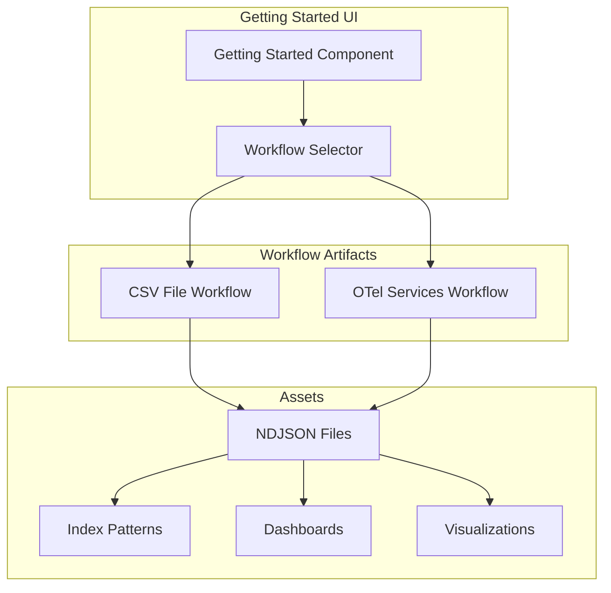

# Observability Getting Started Workflows

## Summary

The Getting Started workflows in OpenSearch Dashboards Observability provide pre-configured templates and sample data to help users quickly set up observability pipelines. These workflows include index patterns, dashboards, and visualizations for common data sources like CSV files and OpenTelemetry (OTel) services.

## Details

### Architecture



### Components

| Component | Description |
|-----------|-------------|
| `fluent-bit-csv-upload-1.0.0.ndjson` | Assets for CSV file upload workflow using Fluent Bit |
| `otel-index-patterns-1.0.0.ndjson` | Index patterns for OpenTelemetry services |
| Getting Started UI | Interactive wizard for selecting and configuring workflows |

### Supported Workflows

| Workflow | Index Pattern | Description |
|----------|---------------|-------------|
| CSV File Upload | `logs-*` | Upload CSV files using Fluent Bit agent |
| OTel Services | `otel-v1-apm-span-*`, `otel-v1-apm-service-map` | OpenTelemetry traces and service maps |

### Configuration

The workflows use NDJSON (Newline Delimited JSON) files containing:

| Asset Type | Description |
|------------|-------------|
| `index-pattern` | Defines the index pattern for data discovery |
| `visualization` | Markdown or chart visualizations |
| `dashboard` | Dashboard layouts referencing visualizations |

### Usage Example

Using the CSV File Upload workflow:

1. Navigate to **Observability** > **Getting Started**
2. Select **CSV File Upload**
3. Follow the Fluent Bit configuration instructions
4. View ingested data in the created dashboard

Fluent Bit configuration example:

```ini
[SERVICE]
    Flush        1
    Log_Level    info
    Parsers_File parsers.conf

[INPUT]
    Name         tail
    Path         /path/to/your/csv/files/*.csv
    Parser       csv
    Tag          csv

[OUTPUT]
    Name         opensearch
    Match        *
    Host         your-opensearch-host
    Port         9200
    Index        logs
```

## Limitations

- Workflows are designed for specific data formats and may require customization
- Index patterns must match the actual indices created by data ingestion pipelines
- Sample data is for demonstration purposes only

## Related PRs

| Version | PR | Description |
|---------|-----|-------------|
| v2.17.0 | [#2016](https://github.com/opensearch-project/dashboards-observability/pull/2016) | Update ndjson so workflow matches patterns created |

## References

- [Observability Documentation](https://docs.opensearch.org/2.17/observing-your-data/)
- [Fluent Bit OpenSearch Output](https://docs.fluentbit.io/manual/pipeline/outputs/opensearch)
- [OpenTelemetry Collector](https://opentelemetry.io/docs/collector/)

## Change History

- **v2.17.0** (2024-10-22): Fixed index pattern mismatches - CSV workflow now uses `logs-*` pattern, removed unused `otel-metrics*` from OTel workflow
