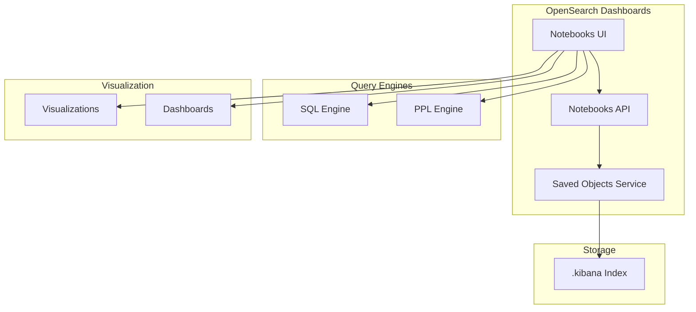
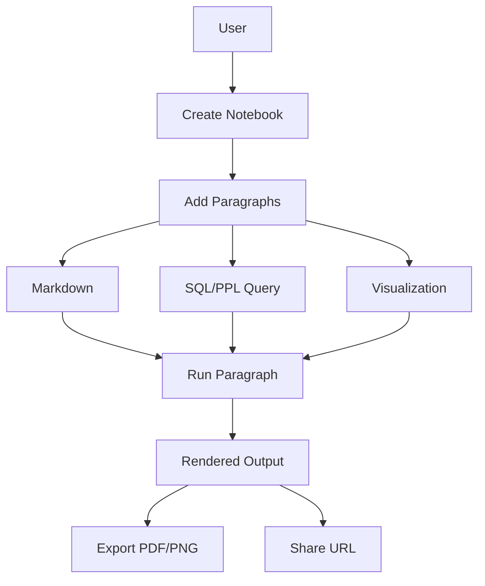

# OpenSearch Dashboards Notebooks

## Summary

OpenSearch Dashboards Notebooks is a feature that enables users to combine live visualizations, narrative text, and SQL/PPL queries in an interactive document format. Notebooks facilitate data exploration, collaboration, and reporting by allowing users to create rich, shareable reports backed by live data. Use cases include postmortem reports, operations runbooks, infrastructure reports, and documentation.

## Details

### Architecture



### Data Flow



### Components

| Component | Description |
|-----------|-------------|
| Notebooks UI | React-based interface for creating and editing notebooks |
| Notebooks API | Server-side REST API for notebook CRUD operations |
| Saved Objects Backend | Storage layer using OpenSearch Dashboards saved objects |
| Paragraph Renderer | nteract library-based renderer for markdown and code blocks |
| Query Integration | Integration with SQL and PPL query engines |
| Visualization Integration | Embedding of OpenSearch Dashboards visualizations |
| Reporting Integration | Export capabilities for PDF, PNG, and shareable URLs |

### Paragraph Types

| Type | Syntax | Description |
|------|--------|-------------|
| Markdown | `%md` | Rich text formatting with markdown syntax |
| SQL | `%sql` | SQL queries against OpenSearch indices |
| PPL | `%ppl` | Piped Processing Language queries |
| Visualization | UI selection | Embedded visualizations with time range support |

### Storage

Notebooks are stored as saved objects in the `.kibana` index. Each notebook contains:

- **Metadata**: Name, creation date, modification date
- **Paragraphs**: Array of paragraph objects with input and output

```json
{
  "type": "notebook",
  "attributes": {
    "name": "My Notebook",
    "dateCreated": "2024-01-01T00:00:00Z",
    "dateModified": "2024-01-01T00:00:00Z",
    "paragraphs": [
      {
        "id": "paragraph_uuid",
        "input": {
          "inputType": "MARKDOWN",
          "inputText": "%md\n# Title"
        },
        "output": [
          {
            "outputType": "MARKDOWN",
            "result": "# Title"
          }
        ]
      }
    ]
  }
}
```

### Usage Example

```markdown
# Creating a Notebook

1. Navigate to Observability > Notebooks in OpenSearch Dashboards
2. Click "Create notebook" and enter a name
3. Add paragraphs:

## Limitations

- Notebooks require the dashboards-observability plugin
- Query execution depends on SQL/PPL plugin availability
- Visualization embedding requires saved visualizations
- Export functionality requires the reporting plugin

## Change History

- **v3.0.0** (2025-05-06): Removed legacy notebooks support; only `.kibana` storage supported
- **v2.19.0** (2025-02-11): Deprecated legacy notebooks with migration notice
- **v2.17.0** (2024-09-17): UI improvements (badge counter in breadcrumbs, simplified delete workflow); fixed sample notebooks for MDS environments
- **v1.0.0** (2021-07-12): Initial production release with SQL, PPL, and visualization support

## References

### Documentation
- [Notebooks Documentation](https://docs.opensearch.org/3.0/observing-your-data/notebooks/): Official documentation
- [Observability Security](https://docs.opensearch.org/3.0/observing-your-data/observability-security/): Security configuration for observability features

### Blog Posts
- [Blog: Feature Deep Dive - OpenSearch Dashboards Notebooks](https://opensearch.org/blog/feature-highlight-opensearch-dashboards-notebooks/): Feature overview and use cases

### Pull Requests
| Version | PR | Description |
|---------|-----|-------------|
| v3.0.0 | [#2406](https://github.com/opensearch-project/dashboards-observability/pull/2406) | Remove support for legacy notebooks |
| v2.17.0 | [#2110](https://github.com/opensearch-project/dashboards-observability/pull/2110) | UI update: badge counter in breadcrumbs, simplified delete workflow |
| v2.17.0 | [#2108](https://github.com/opensearch-project/dashboards-observability/pull/2108) | Fix sample notebooks for MDS environments |
| v1.0.0 | - | Initial production release of Notebooks |

### Issues (Design / RFC)
- [Issue #2350](https://github.com/opensearch-project/dashboards-observability/issues/2350): Deprecation notice for legacy notebooks
- [Issue #2311](https://github.com/opensearch-project/dashboards-observability/issues/2311): Notebooks migration tracking
