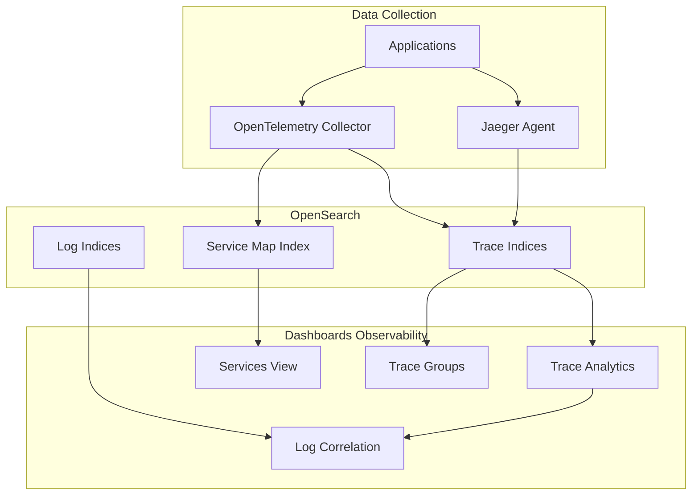
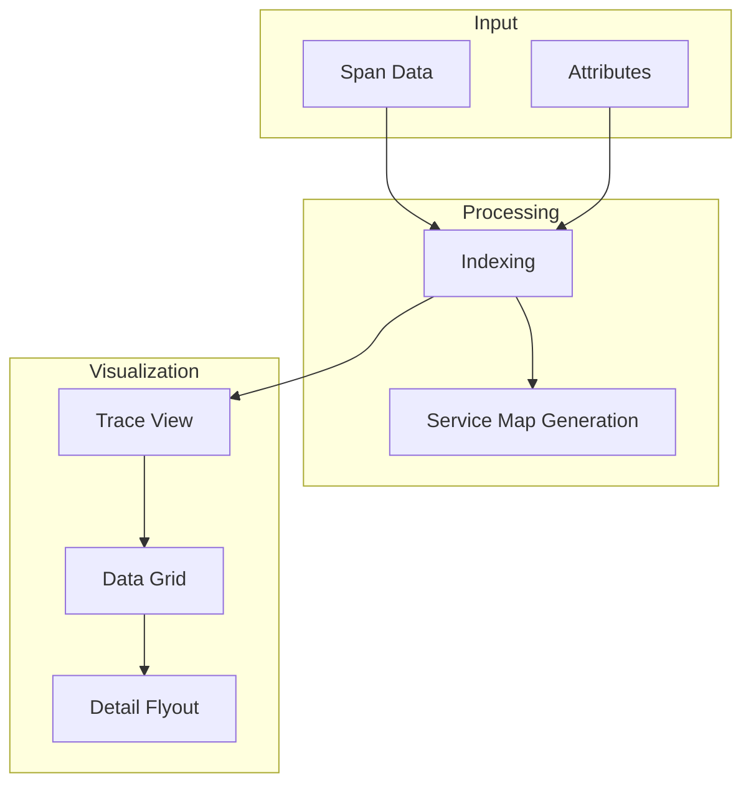

# Observability Traces

## Summary

Observability Traces (Trace Analytics) is a feature in OpenSearch Dashboards that enables visualization and analysis of distributed traces from applications instrumented with OpenTelemetry or Jaeger. It helps identify performance bottlenecks, troubleshoot errors, and understand request flows across microservices by providing trace visualization, service maps, and correlation with logs.

## Details

### Architecture



### Data Flow



### Components

| Component | Description |
|-----------|-------------|
| Trace Analytics | Main interface for viewing and filtering traces |
| Services View | Service dependency visualization with metrics |
| Trace Groups | Grouping of traces by operation patterns |
| Service Map | Visual representation of service dependencies |
| Custom Logs Correlation | Configurable log source for trace-log correlation |
| Data Grid Table | Paginated traces table with column customization |
| Amazon Network Firewall Integration | Pre-built dashboards for AWS Network Firewall logs |

### Configuration

| Setting | Description | Default |
|---------|-------------|---------|
| Custom Log Source | User-defined log index for correlation | None |
| Database Selector | Database name for integration setup | `default` |
| Spans Limit | Maximum spans displayed in trace view | 3000 |
| Trace Data Source | OTEL or Jaeger format | OTEL |

### Usage Example

#### Viewing Traces
```
1. Navigate to Observability → Trace Analytics
2. Use filters to narrow down traces by:
   - Service name
   - Operation name
   - Time range
   - Latency threshold
3. Click on a trace to view the span waterfall
```

#### Custom Logs Correlation
```
1. Go to Trace Analytics → Advanced Settings
2. Configure custom log source:
   - Index pattern: logs-*
   - Correlation field: traceId
   - Target application: Explorer
3. From trace view, click "View Logs" to see correlated logs
```

#### Setting Up Integrations
```
1. Navigate to Observability → Integrations
2. Select an integration (e.g., Amazon Network Firewall)
3. Configure:
   - Data source connection
   - Database name (customizable)
   - Table name
4. Deploy the integration
```

## Limitations

- Custom logs correlation requires manual configuration
- Discover may show errors when loading data from specific indexes using PPL
- Sorting is disabled on attribute fields in the data grid
- Maximum 10,000 spans can be retrieved for pagination
- Service map generation requires proper span relationships

## Change History

- **v3.0.0** (2025-02-25): Custom logs correlation, data grid migration, OTEL attributes support, service view optimizations, Amazon Network Firewall integration, trace-to-logs correlation improvements

## References

### Documentation
- [Trace Analytics Documentation](https://docs.opensearch.org/3.0/observing-your-data/trace/index/): Official documentation
- [Trace Analytics Plugin](https://docs.opensearch.org/3.0/observing-your-data/trace/ta-dashboards/): Dashboards plugin guide
- [Jaeger Trace Data](https://docs.opensearch.org/3.0/observing-your-data/trace/trace-analytics-jaeger/): Jaeger integration
- [Simple Schema for Observability](https://docs.opensearch.org/3.0/observing-your-data/ss4o/): SS4O schema

### Pull Requests
| Version | PR | Description |
|---------|-----|-------------|
| v3.0.0 | [#2375](https://github.com/opensearch-project/dashboards-observability/pull/2375) | Support custom logs correlation |
| v3.0.0 | [#2380](https://github.com/opensearch-project/dashboards-observability/pull/2380) | Database selector in integration setup |
| v3.0.0 | [#2383](https://github.com/opensearch-project/dashboards-observability/pull/2383) | Service Content/View Optimizations |
| v3.0.0 | [#2390](https://github.com/opensearch-project/dashboards-observability/pull/2390) | Custom source switch to data grid |
| v3.0.0 | [#2398](https://github.com/opensearch-project/dashboards-observability/pull/2398) | Trace to logs correlation |
| v3.0.0 | [#2410](https://github.com/opensearch-project/dashboards-observability/pull/2410) | Amazon Network Firewall Integration |
| v3.0.0 | [#2432](https://github.com/opensearch-project/dashboards-observability/pull/2432) | OTEL attributes field support |

### Issues (Design / RFC)
- [Issue #2141](https://github.com/opensearch-project/dashboards-observability/issues/2141): Custom logs correlation request
- [Issue #2334](https://github.com/opensearch-project/dashboards-observability/issues/2334): Service optimizations
