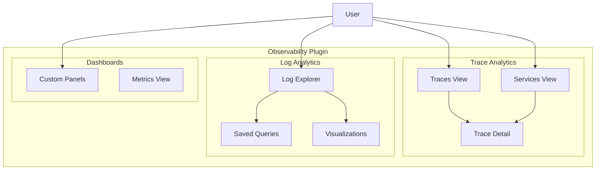

---
tags:
  - dashboards
  - observability
  - search
  - sql
---

# Observability UI

## Summary

The OpenSearch Dashboards Observability plugin provides a unified interface for visualizing and exploring logs, traces, and metrics data. The UI components include Trace Analytics (Traces and Services views), Log Explorer, Observability Dashboards, and various supporting features for monitoring distributed systems.

## Details

### Architecture



### Components

| Component | Description |
|-----------|-------------|
| Trace Analytics | Visualizes distributed traces and service dependencies |
| Services View | Lists all services with latency and error rate metrics |
| Traces View | Shows individual traces with timing and span details |
| Log Explorer | PPL-based log search and visualization interface |
| Saved Queries | Persisted queries and visualizations |
| Custom Panels | User-created observability dashboards |
| Metrics View | Prometheus-compatible metrics visualization |

### UI Layout

The Observability plugin follows a consistent layout pattern:

```
┌─────────────────────────────────────────────────────────────┐
│  Page Title                                    [Actions ▼]  │
├─────────────────────────────────────────────────────────────┤
│  [🔍 Search...        ] [Filters ▼] [Date Picker] [Refresh]│
├─────────────────────────────────────────────────────────────┤
│                                                             │
│                    Content Area                             │
│                                                             │
└─────────────────────────────────────────────────────────────┘
```

### Search Bar Features

The search bar component provides:

| Feature | Description |
|---------|-------------|
| Text Search | Search by trace ID, service name, or query content |
| Global Filter | Filter icon for managing all active filters |
| Type Filter | Filter by Query, Visualization, or Metric type |
| Date Picker | Time range selection with quick presets |
| Refresh | Manual refresh button |

### Configuration

The Observability plugin uses OpenSearch Dashboards saved objects for persistence:

| Object Type | Description |
|-------------|-------------|
| `observability-savedQuery` | Saved PPL queries |
| `observability-savedVisualization` | Saved visualizations |
| `observability-panel` | Custom dashboard panels |

## Limitations

- Trace Analytics requires data indexed in OpenTelemetry or Jaeger format
- Log correlation requires TraceId field in log documents
- Custom panels are stored as saved objects, not index data

## Change History

- **v2.18.0** (2024-10-22): Services data picker fix, header control styling updates, custom traces table with filtering (All Spans, Traces, Service Entry, Trace Root), overview page typography, Getting Started workflow restructure (Logs/Metrics/Traces), CI build cache optimization, navigation fixes, x-axis label rotation, and trace-to-logs redirection improvements
- **v2.17.0** (2024-09-17): UI updates for Traces, Services, Logs, and Dashboards views to align with new header design patterns

## Related Features
- [SQL/PPL](../sql/calcite-query-engine.md)
- [Observability](../observability/observability-cypress-updates.md)

## References

### Documentation
- [Trace Analytics Documentation](https://docs.opensearch.org/2.17/observing-your-data/trace/ta-dashboards/): Official trace analytics plugin documentation
- [Observability Overview](https://docs.opensearch.org/2.17/observing-your-data/): OpenSearch Observability documentation
- [Event Analytics](https://docs.opensearch.org/2.17/observing-your-data/event-analytics/): Log exploration and PPL queries
- [Application Analytics](https://docs.opensearch.org/2.17/observing-your-data/app-analytics/): Correlating logs, traces, and metrics

### Pull Requests
| Version | PR | Description | Related Issue |
|---------|-----|-------------|---------------|
| v2.18.0 | [#2177](https://github.com/opensearch-project/dashboards-observability/pull/2177) | Services data picker fix, metrics refresh button, overview page title, URL redirection |   |
| v2.18.0 | [#2171](https://github.com/opensearch-project/dashboards-observability/pull/2171) | Header control styling, integrations UI updates, Cypress testing updates |   |
| v2.18.0 | [#2178](https://github.com/opensearch-project/dashboards-observability/pull/2178) | Custom traces table with filters (All Spans, Traces, Service Entry, Trace Root) |   |
| v2.18.0 | [#2186](https://github.com/opensearch-project/dashboards-observability/pull/2186) | Overview page typography and navigation-aware title |   |
| v2.18.0 | [#2194](https://github.com/opensearch-project/dashboards-observability/pull/2194) | Getting Started rework - Logs/Metrics/Traces structure |   |
| v2.18.0 | [#2196](https://github.com/opensearch-project/dashboards-observability/pull/2196) | CI workflow build cache optimization | [#2188](https://github.com/opensearch-project/dashboards-observability/issues/2188) |
| v2.18.0 | [#2146](https://github.com/opensearch-project/dashboards-observability/pull/2146) | Fix getting started cards re-direction to integrations |   |
| v2.18.0 | [#2201](https://github.com/opensearch-project/dashboards-observability/pull/2201) | Update traces span redirection to Discover |   |
| v2.18.0 | [#2209](https://github.com/opensearch-project/dashboards-observability/pull/2209) | Update getting started cards content and visual design |   |
| v2.18.0 | [#2210](https://github.com/opensearch-project/dashboards-observability/pull/2210) | Observability Overview page rework |   |
| v2.18.0 | [#2211](https://github.com/opensearch-project/dashboards-observability/pull/2211) | Rotate x-Axis labels by 45 degrees |   |
| v2.18.0 | [#2217](https://github.com/opensearch-project/dashboards-observability/pull/2217) | Metrics fixes - disable expand button |   |
| v2.18.0 | [#2219](https://github.com/opensearch-project/dashboards-observability/pull/2219) | Re-direction fix for associated logs from traces |   |
| v2.18.0 | [#2225](https://github.com/opensearch-project/dashboards-observability/pull/2225) | Fixes span to logs redirection, updates MDS label |   |
| v2.17.0 | [#2078](https://github.com/opensearch-project/dashboards-observability/pull/2078) | Traces/Services UI update |   |
| v2.17.0 | [#2090](https://github.com/opensearch-project/dashboards-observability/pull/2090) | Observability dashboards UI update |   |
| v2.17.0 | [#2092](https://github.com/opensearch-project/dashboards-observability/pull/2092) | Logs UI update |   |
