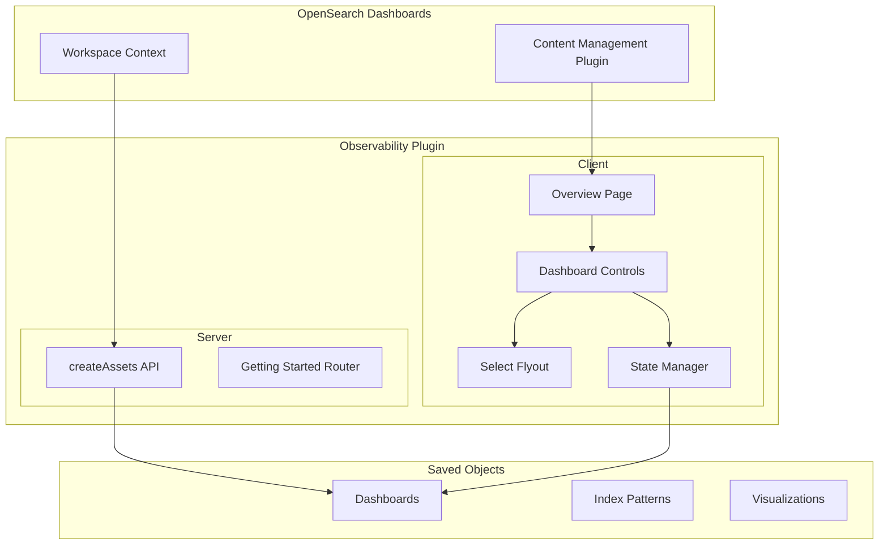
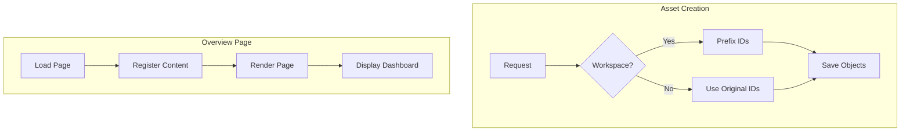

---
tags:
  - dashboards
  - indexing
  - observability
---

# Observability Workspace Integration

## Summary

The Observability Workspace Integration feature enables the OpenSearch Dashboards Observability plugin to work seamlessly in multi-workspace environments. It provides workspace-aware asset creation and a dynamic Overview page built with the Content Management framework, allowing users to customize their observability experience with embedded dashboards and quick-access cards.

## Details

### Architecture



### Data Flow



### Components

| Component | Description |
|-----------|-------------|
| `getting_started_router.ts` | Server-side router handling asset creation with workspace support |
| `DashboardControls` | React component for dashboard selection and date range controls |
| `SelectDashboardFlyout` | Flyout component for selecting dashboards from saved objects |
| `AddDashboardCallout` | Callout component prompting users to select a dashboard |
| `ObsDashboardStateManager` | RxJS-based state manager for dashboard state |
| `cardConfigs` | Configuration array defining Getting Started cards |
| `home.tsx` | Main Overview page component using Content Management |

### Configuration

| Setting | Description | Default |
|---------|-------------|---------|
| `observability:defaultDashboard` | Saved object ID of the default dashboard to display | (none) |

### Usage Example

#### Workspace-Aware Asset Creation

When creating assets in a workspace context, IDs are automatically prefixed:

```typescript
// Server-side ID transformation
const { requestWorkspaceId } = getWorkspaceState(request);

if (requestWorkspaceId) {
  newId = `workspaceId-${requestWorkspaceId}-${newId}`;
  references = references?.map((ref) => ({
    ...ref,
    id: `workspaceId-${requestWorkspaceId}-${ref.id}`,
  }));
}
```

#### Content Management Registration

```typescript
// Register Getting Started cards
coreRefs.contentManagement?.registerContentProvider({
  id: card.id,
  getContent: () => ({
    id: card.id,
    kind: 'card',
    order: card.order,
    description: card.description,
    title: card.title,
    onClick: () => coreRefs.application?.navigateToApp(card.url),
    getFooter: () => <EuiText size="s">{card.footer}</EuiText>,
  }),
  getTargetArea: () => HOME_CONTENT_AREAS.GET_STARTED,
});

// Register embedded dashboard
coreRefs.contentManagement?.registerContentProvider({
  id: 'dashboard_content',
  getContent: () => ({
    id: 'dashboard_content',
    kind: 'dashboard',
    order: 1000,
    input: {
      kind: 'dynamic',
      get: () => Promise.resolve(getObservabilityDashboardsId()),
    },
  }),
  getTargetArea: () => HOME_CONTENT_AREAS.DASHBOARD,
});
```

#### Dashboard State Management

```typescript
// State manager using RxJS BehaviorSubjects
class ObsDashboardStateManager {
  static isDashboardSelected$ = new BehaviorSubject<boolean>(false);
  static dashboardState$ = new BehaviorSubject<DashboardState>({
    startDate: '',
    endDate: '',
    dashboardTitle: '',
    dashboardId: '',
  });
  static showFlyout$ = new BehaviorSubject<() => void>(() => {});
}
```

## Limitations

- State management uses RxJS BehaviorSubjects as a temporary solution; planned migration to Redux or React Context
- Workspace ID prefixing only applies to newly created assets, not existing ones
- The embedded dashboard inherits the time range from the Overview page controls, not from the dashboard's saved time range
- The `observability:defaultDashboard` setting can only be updated by workspace owners or OSD admins when workspaces are enabled (v2.18.0+)

## Change History

- **v2.18.0** (2024-10-22): Fixed permission issue where non-workspace admins could update `observability:defaultDashboard` setting
- **v2.17.0** (2024-10-15): Initial implementation - workspace-compatible createAssets API and Content Management-based Overview page

## References

### Documentation
- [Observability Documentation](https://docs.opensearch.org/2.17/observing-your-data/): Official observability documentation
- [OpenSearch-Dashboards #7201](https://github.com/opensearch-project/OpenSearch-Dashboards/pull/7201): Content Management plugin RFC and implementation

### Pull Requests
| Version | PR | Description | Related Issue |
|---------|-----|-------------|---------------|
| v2.18.0 | [#2223](https://github.com/opensearch-project/dashboards-observability/pull/2223) | Fix non-workspace admin update observability:defaultDashboard |   |
| v2.17.0 | [#2101](https://github.com/opensearch-project/dashboards-observability/pull/2101) | Make createAssets API compatible with workspace |   |
| v2.17.0 | [#2077](https://github.com/opensearch-project/dashboards-observability/pull/2077) | OverviewPage made with Content Management |   |
| v2.16.0 | [#7201](https://github.com/opensearch-project/OpenSearch-Dashboards/pull/7201) | Content Management plugin introduction (dependency) | [#1234](https://github.com/opensearch-project/OpenSearch-Dashboards/issues/1234) |
