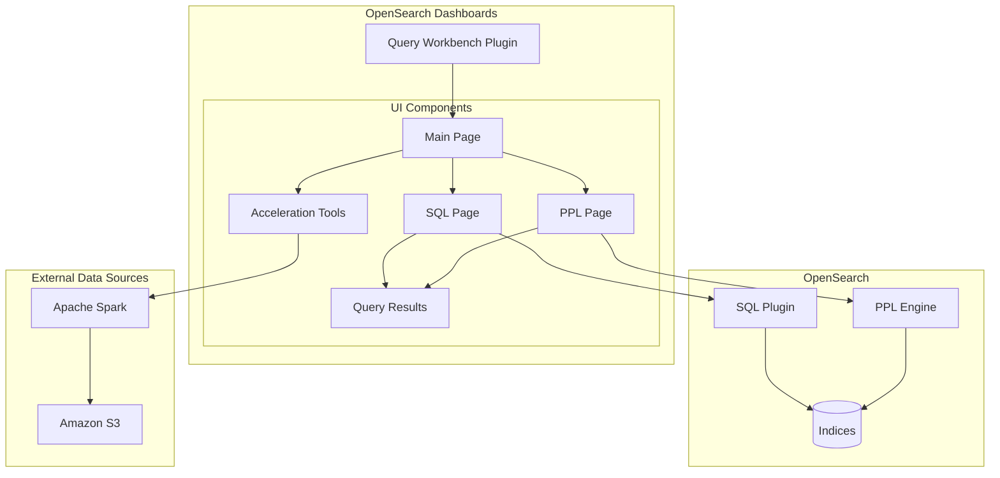
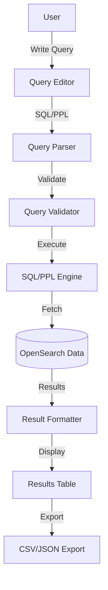

---
tags:
  - dashboards-query-workbench
---
# Query Workbench

## Summary

Query Workbench is an OpenSearch Dashboards plugin that enables users to query OpenSearch data using SQL or PPL (Piped Processing Language). It provides an interactive interface for writing, executing, and analyzing queries with features like syntax highlighting, query translation, and result visualization.

## Details

### Architecture



### Data Flow



### Components

| Component | Description |
|-----------|-------------|
| SQL Editor | Monaco-based editor for SQL queries with syntax highlighting |
| PPL Editor | Editor for Piped Processing Language queries |
| Query Results | Tabular display of query results with pagination |
| Data Source Selector | Dropdown for selecting OpenSearch or external data sources |
| Acceleration Tools | UI for creating covering indexes and materialized views |
| Query Translation | Explain feature showing query DSL translation |

### Configuration

| Setting | Description | Default |
|---------|-------------|---------|
| `opensearch_sql.enabled` | Enable SQL plugin | `true` |
| `opensearch_sql.ppl.enabled` | Enable PPL support | `true` |
| `opensearch_sql.query.size_limit` | Maximum result size | `10000` |

### Usage Example

SQL Query:
```sql
SELECT customer_name, order_date, total_amount
FROM orders
WHERE order_date > '2024-01-01'
ORDER BY total_amount DESC
LIMIT 100
```

PPL Query:
```
source=orders
| where order_date > '2024-01-01'
| sort - total_amount
| head 100
| fields customer_name, order_date, total_amount
```

## Limitations

- Complex nested aggregations may have limited support in SQL
- PPL syntax differs from standard SQL and requires learning
- External data source queries require additional Spark configuration
- Large result sets may impact browser performance

## Change History

- **v3.0.0** (2025-02-25): Maintenance updates including dependency bumps (glob-parent, @babel/helpers, @babel/runtime), CI/CD improvements (actions/cache v4), and Cypress test enhancements
- **v2.18.0** (2024-11-12): Bug fixes for modal mounting support and MDS error handling
- **v2.17.0** (2024-09-17): UI improvements with smaller and compressed button/form variants for better consistency


## References

### Documentation
- [Query Workbench Documentation](https://docs.opensearch.org/latest/dashboards/query-workbench/)
- [SQL Plugin Documentation](https://docs.opensearch.org/latest/search-plugins/sql/index/)
- [PPL Documentation](https://docs.opensearch.org/latest/search-plugins/sql/ppl/index/)
- [Scheduled Query Acceleration](https://docs.opensearch.org/latest/dashboards/management/scheduled-query-acceleration/)

### Pull Requests
| Version | PR | Description | Related Issue |
|---------|-----|-------------|---------------|
| v3.0.0 | [#130](https://github.com/opensearch-project/dashboards-query-workbench/pull/130) | Update packages and tsconfig |   |
| v3.0.0 | [#133](https://github.com/opensearch-project/dashboards-query-workbench/pull/133) | Update form validations and tests for acceleration |   |
| v3.0.0 | [#139](https://github.com/opensearch-project/dashboards-query-workbench/pull/139) | Updates 2.x branch with opensearch-spark changes | [#122](https://github.com/opensearch-project/dashboards-query-workbench/issues/122) |
| v2.18.0 | [#401](https://github.com/opensearch-project/dashboards-query-workbench/pull/401) | Fix workbench routes to support modal mounting |   |
| v2.18.0 | [#408](https://github.com/opensearch-project/dashboards-query-workbench/pull/408) | Added error handling for API calls |   |
| v2.17.0 | [#370](https://github.com/opensearch-project/dashboards-query-workbench/pull/370) | Use smaller and compressed variants of buttons and form components |   |
