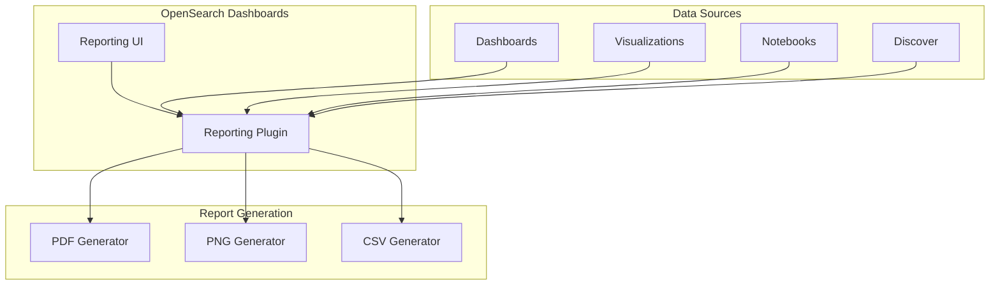

---
tags:
  - domain/infra
  - component/dashboards
  - dashboards
  - ml
---
# OpenSearch Dashboards Reporting

## Summary

OpenSearch Dashboards Reporting is a plugin that enables users to export and automate PNG, PDF, and CSV reports directly from OpenSearch Dashboards. It provides both an interactive UI for on-demand report generation and a CLI tool for programmatic report creation in automated workflows.

## Details

### Architecture



### Components

| Component | Description |
|-----------|-------------|
| Reporting Plugin | Core plugin that handles report generation requests |
| Report Definition | Configuration for scheduled or on-demand reports |
| Time Range Handler | Manages absolute and relative time ranges for reports |
| Popover UI | User interface for initiating report downloads |
| CLI Tool | Command-line interface for programmatic report generation |

### Report Types

| Type | Description | Use Case |
|------|-------------|----------|
| PDF | Portable Document Format export | Sharing dashboards as documents |
| PNG | Image export | Embedding visualizations in presentations |
| CSV | Comma-separated values | Data export for analysis |

### Configuration

| Setting | Description | Default |
|---------|-------------|---------|
| `timeFrom` | Start time for report data (optional) | Dashboard default |
| `timeTo` | End time for report data (optional) | Dashboard default |
| Report Format | PDF, PNG, or CSV | PDF |
| Schedule | Cron expression for scheduled reports | None (on-demand) |

### Usage Example

#### Generating a Report from the UI

1. Navigate to a dashboard, visualization, or notebook
2. Click the "Reporting" button in the top navigation
3. Select "Download PDF" or "Download PNG"
4. The report will be generated with the current time range

#### Using the CLI

```bash
# Generate a PDF report
opensearch-reporting-cli \
  --url https://localhost:5601/app/dashboards#/view/7adfa750-4c81-11e8-b3d7-01146121b73d \
  --format pdf \
  --auth basic \
  --credentials admin:admin
```

#### Creating a Report Definition with Absolute Date Range

```json
{
  "reportDefinition": {
    "name": "Monthly Sales Report",
    "source": {
      "type": "Dashboard",
      "id": "dashboard-id"
    },
    "timeRange": {
      "timeFrom": "2024-08-01T00:00:00.000Z",
      "timeTo": "2024-08-31T23:59:59.999Z"
    },
    "format": "pdf"
  }
}
```

## Limitations

- Report generation requires sufficient memory for rendering large dashboards
- PDF/PNG generation uses headless browser rendering which may have performance implications
- Time range parameters are optional; reports without them use the dashboard's default time range
- The popover UI requires JavaScript to be enabled

## Change History

- **v3.4.0** (2026-01-14): Security fix for CVE-2025-57810 (jspdf bump), fixed null/undefined datetime handling in CSV reports
- **v3.0.0** (2025-05-20): Fixed date range handling in report generation, made time parameters optional, fixed popover UI positioning
- **v2.18.0** (2024-11-12): Fixed missing EUI component imports in report_settings component


## References

### Documentation
- [Documentation](https://docs.opensearch.org/3.0/reporting/): Reporting overview
- [Dashboard Reporting](https://docs.opensearch.org/3.0/reporting/report-dashboard-index/): Reporting using OpenSearch Dashboards
- [CLI Documentation](https://docs.opensearch.org/3.0/reporting/rep-cli-index/): Reporting using the CLI

### Pull Requests
| Version | PR | Description | Related Issue |
|---------|-----|-------------|---------------|
| v3.4.0 | [#650](https://github.com/opensearch-project/dashboards-reporting/pull/650) | Bump jspdf to fix CVE-2025-57810 |   |
| v3.4.0 | [#649](https://github.com/opensearch-project/dashboards-reporting/pull/649) | Undefined and null check for date time values | [#308](https://github.com/opensearch-project/dashboards-reporting/issues/308) |
| v3.0.0 | [#524](https://github.com/opensearch-project/dashboards-reporting/pull/524) | Support for date range in report generation | [#414](https://github.com/opensearch-project/dashboards-reporting/issues/414) |
| v3.0.0 | [#554](https://github.com/opensearch-project/dashboards-reporting/pull/554) | Updated optional parameters for timeFrom and timeTo |   |
| v3.0.0 | [#570](https://github.com/opensearch-project/dashboards-reporting/pull/570) | Reporting Popover UI fix | [#401](https://github.com/opensearch-project/dashboards-reporting/issues/401) |
| v2.18.0 | [#464](https://github.com/opensearch-project/dashboards-reporting/pull/464) | Fix missing imports in report_settings |   |

### Issues (Design / RFC)
- [Issue #308](https://github.com/opensearch-project/dashboards-reporting/issues/308): Undefined date throws error while creating CSV
- [Issue #414](https://github.com/opensearch-project/dashboards-reporting/issues/414): Absolute date interval interpreted as relative to "now"
- [Issue #401](https://github.com/opensearch-project/dashboards-reporting/issues/401): Reporting UI issue
