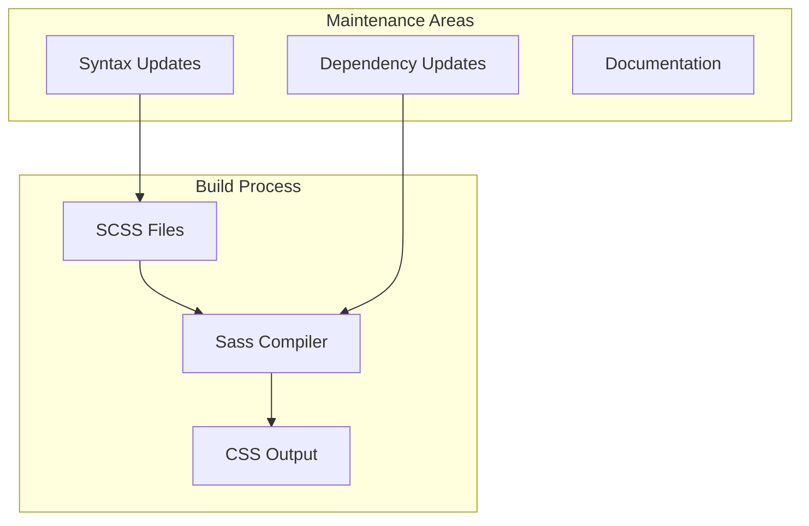

---
tags:
  - dashboards
  - search
---

# Dashboards Search Relevance Build Maintenance

## Summary

The dashboards-search-relevance plugin requires ongoing maintenance to ensure compatibility with evolving build tools and dependencies. This includes updating deprecated syntax, fixing build warnings, and maintaining documentation.

## Details

### Build System Compatibility

The plugin uses Sass for styling, which requires updates as the Sass compiler evolves. Key maintenance areas include:

### Components

| Component | Description |
|-----------|-------------|
| `result_grid.scss` | Styling for query comparison result grid |
| `CONTRIBUTING.md` | Contributor guidelines |
| `DEVELOPER_GUIDE.md` | Development setup instructions |

### Sass Syntax Modernization

Modern Sass compilers (Dart Sass) have deprecated certain syntax patterns:

| Deprecated Syntax | Modern Syntax | Status |
|-------------------|---------------|--------|
| `$var / 2` (division) | `calc($var / 2)` or `math.div($var, 2)` | Fixed in v2.17.0 |

### Configuration

No additional configuration is required. The fixes are applied at the source code level.

## Limitations

- Build warnings may appear with older Sass compiler versions
- Future Sass versions may introduce additional deprecations requiring updates

## Change History

- **v2.17.0** (2024-09-17): Fixed Sass division warning by updating to `calc()` syntax; Fixed broken LICENSE file link and removed unused Docker documentation links

## References

### Documentation
- [Sass Breaking Change: Slash as Division](https://sass-lang.com/documentation/breaking-changes/slash-div/)
- [dashboards-search-relevance Repository](https://github.com/opensearch-project/dashboards-search-relevance)
- [OpenSearch Dashboards PR #5338](https://github.com/opensearch-project/OpenSearch-Dashboards/pull/5338): Replace `node-sass` with `sass-embedded`

### Pull Requests
| Version | PR | Description | Related Issue |
|---------|-----|-------------|---------------|
| v2.17.0 | [#426](https://github.com/opensearch-project/dashboards-search-relevance/pull/426) | Fix sass division warning |   |
| v2.17.0 | [#420](https://github.com/opensearch-project/dashboards-search-relevance/pull/420) | Update Links in Documentation |   |
