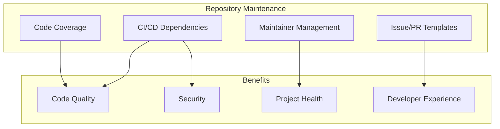

---
tags:
  - ml
  - security
---

# Repository Maintenance

## Summary

Repository maintenance encompasses the ongoing activities required to keep OpenSearch plugin repositories healthy, secure, and well-maintained. This includes managing maintainer lists, standardizing contribution workflows through templates, integrating test coverage tools, and keeping CI/CD dependencies up to date.

## Details

### Architecture

### Components

| Component | Description |
|-----------|-------------|
| MAINTAINERS.md | List of active maintainers and emeritus contributors |
| Issue Templates | Standardized templates for bug reports and feature requests |
| PR Templates | Templates for pull request descriptions |
| Codecov Integration | Automated test coverage reporting |
| GitHub Actions | CI/CD workflow automation |

### Maintainer Governance

OpenSearch projects follow a maintainer governance model:
- **Active Maintainers**: Have merge rights and responsibility for code review
- **Emeritus Maintainers**: Former maintainers who are no longer active but recognized for past contributions
- Maintainer transitions help ensure project continuity and health

### Test Coverage Integration

Codecov integration provides:
- Automated coverage reports on pull requests
- Coverage trend tracking over time
- Coverage badges for repository README
- Identification of untested code paths

### CI/CD Best Practices

Keeping GitHub Actions dependencies updated ensures:
- Security patches are applied promptly
- Compatibility with latest GitHub features
- Reliable and efficient CI/CD pipelines
- Reduced technical debt

## Limitations

- Maintainer changes require consensus from existing maintainers
- Coverage thresholds may need adjustment per repository
- GitHub Actions updates may introduce breaking changes requiring workflow adjustments

## Change History

- **v3.2.0** (2026-01): Maintainer updates, issue templates, codecov integration, GitHub Actions dependency bumps

## Related Features
- [Search Relevance](../search-relevance/dashboards-observability-search-relevance-ci-tests.md)
- [Neural Search](../neural-search/neural-search-agentic-search.md)

## References

### Documentation
- [Codecov Documentation](https://docs.codecov.com/)
- [GitHub Actions Documentation](https://docs.github.com/en/actions)
- [OpenSearch Maintainer Guidelines](https://github.com/opensearch-project/.github/blob/main/MAINTAINERS.md)

### Pull Requests
| Version | PR | Repository | Description | Related Issue |
|---------|-----|------------|-------------|---------------|
| v3.2.0 | [#569](https://github.com/opensearch-project/dashboards-search-relevance/pull/569) | dashboards-search-relevance | Adding new maintainers |   |
| v3.2.0 | [#576](https://github.com/opensearch-project/dashboards-search-relevance/pull/576) | dashboards-search-relevance | Update maintainer list |   |
| v3.2.0 | [#601](https://github.com/opensearch-project/dashboards-search-relevance/pull/601) | dashboards-search-relevance | Add issue template and codecov |   |
| v3.2.0 | [#2260](https://github.com/opensearch-project/security/pull/2260) | security | Bump actions/checkout |   |
| v3.2.0 | [#2263](https://github.com/opensearch-project/security/pull/2263) | security | Bump codecov/codecov-action |   |
