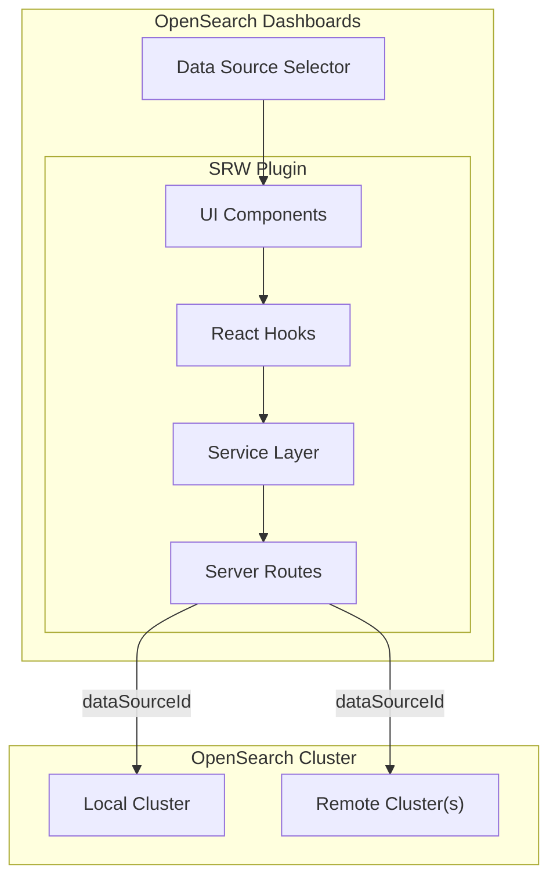

---
tags:
  - dashboards-search-relevance
---
# Search Relevance Workbench (SRW)

## Summary

The Search Relevance Workbench (SRW) is an OpenSearch Dashboards plugin that provides tools for search relevance engineers and business users to tune and evaluate search results. It offers a comprehensive suite of capabilities including query comparison (Query Analysis), experiment management with scheduled runs, judgment-based relevance evaluation, query set management, and search configuration management.

## Details

### Architecture

### Components

| Component | Description |
|-----------|-------------|
| Query Analysis | Run and compare search queries against one or two setups side-by-side (formerly "Single Query Comparison") |
| Query Compare | Compare two query configurations with resizable editors and synchronized results |
| Experiments | Create, schedule (cron), and run search relevance experiments with visualization |
| Judgments | Manage relevance judgment ratings for query-document pairs |
| Query Sets | Create and manage collections of test queries via text input or file upload |
| Search Configurations | Store and manage reusable search configurations |
| Data Source Selector | Select local or remote OpenSearch clusters when MDS is enabled |
| Ask AI Callout | Dismissible banner guiding users to the AI relevance tuning agent |

### Query Set Input Formats

Query Sets can be created via manual text input supporting three formats with automatic fallback detection (NDJSON → Key-Value → Plain Text):

| Format | Example |
|--------|---------|
| Plain text | `red bluejeans` |
| Key-value | `query: "capital of France?", answer: "Paris"` |
| NDJSON | `{"queryText":"capital of France?","referenceAnswer":"Paris"}` |

File uploads accept `.ndjson` and `.jsonl` formats.

### Configuration

| Setting | Description | Default |
|---------|-------------|---------|
| `data_source.enabled` | Enable multiple data source support in SRW | `false` |

### Multiple Data Source Support

When `data_source.enabled: true`, all four resource types (Experiments, Judgments, Query Sets, Search Configurations) support `dataSourceId` across the full stack — server routing, service layer, hooks, and UI components. Users can query local and remote OpenSearch clusters from the same dashboard.

## Limitations

- Multiple data source support requires explicit configuration enablement
- The "Ask AI" button requires the chat plugin to be activated
- Resizable query editors are constrained to 160px–600px height range
- Query Set manual input parser uses automatic format detection which may misinterpret ambiguous input

## Change History

- **v3.6.0**: Manual Query Set creation with multi-format input (PR #754), Query Set Help flyout (PR #767), multiple data source support (PR #802), Ask AI button (PR #810), resizable query editors (PR #791), rename to Query Analysis (PR #773), NDJSON/JSONL file support (PR #775), standardized tooltips (PR #782), timestamp format cleanup (PR #799), scheduler null cron fix (PR #808), judgment deletion fix (PR #751), single query execution fix (PR #746), Query Analysis alignment fix (PR #752), NDJSON error message fix (PR #776)

## References

### Pull Requests
| Version | PR | Description |
|---------|-----|-------------|
| v3.6.0 | `https://github.com/opensearch-project/dashboards-search-relevance/pull/754` | Manual Query Set creation |
| v3.6.0 | `https://github.com/opensearch-project/dashboards-search-relevance/pull/767` | Query Set Help flyout |
| v3.6.0 | `https://github.com/opensearch-project/dashboards-search-relevance/pull/802` | Multiple data source support |
| v3.6.0 | `https://github.com/opensearch-project/dashboards-search-relevance/pull/810` | Ask AI button |
| v3.6.0 | `https://github.com/opensearch-project/dashboards-search-relevance/pull/775` | NDJSON/JSONL file support |
| v3.6.0 | `https://github.com/opensearch-project/dashboards-search-relevance/pull/791` | Resizable query editors |
| v3.6.0 | `https://github.com/opensearch-project/dashboards-search-relevance/pull/782` | Standardized action tooltips |
| v3.6.0 | `https://github.com/opensearch-project/dashboards-search-relevance/pull/799` | Timestamp format cleanup |
| v3.6.0 | `https://github.com/opensearch-project/dashboards-search-relevance/pull/773` | Rename to Query Analysis |
| v3.6.0 | `https://github.com/opensearch-project/dashboards-search-relevance/pull/808` | Scheduler null cron fix |
| v3.6.0 | `https://github.com/opensearch-project/dashboards-search-relevance/pull/752` | Query Analysis alignment fix |
| v3.6.0 | `https://github.com/opensearch-project/dashboards-search-relevance/pull/746` | Single query execution fix |
| v3.6.0 | `https://github.com/opensearch-project/dashboards-search-relevance/pull/751` | Judgment deletion fix |
| v3.6.0 | `https://github.com/opensearch-project/dashboards-search-relevance/pull/776` | NDJSON error message fix |
