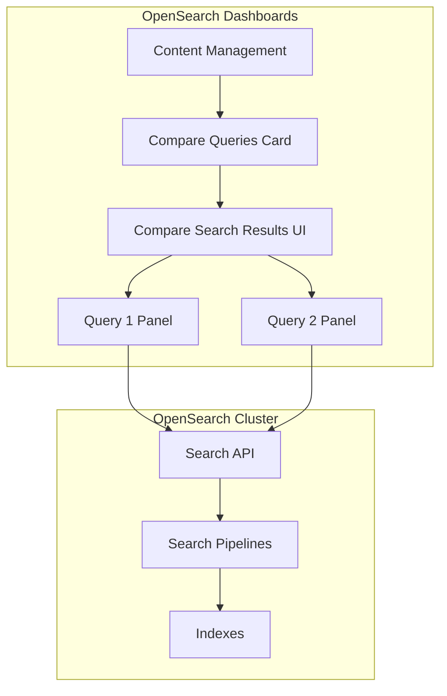
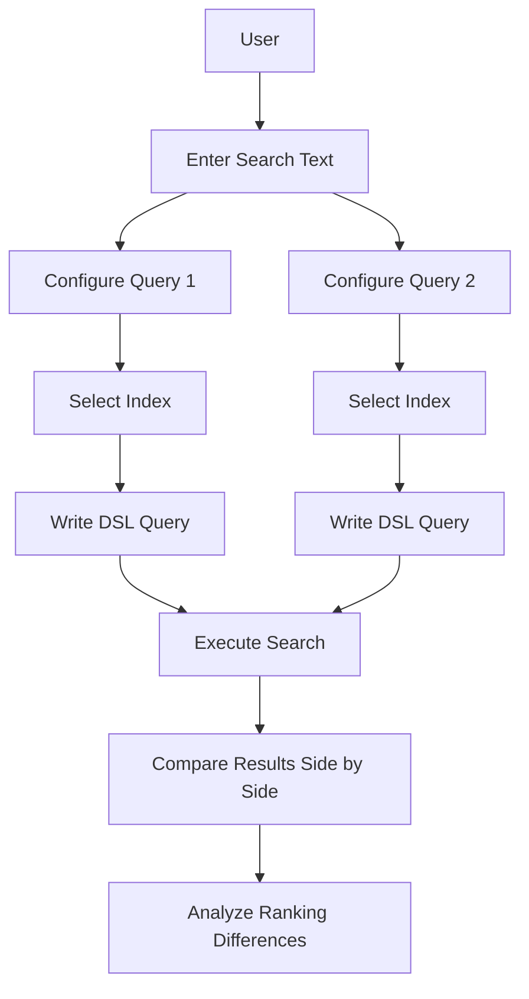

# Search Comparison (Compare Search Results)

## Summary

Compare Search Results is a search relevance tool in OpenSearch Dashboards that allows users to compare results from two different queries side by side. This feature helps search relevance engineers and business users evaluate and tune search quality by experimenting with different query configurations, field weightings, and search pipelines.

## Details

### Architecture



### Data Flow



### Components

| Component | Description |
|-----------|-------------|
| Search Bar | Input field for the search text that gets substituted into queries via `%SearchText%` |
| Query Panel | Two side-by-side panels for configuring and viewing query results |
| Index Selector | Dropdown to select the target index for each query |
| Query Editor | JSON editor for writing OpenSearch Query DSL |
| Pipeline Selector | Optional dropdown to select a search pipeline |
| Results Panel | Displays search results with ranking position indicators |
| Compare Queries Card | Service card on Search use case overview page (v2.17.0+) |

### Configuration

| Setting | Description | Default |
|---------|-------------|---------|
| `size` | Number of results to return per query | 10 |
| Search Pipeline | Optional search pipeline to apply to the query | None |

### Usage Example

**Basic Query Comparison:**

Query 1 - Standard multi-match:
```json
{
  "query": {
    "multi_match": {
      "query": "%SearchText%",
      "fields": ["description", "item_name"]
    }
  }
}
```

Query 2 - Boosted field:
```json
{
  "query": {
    "multi_match": {
      "query": "%SearchText%",
      "fields": ["description", "item_name^3"]
    }
  }
}
```

**With Search Pipeline:**
```json
{
  "query": {
    "match": {
      "bullet_point": "%SearchText%"
    }
  },
  "size": 25,
  "ext": {
    "search_configuration": {
      "result_transformer": {
        "kendra_intelligent_ranking": {
          "order": 1,
          "properties": {
            "title_field": "item_name",
            "body_field": "bullet_point"
          }
        }
      }
    }
  }
}
```

### Key Features

1. **Side-by-Side Comparison**: View results from two queries simultaneously
2. **Ranking Indicators**: Up/Down arrows show how document positions changed between queries
3. **Variable Substitution**: Use `%SearchText%` to reference the search bar input
4. **Search Pipeline Support**: Apply search pipelines including rerankers (v2.14.0+)
5. **Multi-Data Source Support**: Query different data sources (v2.14.0+)
6. **Workspace Integration**: Access via Compare Queries card in Search workspace (v2.17.0+)

## Limitations

- Cannot save comparisons for future use - not suitable for systematic testing
- Setting `size` to values larger than 250 may degrade performance
- Requires manual query construction in OpenSearch Query DSL
- Hybrid optimizer experiments with more than 10,000 evaluation results will only display the first 10,000 due to OpenSearch's `max_result_window` limit (v3.3.0+)

## Change History

- **v3.4.0** (2026-03-11): Added support for filtering Query Sets by GUID, introduced strongly typed `QuerySetItem` interface
- **v3.3.0** (2026-01-14): Improved color coding for visual comparison, fixed pairwise comparison to show more than 10 results, added support for large experiment results up to 10,000
- **v3.1.0** (2025-06-11): Fixed schema validation in POST Query Sets endpoint - added missing `querySetSize` parameter
- **v2.17.0** (2024-09-17): Added Compare Queries card to Search use case overview page via Content Management integration
- **v2.14.0** (2024-05-02): Added multi-datasource support and search pipeline selection
- **v2.11.0** (2023-10-16): Fixed ace editor theme consistency for dark mode

## References

### Documentation
- [Documentation](https://docs.opensearch.org/latest/search-plugins/search-relevance/compare-search-results/): Comparing search results
- [Search Relevance Stats API](https://docs.opensearch.org/latest/search-plugins/search-relevance/stats-api/): API for search relevance statistics

### Pull Requests
| Version | PR | Description | Related Issue |
|---------|-----|-------------|---------------|
| v3.4.0 | [#687](https://github.com/opensearch-project/dashboards-search-relevance/pull/687) | Added support for filtering Query Sets by GUID |   |
| v3.3.0 | [#632](https://github.com/opensearch-project/dashboards-search-relevance/pull/632) | Improve color coding for search result comparison |   |
| v3.3.0 | [#637](https://github.com/opensearch-project/dashboards-search-relevance/pull/637) | Allow more than 10 results in pairwise comparison view |   |
| v3.3.0 | [#645](https://github.com/opensearch-project/dashboards-search-relevance/pull/645) | Show first 10,000 experiment results | [#157](https://github.com/opensearch-project/search-relevance/issues/157) |
| v3.1.0 | [#542](https://github.com/opensearch-project/dashboards-search-relevance/pull/542) | Fix schema validation in POST Query Sets endpoint | [#541](https://github.com/opensearch-project/dashboards-search-relevance/issues/541) |
| v2.17.0 | [#427](https://github.com/opensearch-project/dashboards-search-relevance/pull/427) | Add compare queries card to search use case overview page | [#7807](https://github.com/opensearch-project/OpenSearch-Dashboards/issues/7807) |
| v2.14.0 | [#383](https://github.com/opensearch-project/dashboards-search-relevance/pull/383) | Multi-datasource support for Search-relevance | [#371](https://github.com/opensearch-project/dashboards-search-relevance/issues/371) |
| v2.14.0 | [#352](https://github.com/opensearch-project/dashboards-search-relevance/pull/352) | Add ability to select a search pipeline in comparison tool | [#260](https://github.com/opensearch-project/dashboards-search-relevance/issues/260) |

### Issues (Design / RFC)
- [Issue #7807](https://github.com/opensearch-project/OpenSearch-Dashboards/issues/7807): Search use case overview page
- [Issue #157](https://github.com/opensearch-project/search-relevance/issues/157): No evaluation results loaded for extensive experiments
