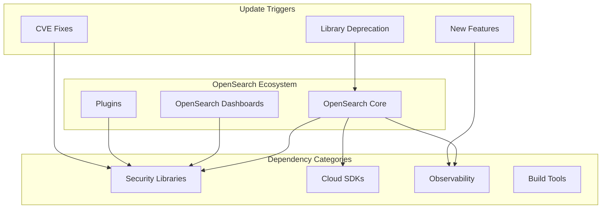
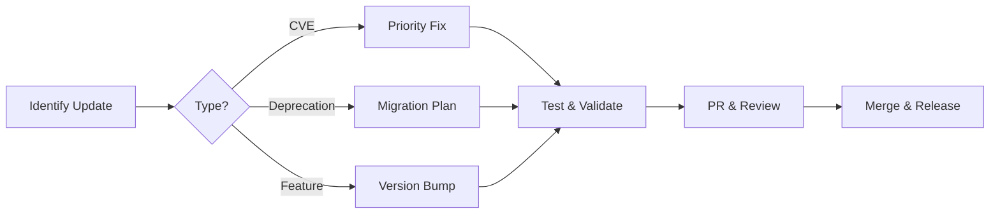

# Dependency Updates

## Summary

OpenSearch maintains a comprehensive dependency management strategy to ensure security, stability, and compatibility across its ecosystem. This includes regular updates to address CVEs, migration from deprecated libraries to maintained alternatives, and version upgrades for improved functionality.

## Details

### Architecture

### Components

| Component | Description |
|-----------|-------------|
| Core Dependencies | Java libraries used by OpenSearch engine |
| Dashboard Dependencies | Node.js packages for OpenSearch Dashboards |
| Plugin Dependencies | Shared libraries across OpenSearch plugins |
| Build Dependencies | Gradle plugins and CI/CD actions |

### Dependency Categories

#### Security Libraries
- Bouncy Castle (cryptography)
- Nimbus JOSE+JWT (JWT handling)
- cipher-base, sha.js (cryptographic primitives)
- pbkdf2 (key derivation)

#### Cloud SDKs
- Google Cloud Storage SDK
- Azure SDK (azure-core, azure-identity, azure-storage-common)
- AWS SDK components

#### Observability
- OpenTelemetry
- SLF4J (logging facade)
- Log4j

#### Networking
- Netty
- Reactor Netty
- gRPC

### Update Process

## Limitations

- Transitive dependency conflicts may require resolution overrides
- Major version upgrades may introduce breaking API changes
- Some deprecated libraries may persist due to transitive dependencies

## Related PRs

| Version | PR | Description |
|---------|-----|-------------|
| v3.3.0 | [#19068](https://github.com/opensearch-project/OpenSearch/pull/19068) | OpenTelemetry 1.53.0 |
| v3.3.0 | [#19125](https://github.com/opensearch-project/OpenSearch/pull/19125) | Tika 3.2.2 (CVE fix) |
| v3.3.0 | [#19136](https://github.com/opensearch-project/OpenSearch/pull/19136) | SLF4J 2.0.17 |
| v3.3.0 | [#18922](https://github.com/opensearch-project/OpenSearch/pull/18922) | GCS SDK 2.55.0 |
| v3.3.0 | [#19229](https://github.com/opensearch-project/OpenSearch/pull/19229) | commons-lang3 migration |
| v3.3.0 | [#10378](https://github.com/opensearch-project/OpenSearch-Dashboards/pull/10378) | pbkdf2, form-data CVE fixes |
| v3.3.0 | [#10442](https://github.com/opensearch-project/OpenSearch-Dashboards/pull/10442) | cipher-base, sha.js fixes |

## References

- [OpenSearch Security Advisories](https://github.com/opensearch-project/OpenSearch/security/advisories)
- [NVD CVE Database](https://nvd.nist.gov/)
- [GitHub Security Advisories](https://github.com/advisories)

## Change History

- **v3.3.0** (2026-01-11): 55 dependency updates including OpenTelemetry 1.53.0, SLF4J 2.0.17, GCS SDK 2.55.0, commons-lang3 migration, and multiple CVE fixes
