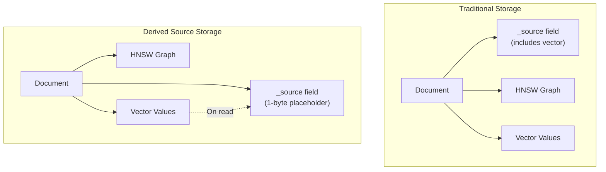
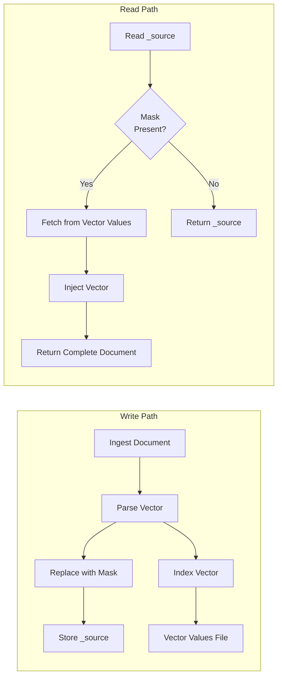

# Derived Source for k-NN Vectors

## Summary

Derived source for k-NN vectors is a storage optimization feature that reduces index size by up to 3x and improves query latency by up to 30x for cold start scenarios. Instead of storing vectors in the `_source` field, OpenSearch replaces them with a single-byte placeholder during indexing and retrieves them from the vector values file when needed.

Key benefits:
- **3x storage reduction**: Vectors are not duplicated in `_source` field
- **Up to 30x faster cold start queries**: Reduced data loading improves page cache efficiency
- **10% faster force merges**: Less data to copy during segment merges
- **Transparent operation**: No changes required to queries or application code
- **Full functionality preserved**: Update, reindex, and recovery operations work normally

## Details

### Architecture



### Data Flow



### Components

| Component | Description |
|-----------|-------------|
| KNN10010DerivedSourceStoredFieldsFormat | Handles derived source storage format for v3.0.0+ |
| DerivedSourceMask | Single-byte placeholder replacing vectors in `_source` |
| Vector Values File | Columnar storage containing actual vector data |
| KNN9120Codec (backwards compat) | Legacy codec for reading older filter-based derived source |

### Configuration

| Setting | Description | Default |
|---------|-------------|---------|
| `index.knn` | Enable k-NN functionality | `false` |
| `index.knn.derived_source.enabled` | Enable derived source for vectors | `true` (v3.0.0+) |

### Usage Example

```json
PUT /my_vector_index
{
  "settings": {
    "index.knn": true,
    "index.knn.derived_source.enabled": true
  },
  "mappings": {
    "properties": {
      "my_vector": {
        "type": "knn_vector",
        "dimension": 128,
        "method": {
          "name": "hnsw",
          "engine": "faiss"
        }
      },
      "title": {
        "type": "text"
      }
    }
  }
}
```

### Performance Benchmarks

| Metric | Without Derived Source | With Derived Source | Improvement |
|--------|------------------------|---------------------|-------------|
| Storage Size | 3x baseline | 1x baseline | 3x reduction |
| Force Merge Time | baseline | ~10% faster | 10% improvement |
| Cold Start Query Latency (Lucene) | baseline | ~90% reduction | ~30x faster |

### Supported Vector Types

| Vector Type | Support |
|-------------|---------|
| Float vectors | ✓ |
| Byte vectors | ✓ (fixed in PR #2533) |
| Binary vectors | ✓ (fixed in PR #2533) |
| Nested vectors | ✓ (improved in PR #2612) |

## Limitations

- **Requires vector values storage**: Vectors must be stored in vector values file (default behavior)
- **Slight read overhead**: Reading vectors requires additional file access when `_source` is requested
- **Migration required**: Existing indexes need reindexing to benefit from derived source

## Related PRs

| Version | PR | Description |
|---------|-----|-------------|
| v3.0.0 | [k-NN #2533](https://github.com/opensearch-project/k-NN/pull/2533) | Fix derived source for binary and byte vectors |
| v3.0.0 | [k-NN #2606](https://github.com/opensearch-project/k-NN/pull/2606) | Switch from field attributes to segment attributes |
| v3.0.0 | [k-NN #2612](https://github.com/opensearch-project/k-NN/pull/2612) | Migrate from filter to mask approach for nested docs support |

## References

- [Indexing performance tuning documentation](https://docs.opensearch.org/3.0/vector-search/performance-tuning-indexing/)
- [k-NN vector field type](https://docs.opensearch.org/3.0/field-types/supported-field-types/knn-vector/)
- [Blog: Save up to 3x on storage with derived vector source](https://opensearch.org/blog/do-more-with-less-save-up-to-3x-on-storage-with-derived-vector-source/)
- [Issue #2377](https://github.com/opensearch-project/k-NN/issues/2377): Nested docs support for derived source
- [Issue #9568](https://github.com/opensearch-project/OpenSearch/issues/9568): Derived source for all field types (future)

## Change History

- **v3.0.0** (2025): Production ready with mask-based approach, nested docs support, binary/byte vector fixes
