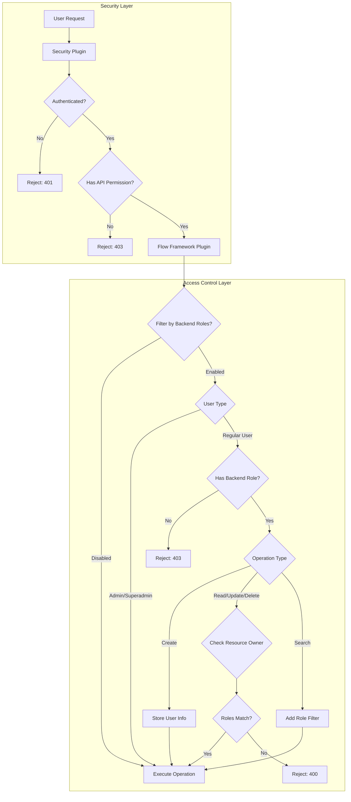
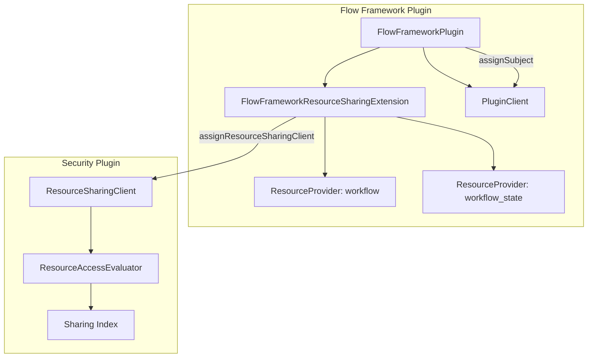

---
tags:
  - domain/ml
  - component/server
  - ml
  - search
  - security
---
# Flow Framework Access Control

## Summary

Flow Framework Access Control provides user-level security for workflow resources based on backend roles. This feature enables multi-tenant environments where users can only access workflows created by users who share at least one backend role, adding an additional layer of security beyond basic API permissions.

## Details

### Architecture



### Data Flow

```mermaid
flowchart TB
    subgraph "Workflow Creation"
        A1[Create Request] --> A2[Extract User Context]
        A2 --> A3[Validate Backend Roles]
        A3 --> A4[Store Template with User]
        A4 --> A5[Create Workflow State]
    end
    
    subgraph "Workflow Access"
        B1[Access Request] --> B2[Get User Context]
        B2 --> B3[Fetch Workflow]
        B3 --> B4[Compare Backend Roles]
        B4 --> B5{Match Found?}
        B5 -->|Yes| B6[Allow Access]
        B5 -->|No| B7[Deny Access]
    end
    
    subgraph "Search Operations"
        C1[Search Request] --> C2[Get User Context]
        C2 --> C3[Build Query]
        C3 --> C4[Add Nested Role Filter]
        C4 --> C5[Execute Search]
        C5 --> C6[Return Filtered Results]
    end
```



### Components

| Component | Description |
|-----------|-------------|
| `FlowFrameworkSettings.FILTER_BY_BACKEND_ROLES` | Cluster setting to enable/disable backend role filtering |
| `SearchHandler` | Centralized handler for search operations with role-based filtering |
| `ParseUtils.resolveUserAndExecute()` | Utility method to verify user permissions before workflow operations |
| `ParseUtils.checkFilterByBackendRoles()` | Validates user has backend roles when filtering is enabled |
| `ParseUtils.getWorkflow()` | Retrieves workflow and verifies user access permissions |
| `ParseUtils.addUserBackendRolesFilter()` | Adds nested query filter for backend roles to search requests |

### Configuration

| Setting | Description | Default |
|---------|-------------|---------|
| `plugins.flow_framework.filter_by_backend_roles` | Enable backend role-based access control for workflows | `false` |

### Built-in Roles

| Role | Description |
|------|-------------|
| `flow_framework_full_access` | Full access to all Flow Framework APIs |
| `flow_framework_read_access` | Read-only access to workflows and workflow states |

### Usage Example

#### Enable Backend Role Filtering

```json
PUT _cluster/settings
{
  "transient": {
    "plugins.flow_framework.filter_by_backend_roles": "true"
  }
}
```

#### Create Users with Backend Roles

```json
PUT _plugins/_security/api/internalusers/alice
{
  "password": "secure-password",
  "backend_roles": ["data-science"],
  "attributes": {}
}

PUT _plugins/_security/api/internalusers/bob
{
  "password": "secure-password",
  "backend_roles": ["engineering"],
  "attributes": {}
}
```

#### Map Users to Flow Framework Roles

```json
PUT _plugins/_security/api/rolesmapping/flow_framework_full_access
{
  "backend_roles": [],
  "hosts": [],
  "users": ["alice", "bob"]
}
```

#### Access Control Behavior

With the above configuration:
- Alice creates a workflow → workflow is tagged with `data-science` backend role
- Bob tries to access Alice's workflow → **Denied** (different backend roles)
- Alice accesses her own workflow → **Allowed** (matching backend role)
- Admin user accesses any workflow → **Allowed** (admin bypass)

### API Permissions

| Permission | Description |
|------------|-------------|
| `cluster:admin/opensearch/flow_framework/workflow/create` | Create workflows |
| `cluster:admin/opensearch/flow_framework/workflow/provision` | Provision workflows |
| `cluster:admin/opensearch/flow_framework/workflow/deprovision` | Deprovision workflows |
| `cluster:admin/opensearch/flow_framework/workflow/delete` | Delete workflows |
| `cluster:admin/opensearch/flow_framework/workflow/get` | Get workflow details |
| `cluster:admin/opensearch/flow_framework/workflow/search` | Search workflows |
| `cluster:admin/opensearch/flow_framework/workflow_state/search` | Search workflow states |

### Resource Sharing Integration (v3.4.0+)

Starting in v3.4.0, Flow Framework integrates with the centralized Resource Sharing and Access Control framework, providing owner-controlled sharing capabilities.

#### Resource Sharing Architecture



#### Resource Types

| Resource Type | Index | Description |
|---------------|-------|-------------|
| `workflow` | `.plugins-flow-framework-templates` | Workflow templates |
| `workflow_state` | `.plugins-flow-framework-state` | Workflow execution states |

#### Access Levels

| Access Level | Allowed Actions |
|--------------|-----------------|
| `workflow_read_only` | Get and search workflows |
| `workflow_read_write` | All workflow operations |
| `workflow_full_access` | All operations including sharing |

#### Enable Resource Sharing

```yaml
# opensearch.yml
plugins.security.experimental.resource_sharing.enabled: true
plugins.security.experimental.resource_sharing.protected_types: ["workflow", "workflow_state"]
```

#### Share a Workflow

```json
PUT /_plugins/_security/api/resource/share
{
  "resource_id": "workflow-123",
  "resource_type": "workflow",
  "share_with": {
    "workflow_read_only": {
      "users": ["alice"],
      "roles": ["data_analyst"]
    }
  }
}
```

## Limitations

- Backend roles cannot be changed after workflow creation (legacy mode)
- Users with `flow_framework_read_access` can view any workflow's results even with filtering enabled (legacy mode)
- Backend roles must be configured before creating workflows (legacy mode)
- The feature requires the Security plugin to be enabled
- Resource sharing is experimental and disabled by default (v3.4.0+)

## Change History

- **v3.4.0** (2026-01-14): Integration with centralized Resource Sharing and Access Control framework
- **v2.17.0** (2024-09-17): Initial implementation of user-level access control based on backend roles


## References

### Documentation
- [Workflow Security Documentation](https://docs.opensearch.org/3.0/automating-configurations/workflow-security/): Official documentation
- [Access Control Documentation](https://docs.opensearch.org/3.0/security/access-control/index/): OpenSearch access control concepts

### Blog Posts
- [Resource Sharing Blog](https://opensearch.org/blog/introducing-resource-sharing-a-new-access-control-model-for-opensearch/): Introducing resource sharing

### Pull Requests
| Version | PR | Description | Related Issue |
|---------|-----|-------------|---------------|
| v3.4.0 | [#1251](https://github.com/opensearch-project/flow-framework/pull/1251) | Onboard to resource-sharing and access control framework | [#1250](https://github.com/opensearch-project/flow-framework/issues/1250) |
| v2.17.0 | [#838](https://github.com/opensearch-project/flow-framework/pull/838) | Initial implementation of backend role-based access control | [#668](https://github.com/opensearch-project/flow-framework/issues/668) |

### Issues (Design / RFC)
- [Issue #1250](https://github.com/opensearch-project/flow-framework/issues/1250): Request to onboard to centralized authz framework
- [Issue #668](https://github.com/opensearch-project/flow-framework/issues/668): Original feature request
- [Security Issue #4500](https://github.com/opensearch-project/security/issues/4500): Resource Permissions and Sharing design
