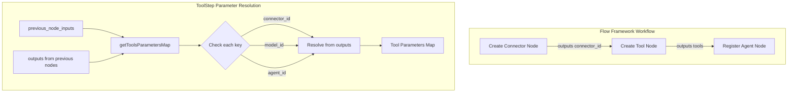
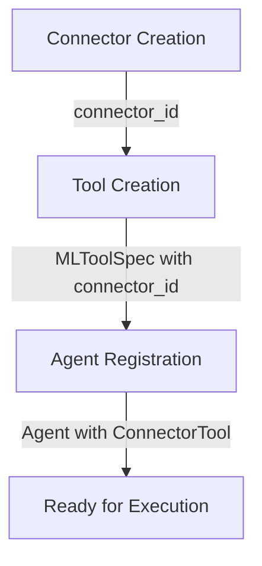

---
tags:
  - ml
---

# Flow Framework Connector Tools

## Summary

Flow Framework Connector Tools enables the automatic parsing of `connector_id` from previous workflow node outputs when creating tools. This feature allows seamless chaining of connector creation with tool creation in workflow templates, eliminating the need to manually specify connector IDs when building AI agent workflows.

## Details

### Architecture



### Data Flow



### Components

| Component | Description |
|-----------|-------------|
| `ToolStep` | Workflow step that creates ML tools with automatic parameter resolution |
| `getToolsParametersMap` | Method that resolves tool parameters from previous node outputs |
| `toolParameterKeys` | Set of supported parameter keys: `connector_id`, `model_id`, `agent_id` |
| `MLToolSpec` | ML Commons tool specification that holds the resolved parameters |

### Configuration

| Setting | Description | Default |
|---------|-------------|---------|
| `previous_node_inputs` | Map of node IDs to parameter keys to resolve | Empty |
| `parameters` | Explicit tool parameters (can be overridden by previous node inputs) | Empty |

### Usage Example

```json
{
  "name": "connector-tool-workflow",
  "description": "Create a ConnectorTool with dynamic connector_id",
  "workflows": {
    "provision": {
      "nodes": [
        {
          "id": "create_connector",
          "type": "create_connector",
          "user_inputs": {
            "name": "OpenAI Chat Connector",
            "description": "Connector to OpenAI GPT model",
            "version": "1",
            "protocol": "http",
            "parameters": {
              "endpoint": "api.openai.com",
              "model": "gpt-3.5-turbo"
            },
            "credential": {
              "openAI_key": "YOUR_API_KEY"
            },
            "actions": [
              {
                "action_type": "predict",
                "method": "POST",
                "url": "https://${parameters.endpoint}/v1/chat/completions"
              }
            ]
          }
        },
        {
          "id": "create_connector_tool",
          "type": "create_tool",
          "previous_node_inputs": {
            "create_connector": "connector_id"
          },
          "user_inputs": {
            "parameters": {},
            "name": "ConnectorTool",
            "type": "ConnectorTool"
          }
        },
        {
          "id": "create_flow_agent",
          "type": "register_agent",
          "previous_node_inputs": {
            "create_connector_tool": "tools"
          },
          "user_inputs": {
            "parameters": {},
            "type": "flow",
            "name": "OpenAI Chat Agent"
          }
        }
      ],
      "edges": [
        { "source": "create_connector", "dest": "create_connector_tool" },
        { "source": "create_connector_tool", "dest": "create_flow_agent" }
      ]
    }
  }
}
```

## Limitations

- Only three parameter keys are supported for automatic resolution: `connector_id`, `model_id`, and `agent_id`
- Custom parameters must be explicitly specified in the `parameters` field
- If a parameter is already present in `parameters`, it will not be overwritten by previous node outputs

## Change History

- **v2.17.0** (2024-10-15): Added support for parsing `connector_id` from previous node inputs in ToolStep

## References

### Documentation
- [Connector Tool Documentation](https://docs.opensearch.org/2.17/ml-commons-plugin/agents-tools/tools/connector-tool/): Official ConnectorTool documentation
- [Flow Framework Workflow Steps](https://docs.opensearch.org/latest/automating-configurations/workflow-steps/): Workflow step reference

### Pull Requests
| Version | PR | Description | Related Issue |
|---------|-----|-------------|---------------|
| v2.17.0 | [#846](https://github.com/opensearch-project/flow-framework/pull/846) | Support parsing connector_id when creating tools | [#845](https://github.com/opensearch-project/flow-framework/issues/845) |

### Issues (Design / RFC)
- [Issue #845](https://github.com/opensearch-project/flow-framework/issues/845): Original feature request
