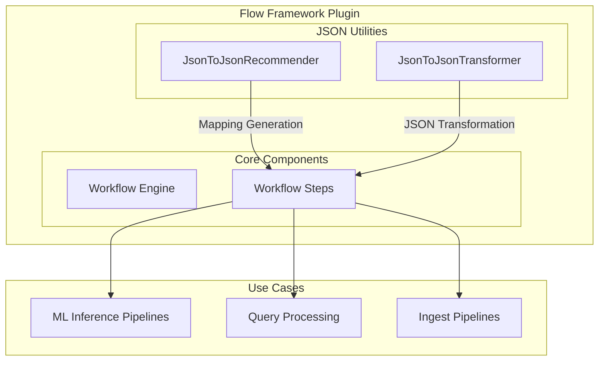
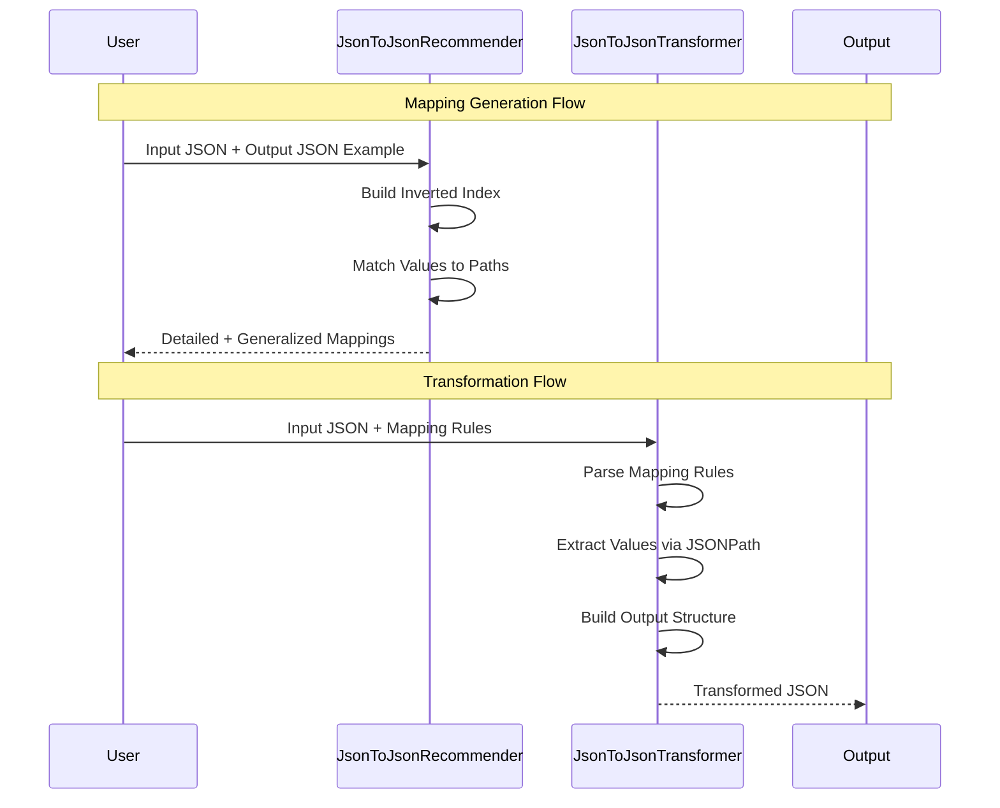

# Flow Framework Utilities

## Summary

Flow Framework Utilities provide JSON-to-JSON transformation capabilities within the OpenSearch Flow Framework plugin. These utilities enable automatic field mapping inference and JSON structure transformation using JSONPath expressions, simplifying the integration of heterogeneous data structures across OpenSearch components such as ML inference pipelines, query processing, and workflow configurations.

## Details

### Architecture



### Data Flow



### Components

| Component | Description |
|-----------|-------------|
| `JsonToJsonRecommender` | Analyzes input/output JSON pairs to automatically generate JSONPath mapping recommendations. Builds an inverted index from input values to paths, then correlates with output structure. |
| `JsonToJsonTransformer` | Transforms input JSON into target structure using JSONPath mapping rules. Supports explicit indices and wildcard `[*]` patterns for array processing. |
| `MapFormatResult` | Container class holding detailed and generalized JSONPath mappings as nested `Map<String, Object>` structures |
| `StringFormatResult` | Container class holding JSONPath mappings as formatted JSON strings for easy consumption |
| `ArrayKeyInfo` | Internal helper class for parsing array property keys (wildcards vs explicit indices) |

### Configuration

| Setting | Description | Default |
|---------|-------------|---------|
| `MAX_JSON_SIZE` | Maximum allowed JSON size in bytes | ~50MB (50,000,000) |
| `MAX_JSON_NAME_LENGTH` | Maximum allowed name length for JSON keys | 50,000 |
| `MAX_JSON_NESTING_DEPTH` | Maximum allowed nesting depth for JSON structures | 1,000 |

### Usage Example

#### Generating Mapping Recommendations

```java
import org.opensearch.flowframework.util.JsonToJsonRecommender;
import org.opensearch.flowframework.util.JsonToJsonRecommender.StringFormatResult;

// Example: ML inference output to search response mapping
String inputJson = """
    {
      "inference_results": [
        {
          "output": [
            {"name": "sentence_embedding", "data_type": "FLOAT32", "shape": [384], "data": [0.1, 0.2, ...]}
          ]
        }
      ]
    }
    """;

String outputJson = """
    {
      "embeddings": [
        {"vector": [0.1, 0.2, ...], "dimensions": 384}
      ]
    }
    """;

// Generate mapping recommendations
StringFormatResult result = JsonToJsonRecommender.getRecommendationInStringFormat(inputJson, outputJson);

// Detailed mapping shows exact array indices
System.out.println("Detailed: " + result.detailedJsonPathString);

// Generalized mapping uses [*] for repeating patterns
System.out.println("Generalized: " + result.generalizedJsonPathString);
```

#### Transforming JSON with Mappings

```java
import org.opensearch.flowframework.util.JsonToJsonTransformer;

// Transform complex nested structures
String inputJson = """
    {
      "level1": {
        "level2": {
          "level3": {
            "level4": {
              "value": "deep_value",
              "items": [
                {"id": 1, "data": {"info": "item1"}},
                {"id": 2, "data": {"info": "item2"}}
              ]
            }
          }
        }
      }
    }
    """;

String mappingJson = """
    {
      "deepValue": "$.level1.level2.level3.level4.value",
      "deepItems[*]": {
        "itemId": "$.level1.level2.level3.level4.items[*].id",
        "itemInfo": "$.level1.level2.level3.level4.items[*].data.info"
      }
    }
    """;

String result = JsonToJsonTransformer.transform(inputJson, mappingJson);
// Output:
// {
//   "deepValue": "deep_value",
//   "deepItems": [
//     {"itemId": 1, "itemInfo": "item1"},
//     {"itemId": 2, "itemInfo": "item2"}
//   ]
// }
```

#### Using with Explicit Array Indices

```java
// Select specific array elements
String mappingJson = """
    {
      "items[0]": {
        "productName": "$.products[0].name",
        "cost": "$.products[0].price"
      },
      "items[2]": {
        "productName": "$.products[2].name",
        "cost": "$.products[2].price"
      }
    }
    """;
```

## Limitations

- Only `[*]` wildcards are supported for array generalization
- Explicit numeric indices (e.g., `[0]`, `[1]`) are honored verbatim
- Nested wildcards are allowed but must follow consistent patterns across array elements
- Maximum JSON size is limited to ~50MB to prevent memory issues
- Maximum nesting depth is 1,000 levels
- Key names cannot exceed 50,000 characters
- The recommender only maps values that exist in both input and output; unmapped fields are skipped
- Thread-safe: all public APIs are static and use local variables only

## Related PRs

| Version | PR | Description |
|---------|-----|-------------|
| v3.2.0 | [#1168](https://github.com/opensearch-project/flow-framework/pull/1168) | Add JsonToJson Recommender as a utility function |
| v3.2.0 | [#1176](https://github.com/opensearch-project/flow-framework/pull/1176) | Add JsonToJson Transformer as a utility function |

## References

- [Issue #1167](https://github.com/opensearch-project/flow-framework/issues/1167): Feature request for JsonToJson utilities
- [OpenSearch Issue #18507](https://github.com/opensearch-project/OpenSearch/issues/18507): Related core OpenSearch issue
- [Workflow Templates Documentation](https://docs.opensearch.org/3.0/automating-configurations/workflow-templates/)
- [Flow Framework Plugin](https://github.com/opensearch-project/flow-framework)

## Change History

- **v3.2.0** (2025-08-06): Initial implementation of JsonToJsonRecommender and JsonToJsonTransformer utilities for automated JSON field mapping and transformation
