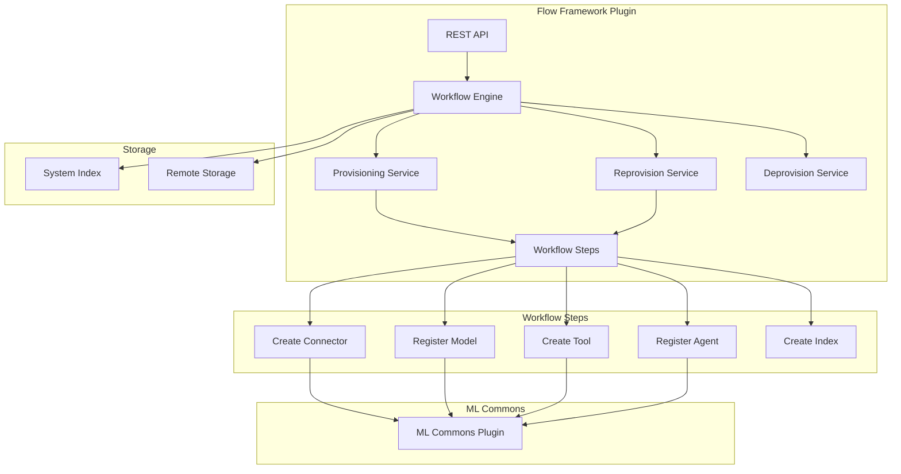
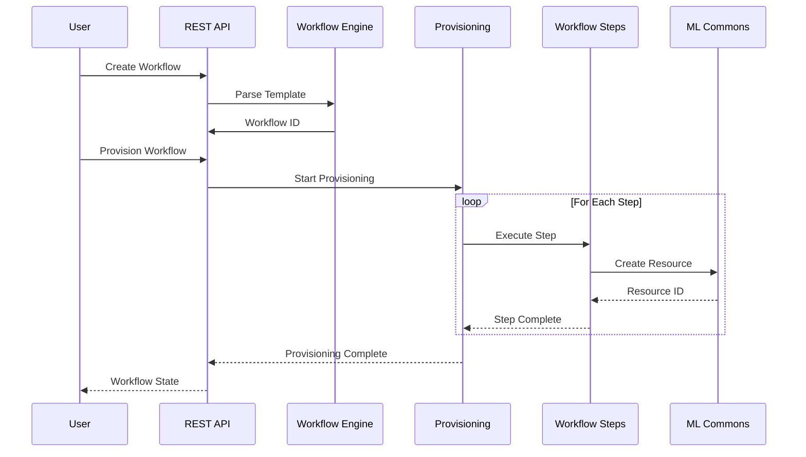

# Flow Framework

## Summary

Flow Framework is an OpenSearch plugin that enables builders to automate the configuration of AI and ML workflows. It provides a declarative approach to creating, provisioning, and managing complex workflows that integrate with ML Commons, including connectors, models, agents, and tools. The plugin supports both synchronous and asynchronous provisioning with tenant-aware throttling for multi-tenant environments.

## Details

### Architecture



### Data Flow



### Components

| Component | Description |
|-----------|-------------|
| Workflow Engine | Parses and validates workflow templates |
| Provisioning Service | Executes workflow steps to create resources |
| Reprovision Service | Updates existing workflows with new configurations |
| Deprovision Service | Removes resources created by workflows |
| Workflow Steps | Individual actions (create_connector, register_model, etc.) |
| ToolStep | Creates ML tools with support for attributes field |
| Config Parser | Handles workflow configuration with tenant awareness |

### Configuration

| Setting | Description | Default |
|---------|-------------|---------|
| `plugins.flow_framework.enabled` | Enable/disable Flow Framework API | `false` |
| `plugins.flow_framework.max_workflows` | Maximum number of workflows | `1000` |
| `plugins.flow_framework.max_workflow_steps` | Maximum steps per workflow | `50` |
| `plugins.flow_framework.max_tenant_provision` | Max concurrent provisions per tenant | Configurable |
| `plugins.flow_framework.max_tenant_reprovision` | Max concurrent reprovisions per tenant | Configurable |
| `plugins.flow_framework.max_tenant_deprovision` | Max concurrent deprovisions per tenant | Configurable |

### Usage Example

```yaml
# Example workflow template
name: semantic-search-workflow
description: Set up semantic search with embeddings
use_case: SEMANTIC_SEARCH
version:
  template: "1.0.0"
  compatibility: ["3.0.0"]

workflows:
  provision:
    nodes:
      - id: create_connector
        type: create_connector
        user_inputs:
          name: OpenAI Connector
          protocol: http
          parameters:
            endpoint: api.openai.com
            model: text-embedding-ada-002
          credential:
            openAI_key: "${OPENAI_API_KEY}"
          actions:
            - action_type: predict
              method: POST
              url: https://api.openai.com/v1/embeddings
              
      - id: register_model
        type: register_remote_model
        previous_node_inputs:
          create_connector: connector_id
        user_inputs:
          name: OpenAI Embedding Model
          function_name: remote
          
      - id: create_tool
        type: create_tool
        previous_node_inputs:
          register_model: model_id
        user_inputs:
          name: VectorDBTool
          type: VectorDBTool
          attributes:
            index: my-vector-index
            source_field: text
```

```bash
# Create and provision workflow
POST /_plugins/_flow_framework/workflow?provision=true
Content-Type: application/yaml
<workflow template>

# Synchronous provisioning with timeout
POST /_plugins/_flow_framework/workflow/<id>/_provision?wait_for_completion_timeout=60s

# Check workflow status
GET /_plugins/_flow_framework/workflow/<id>/_status

# Reprovision with changes
POST /_plugins/_flow_framework/workflow/<id>/_reprovision?wait_for_completion_timeout=30s

# Deprovision workflow
POST /_plugins/_flow_framework/workflow/<id>/_deprovision
```

## Limitations

- Maximum 50 steps per workflow by default
- Maximum 1000 workflows per cluster by default
- Per-tenant throttling requires tenant awareness to be enabled
- Remote storage backends may have additional latency
- Synchronous provisioning has timeout limits

## Related PRs

| Version | PR | Description |
|---------|-----|-------------|
| v3.0.0 | [#1026](https://github.com/opensearch-project/flow-framework/pull/1026) | Fix breaking changes for 3.0.0 release |
| v3.0.0 | [#1074](https://github.com/opensearch-project/flow-framework/pull/1074) | Add per-tenant provisioning throttling |
| v3.0.0 | [#1083](https://github.com/opensearch-project/flow-framework/pull/1083) | Change REST status codes for RBAC and provisioning |
| v3.0.0 | [#1096](https://github.com/opensearch-project/flow-framework/pull/1096) | Fix Config parser does not handle tenant_id field |
| v3.0.0 | [#1098](https://github.com/opensearch-project/flow-framework/pull/1098) | Complete action listener on failed synchronous workflow provisioning |
| v3.0.0 | [#1107](https://github.com/opensearch-project/flow-framework/pull/1107) | Fix bug handleReprovision missing wait_for_completion_timeout response |
| v3.0.0 | [#1113](https://github.com/opensearch-project/flow-framework/pull/1113) | Add new attributes field to ToolStep |
| v3.0.0 | [#936](https://github.com/opensearch-project/flow-framework/pull/936) | Add text to visualization agent template |
| v2.18.0 | [#918](https://github.com/opensearch-project/flow-framework/pull/918) | Fixed template update location and improved logger statements in ReprovisionWorkflowTransportAction |
| v2.18.0 | [#894](https://github.com/opensearch-project/flow-framework/pull/894) | Update workflow state without using painless script |
| v2.17.0 | [#804](https://github.com/opensearch-project/flow-framework/pull/804) | Adds reprovision API to support updating search pipelines, ingest pipelines, index settings |

## References

- [Workflow Settings Documentation](https://docs.opensearch.org/3.0/automating-configurations/workflow-settings/)
- [Workflow Templates Documentation](https://docs.opensearch.org/3.0/automating-configurations/workflow-templates/)
- [Workflow Tutorial](https://docs.opensearch.org/3.0/automating-configurations/workflow-tutorial/)
- [Workflow APIs](https://docs.opensearch.org/3.0/automating-configurations/api/index/)
- [Workflow Template Security](https://docs.opensearch.org/3.0/automating-configurations/workflow-security/)
- [Issue #1095](https://github.com/opensearch-project/flow-framework/issues/1095): Config parser tenant_id handling
- [Issue #1097](https://github.com/opensearch-project/flow-framework/issues/1097): Action listener completion
- [Issue #1106](https://github.com/opensearch-project/flow-framework/issues/1106): Reprovision timeout response
- [Issue #1112](https://github.com/opensearch-project/flow-framework/issues/1112): ToolStep attributes field

## Change History

- **v3.0.0** (2025-05-06): OpenSearch 3.0 compatibility fixes, per-tenant provisioning throttling, REST status code corrections, config parser fix for tenant_id, synchronous provisioning action listener fix, reprovision timeout response fix, ToolStep attributes field, text-to-visualization templates
- **v2.18.0** (2024-11-05): Removed Painless scripts for workflow state updates, implemented optimistic locking with sequence numbers and primary terms for better concurrency control; Fixed template update location in ReprovisionWorkflowTransportAction to resolve flaky integration tests, improved logger statements for better debugging
- **v2.17.0** (2024-10-01): Initial Reprovision API implementation supporting updates to search pipelines, ingest pipelines, and index settings
