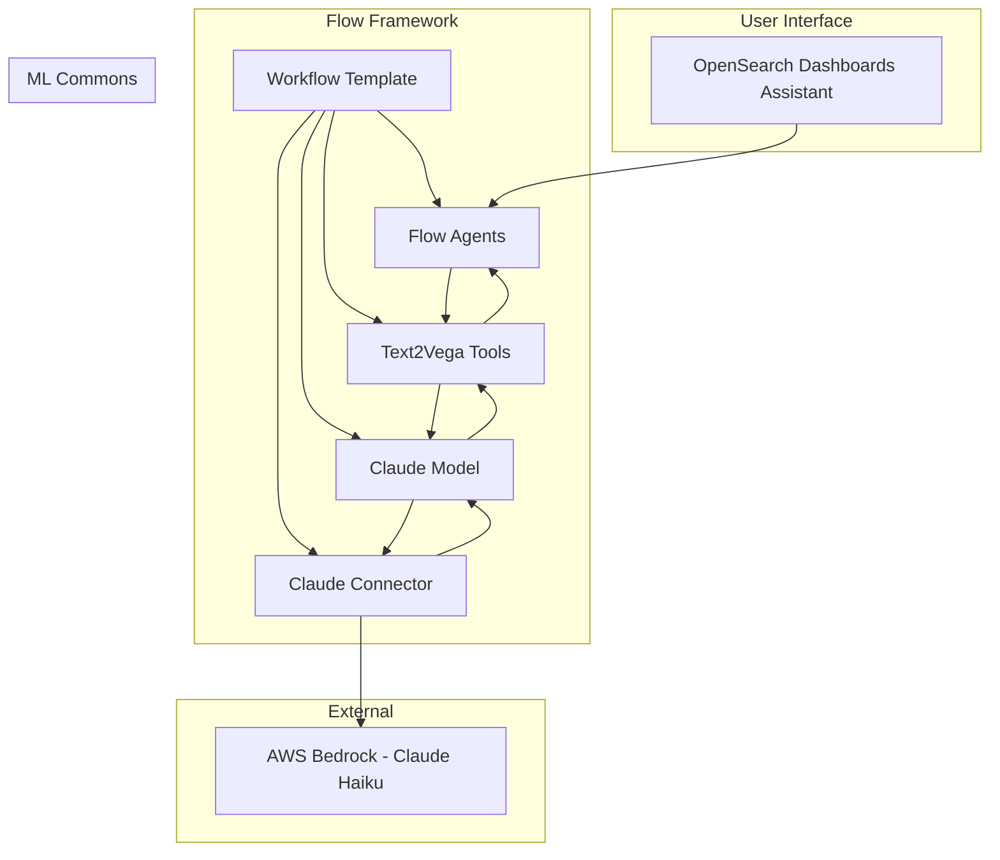
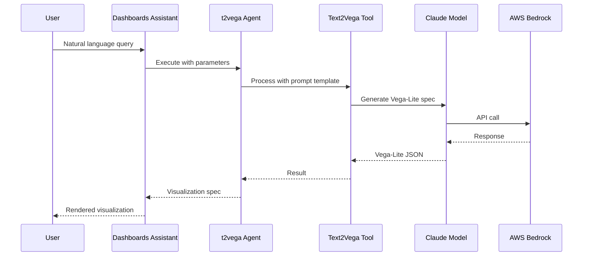

---
tags:
  - dashboards
  - ml
  - search
  - security
---

# Text-to-Visualization Templates

## Summary

Text-to-Visualization Templates are Flow Framework workflow templates that automate the setup of AI agents for generating visualizations from natural language in OpenSearch Dashboards. These templates configure the necessary connectors, models, tools, and agents to enable the Dashboards Assistant's text-to-visualization feature.

## Details

### Architecture



### Data Flow



### Components

| Component | Type | Description |
|-----------|------|-------------|
| Claude Connector | `create_connector` | AWS Bedrock connector for Claude Haiku model with SigV4 authentication |
| Claude Model | `register_remote_model` | Deployed remote model using the connector |
| Text2Vega Tool | `create_tool` (MLModelTool) | Rule-based tool with detailed Vega-Lite generation prompts |
| Instruction-Based Text2Vega Tool | `create_tool` (MLModelTool) | Example-based tool supporting user styling instructions |
| t2vega Agent | `register_agent` (flow) | Flow agent for rule-based visualization generation |
| t2vega Instruction-Based Agent | `register_agent` (flow) | Flow agent supporting custom visualization instructions |

### Configuration

| Setting | Description | Default |
|---------|-------------|---------|
| `create_connector.credential.access_key` | AWS access key | Required |
| `create_connector.credential.secret_key` | AWS secret key | Required |
| `create_connector.credential.session_token` | AWS session token | Required |
| `create_connector.parameters.endpoint` | Bedrock endpoint | bedrock-runtime.us-east-1.amazonaws.com |
| `create_connector.parameters.region` | AWS region | us-east-1 |
| `create_connector.parameters.max_tokens_to_sample` | Max response tokens | 8000 |
| `create_connector.parameters.temperature` | Model temperature | 0.0000 |

### Tool Prompt Types

The templates include two types of prompts for Vega-Lite generation:

#### Rule-Based Prompt (t2vega)
Uses entrance codes based on metric/dimension/date counts to select visualization types:
- Type 1: `<1, 1, 0>` → Bar chart
- Type 2: `<1, 2, 0>` → Grouped bar chart
- Type 3: `<3, 1, 0>` → Bubble chart
- Type 4: `<2, 1, 0>` → Scatter plot
- Type 5-9: Various temporal and layered charts
- Type 10: Table fallback

#### Instruction-Based Prompt (t2vega_instruction_based)
Uses example-based learning with common visualization patterns:
- Bar charts, histograms, pie charts
- Scatter plots, line charts, heatmaps
- Layered and faceted visualizations

### Usage Example

```yaml
# Enable text-to-visualization in opensearch_dashboards.yml
assistant.text2viz.enabled: true
```

```bash
# Create and provision the workflow
POST /_plugins/_flow_framework/workflow?provision=true
{
  "name": "Text to visualization agents",
  "description": "This template is to create all Agents required for text to visualization",
  "use_case": "REGISTER_AGENTS",
  "version": {
    "template": "1.0.0",
    "compatibility": ["2.18.0", "3.0.0"]
  },
  "workflows": {
    "provision": {
      "nodes": [...]
    }
  }
}

# Configure root agent
POST /.plugins-ml-config/_doc/os_text2vega
{
  "type": "os_chat_root_agent",
  "configuration": {
    "agent_id": "<AGENT_ID>"
  }
}
```

## Limitations

- Only supports Claude Haiku model via AWS Bedrock
- Requires valid AWS credentials with Bedrock access
- Text-to-visualization feature is experimental
- Generated Vega-Lite specs may require manual refinement for complex visualizations

## Change History

- **v3.0.0** (2025-05-06): Added text-to-visualization sample templates for Claude Haiku model

## Related Features
- [ML Commons](../ml-commons/agentic-memory.md)
- [Flow Framework (Dashboards)](../dashboards-flow-framework/ai-search-flows.md)

## References

### Documentation
- [Text to visualization documentation](https://docs.opensearch.org/3.0/dashboards/dashboards-assistant/text-to-visualization/)
- [Workflow templates documentation](https://docs.opensearch.org/3.0/automating-configurations/workflow-templates/)
- [Flow agents documentation](https://docs.opensearch.org/3.0/ml-commons-plugin/agents-tools/agents/flow/)
- [OpenSearch Assistant Toolkit](https://docs.opensearch.org/3.0/ml-commons-plugin/opensearch-assistant/)

### Pull Requests
| Version | PR | Description | Related Issue |
|---------|-----|-------------|---------------|
| v3.0.0 | [#936](https://github.com/opensearch-project/flow-framework/pull/936) | Add text to visualization agent template |   |
