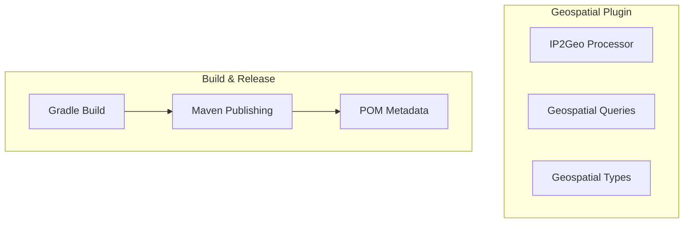

# Geospatial Plugin

## Summary

The OpenSearch Geospatial plugin provides geospatial data processing capabilities including the IP2Geo processor for enriching documents with geographic information based on IP addresses. The plugin supports various geospatial queries and data types for location-based search and analysis.

## Details

### Architecture



### Components

| Component | Description |
|-----------|-------------|
| IP2Geo Processor | Ingest processor that adds geographic information based on IP addresses |
| Geospatial Queries | Query DSL support for geographic and xy queries |
| Geospatial Types | Field types for storing geographic data |
| Geospatial Client | Java client library for geospatial operations |

### Installation

```bash
./bin/opensearch-plugin install opensearch-geospatial
```

### Maven Artifacts

The plugin publishes the following artifacts to Maven Central:

| Artifact | Group ID | Description |
|----------|----------|-------------|
| opensearch-geospatial | org.opensearch | Main plugin artifact |
| geospatial-client | org.opensearch | Java client library |
| geospatial | org.opensearch.plugin | Plugin distribution |

### Build Configuration

The plugin uses Gradle for building and Maven for artifact publishing. POM files include:
- Apache License 2.0
- OpenSearch developer information
- Project description and inception year (2021)

## Limitations

- IP2Geo processor requires external GeoIP data sources
- Search performance may be impacted when using IP2Geo processor due to index lookups

## Change History

- **v3.2.0** (2026-01-11): Upgraded Gradle to 8.14.3, enabled JDK 24 CI checks, updated Lombok plugin to 8.14
- **v3.0.0** (2025-05-06): Fixed Maven POM metadata to include license, description, and developer information for all published artifacts

## References

### Documentation
- [IP2Geo Documentation](https://docs.opensearch.org/3.0/ingest-pipelines/processors/ip2geo/): Official IP2Geo processor docs
- [Installing Plugins](https://docs.opensearch.org/3.0/install-and-configure/plugins/): Plugin installation guide
- [Geospatial Repository](https://github.com/opensearch-project/geospatial): Source code

### Pull Requests
| Version | PR | Description | Related Issue |
|---------|-----|-------------|---------------|
| v3.2.0 | [#776](https://github.com/opensearch-project/geospatial/pull/776) | Upgrade gradle to 8.14.3 and run CI checks with JDK24 |   |
| v3.0.0 | [#732](https://github.com/opensearch-project/geospatial/pull/732) | Persist licenses and developer fields in pom file | [#731](https://github.com/opensearch-project/geospatial/issues/731) |

### Issues (Design / RFC)
- [Issue #731](https://github.com/opensearch-project/geospatial/issues/731): Maven POM metadata bug report
