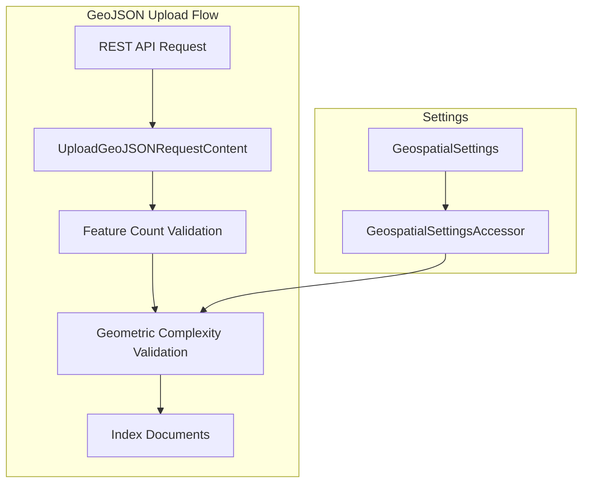

---
tags:
  - geospatial
---
# Geospatial Validation

## Summary

The geospatial plugin provides geometric complexity validation for GeoJSON uploads to prevent system instability. When uploading GeoJSON data via the `POST /_plugins/geospatial/geojson/_upload` endpoint, the plugin validates that geometries do not exceed configurable complexity limits, protecting against Out-of-Memory errors and node crashes.

## Details

### Architecture



### Configuration

All settings are dynamically configurable via the cluster settings API:

| Setting | Description | Default |
|---------|-------------|---------|
| `plugins.geospatial.geojson.max_coordinates_per_geo` | Maximum coordinates per geometry | 10,000 |
| `plugins.geospatial.geojson.max_holes_per_polygon` | Maximum holes in a Polygon | 1,000 |
| `plugins.geospatial.geojson.max_multi_gemoetries` | Maximum geometries in Multi* types | 100 |
| `plugins.geospatial.geojson.max_geometry_collection_nested_depth` | Maximum GeometryCollection nesting | 5 |

### Usage Example

Update validation limits dynamically:

```json
PUT /_cluster/settings
{
  "persistent": {
    "plugins.geospatial.geojson.max_coordinates_per_geo": 5000,
    "plugins.geospatial.geojson.max_holes_per_polygon": 500
  }
}
```

When validation fails, the API returns an error:

```json
{
  "error": {
    "type": "illegal_argument_exception",
    "reason": "LineString has 15000 coordinates, exceeds limit of 10000"
  },
  "status": 400
}
```

### Validated Geometry Types

| Geometry Type | Validation Rules |
|---------------|------------------|
| LineString | Coordinate count ≤ max_coordinates_per_geo |
| Polygon | Holes ≤ max_holes_per_polygon, each ring ≤ max_coordinates_per_geo |
| MultiLineString | Count ≤ max_multi_gemoetries, each LineString validated |
| MultiPolygon | Count ≤ max_multi_gemoetries, each Polygon validated |
| GeometryCollection | Count ≤ max_multi_gemoetries, depth ≤ max_geometry_collection_nested_depth |

## Limitations

- Validation only applies to the GeoJSON upload API (`/_plugins/geospatial/geojson/_upload`)
- Point and MultiPoint geometries are not validated
- Settings are node-scoped (apply to all nodes in the cluster)

## Change History

- **v3.5.0** (2026-01): Initial implementation of geometric complexity validation

## References

### Pull Requests

| Version | PR | Description |
|---------|-----|-------------|
| v3.5.0 | [#829](https://github.com/opensearch-project/geospatial/pull/829) | Add coordinate limit validation for lines, polygons, and holes |

### Issues

| Issue | Description |
|-------|-------------|
| [#828](https://github.com/opensearch-project/geospatial/issues/828) | Enforces geometric complexity limits to ensure system stability |
