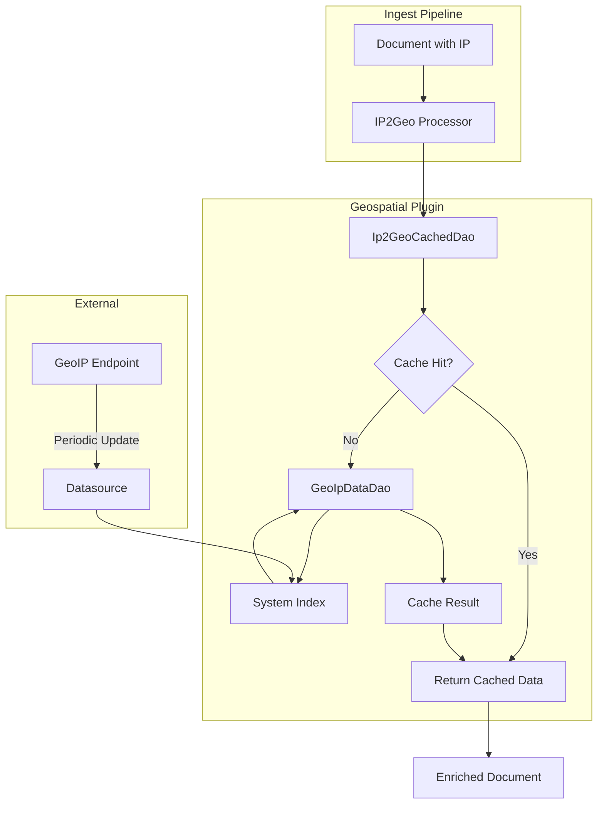

---
tags:
  - indexing
  - performance
---

# IP2Geo Processor

## Summary

The IP2Geo processor is an ingest processor that adds geographical location information to documents based on IPv4 or IPv6 addresses. It uses IP geolocation (GeoIP) data from external endpoints and maintains the mapping in system indexes for efficient lookup during data ingestion.

The processor is part of the `opensearch-geospatial` plugin and requires a datasource configuration that defines where to download GeoIP data and how frequently to update it.

## Details

### Architecture



### Data Flow


### Components

| Component | Description |
|-----------|-------------|
| `Ip2GeoProcessor` | Ingest processor that performs IP-to-geo conversion |
| `Ip2GeoCachedDao` | Caches datasource metadata and GeoIP lookup results |
| `GeoIpDataDao` | Retrieves GeoIP data from system indexes |
| `DatasourceDao` | Manages datasource configurations |
| `DatasourceMetadata` | Stores datasource state, index name, and expiration |

### Configuration

#### Cluster Settings

| Setting | Description | Default |
|---------|-------------|---------|
| `plugins.geospatial.ip2geo.datasource.endpoint` | Default endpoint for creating datasource | `https://geoip.maps.opensearch.org/v1/geolite2-city/manifest.json` |
| `plugins.geospatial.ip2geo.datasource.update_interval_in_days` | Default update interval | 3 |
| `plugins.geospatial.ip2geo.datasource.batch_size` | Max documents per bulk request during datasource creation | 10,000 |
| `plugins.geospatial.ip2geo.processor.cache_size` | Max cached results per node | 1,000 |
| `plugins.geospatial.ip2geo.timeout` | Timeout for endpoint and cluster responses | 30s |

#### Datasource Options

| Option | Required | Default | Description |
|--------|----------|---------|-------------|
| `endpoint` | No | GeoLite2 City manifest | URL to download GeoIP data |
| `update_interval_in_days` | No | 3 | Update frequency (minimum: 1) |

#### Processor Parameters

| Parameter | Required | Default | Description |
|-----------|----------|---------|-------------|
| `datasource` | Yes | - | Datasource name for geo lookup |
| `field` | Yes | - | Field containing IP address |
| `target_field` | No | `ip2geo` | Field for geo information |
| `properties` | No | All fields | Properties to add from datasource |
| `ignore_missing` | No | `false` | Ignore missing field |

### Usage Example

#### Create Datasource

```bash
PUT /_plugins/geospatial/ip2geo/datasource/my-datasource
{
    "endpoint": "https://geoip.maps.opensearch.org/v1/geolite2-city/manifest.json",
    "update_interval_in_days": 3
}
```

#### Create Pipeline

```bash
PUT /_ingest/pipeline/geoip-pipeline
{
    "description": "Add geo information from IP address",
    "processors": [
        {
            "ip2geo": {
                "field": "client_ip",
                "datasource": "my-datasource",
                "target_field": "geo",
                "properties": ["city_name", "country_name", "location"]
            }
        }
    ]
}
```

#### Ingest Document

```bash
PUT /my-index/_doc/1?pipeline=geoip-pipeline
{
    "client_ip": "172.0.0.1"
}
```

#### Result

```json
{
    "client_ip": "172.0.0.1",
    "geo": {
        "city_name": "Calera",
        "country_name": "United States",
        "location": "33.1063,-86.7583"
    }
}
```

### Available GeoIP Endpoints

OpenSearch provides GeoLite2 databases from MaxMind (CC BY-SA 4.0 license):

| Database | Endpoint |
|----------|----------|
| GeoLite2 City | `https://geoip.maps.opensearch.org/v1/geolite2-city/manifest.json` |
| GeoLite2 Country | `https://geoip.maps.opensearch.org/v1/geolite2-country/manifest.json` |
| GeoLite2 ASN | `https://geoip.maps.opensearch.org/v1/geolite2-asn/manifest.json` |

### Available Fields

Fields available depend on the datasource. GeoLite2 City provides:

- `country_iso_code`
- `country_name`
- `continent_name`
- `region_iso_code`
- `region_name`
- `city_name`
- `time_zone`
- `location`

## Limitations

- GeoIP data must be updated within 30 days or lookups return `"error":"ip2geo_data_expired"`
- Search performance is impacted as the processor queries system indexes
- For optimal performance, nodes should have both ingest and data roles to avoid internode calls
- Cache is shared across all IP2Geo processors on each node

## Change History

- **v3.3.0** (2026-01-11): Code modernization - replaced deprecated `URL(String)` constructor with `URI.create(String).toURL()` pattern for Java compatibility
- **v3.2.0** (2026-01-11): Security improvements - block HTTP redirects in datasource fetching, migrate to PluginSubject for system index access
- **v3.1.0** (2026-01-10): Bug fixes for cache synchronization - reset metadata on failure, add retry logic with cache refresh
- **v2.10.0**: Initial implementation of IP2Geo processor

## Related Features
- [Maps (Dashboards)](../dashboards-maps/maps-geospatial.md)

## References

### Documentation
- [IP2Geo Documentation](https://docs.opensearch.org/3.0/ingest-pipelines/processors/ip2geo/): Official processor documentation
- [MaxMind GeoLite2](https://dev.maxmind.com/geoip/geolite2-free-geolocation-data): GeoIP data source
- [Geospatial Plugin](https://github.com/opensearch-project/geospatial): Source repository

### Pull Requests
| Version | PR | Description | Related Issue |
|---------|-----|-------------|---------------|
| v3.3.0 | [#795](https://github.com/opensearch-project/geospatial/pull/795) | Remove deprecated URL(String) usage |   |
| v3.2.0 | [#782](https://github.com/opensearch-project/geospatial/pull/782) | Block redirect in IP2Geo and move validation to transport action |   |
| v3.2.0 | [#715](https://github.com/opensearch-project/geospatial/pull/715) | Replace ThreadContext.stashContext with pluginSubject.runAs | [#238](https://github.com/opensearch-project/geospatial/issues/238) |
| v3.1.0 | [#761](https://github.com/opensearch-project/geospatial/pull/761) | Reset datasource metadata on update failure |   |
| v3.1.0 | [#766](https://github.com/opensearch-project/geospatial/pull/766) | Cache refresh and retry on errors |   |
| v2.10.0 | - | Initial implementation |   |

### Issues (Design / RFC)
- [Issue #238](https://github.com/opensearch-project/opensearch-plugins/issues/238): META - Remove usages of ThreadContext.stashContext
