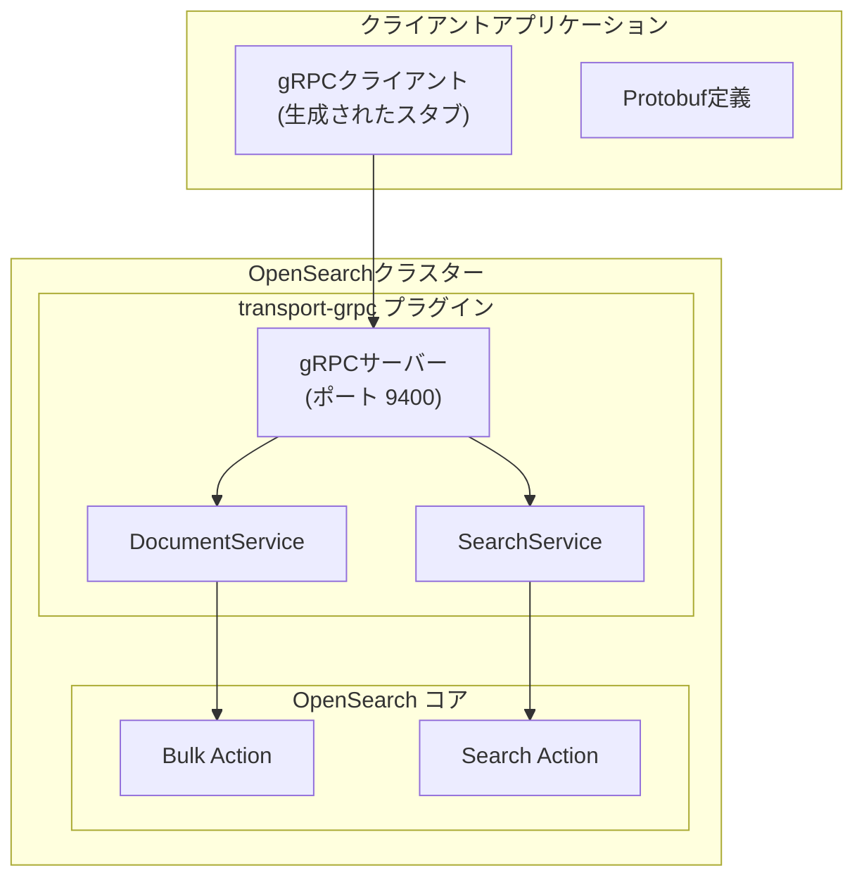
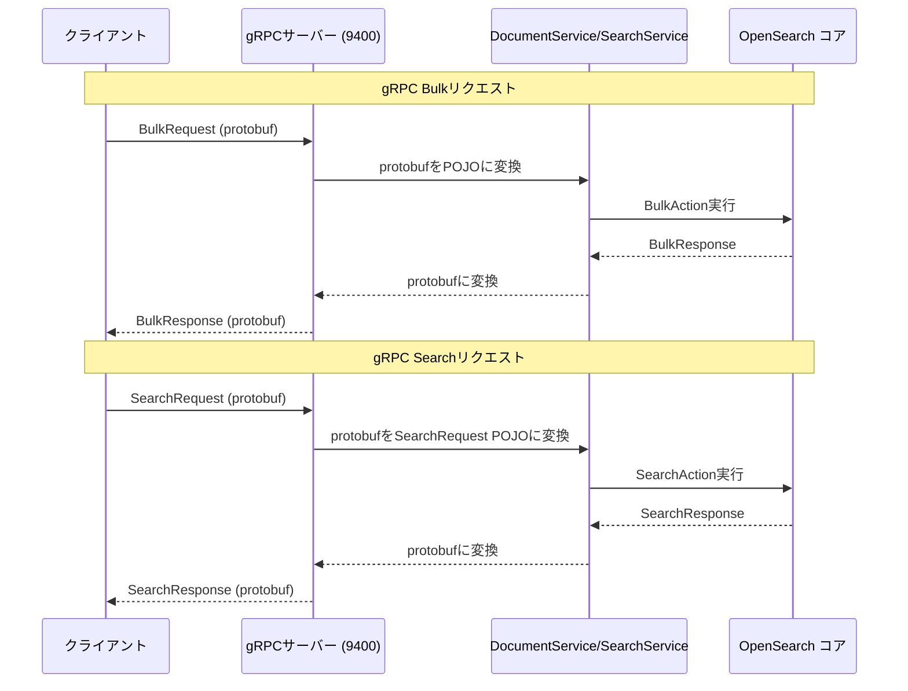

# gRPC/Protobuf トランスポート

## 概要

gRPC/Protobuf トランスポートは、OpenSearch v3.0.0で導入された実験的な高性能データ転送レイヤーです。gRPC上でProtocol Buffersを使用し、従来のHTTP/JSON APIに代わるバイナリインターフェースを提供します。

主なメリット:
- **パフォーマンス**: バイナリProtocol BuffersによりJSONと比較してシリアライゼーションのオーバーヘッドを削減
- **型安全性**: 強く型付けされたprotobufコントラクトによりAPI一貫性を保証
- **効率性**: gRPCのHTTP/2基盤により多重化とヘッダー圧縮を実現
- **互換性**: 既存のHTTP REST APIと機能的な互換性を維持

## 詳細

### アーキテクチャ



### データフロー



### コンポーネント

| コンポーネント | 説明 |
|---------------|------|
| `transport-grpc` プラグイン | gRPCサーバーを起動するOpenSearchプラグイン |
| gRPCサーバー | ポート9400（デフォルト）でgRPCリクエストを待ち受け |
| DocumentService | ドキュメント操作（Bulk、Index）を処理するgRPCサービス |
| SearchService | 検索操作を処理するgRPCサービス |
| opensearch-protobufs | OpenSearch API用の公開protobuf定義 |

### サポートされる操作

| サービス | 操作 | 説明 |
|---------|------|------|
| DocumentService | Bulk | バッチでのindex、create、update、delete操作 |
| SearchService | Search | MatchAll、Term、Terms、MatchNoneクエリによるクエリ実行 |

### 設定

| 設定項目 | 説明 | デフォルト値 |
|---------|------|-------------|
| `grpc.port` | gRPCサーバーのポート | `9400` |
| `tests.opensearch.aux.transport.types` | 実験的gRPCトランスポートを有効化 | N/A |

### 使用例

#### gRPCトランスポートプラグインの有効化

```bash
# gRPCプラグインを有効にしてOpenSearchを起動
./gradlew run -PinstalledPlugins="['transport-grpc']" \
  -Dtests.opensearch.aux.transport.types="[experimental-transport-grpc]"
```

#### gRPCによるBulkリクエスト

```bash
grpcurl -import-path /path/to/protobufs \
  -proto document_service.proto \
  -plaintext localhost:9400 \
  -d '{
    "index": "my_index",
    "request_body": [
      {
        "index": {"id": "1", "index": "my_index"},
        "doc": "eyJ0aXRsZSI6Ik9wZW5TZWFyY2ggQmFzaWNzIn0="
      },
      {
        "create": {"id": "2", "index": "my_index"},
        "doc": "eyJ0aXRsZSI6IkFkdmFuY2VkIFNlYXJjaCJ9"
      }
    ]
  }' \
  org.opensearch.protobufs.services.DocumentService/Bulk
```

#### gRPCによるSearchリクエスト

```bash
grpcurl -import-path /path/to/protobufs \
  -proto search_service.proto \
  -plaintext localhost:9400 \
  -d '{
    "request_body": {
      "query": {
        "match_all": {}
      },
      "size": 10
    }
  }' \
  org.opensearch.protobufs.services.SearchService/Search
```

#### gRPCによるTermクエリ

```bash
grpcurl -import-path /path/to/protobufs \
  -proto search_service.proto \
  -plaintext localhost:9400 \
  -d '{
    "index": "my_index",
    "request_body": {
      "query": {
        "term": {
          "title": {
            "value": {"string_value": "OpenSearch"},
            "case_insensitive": true
          }
        }
      }
    }
  }' \
  org.opensearch.protobufs.services.SearchService/Search
```

#### gRPCによるTermsクエリ

```bash
grpcurl -import-path /path/to/protobufs \
  -proto search_service.proto \
  -plaintext localhost:9400 \
  -d '{
    "request_body": {
      "query": {
        "terms": {
          "terms_lookup_field_string_array_map": {
            "author": {
              "string_array": {
                "string_array": ["Author1", "Author2"]
              }
            }
          }
        }
      }
    }
  }' \
  org.opensearch.protobufs.services.SearchService/Search
```

### Protobufの取得方法

protobuf定義は以下から取得可能です:
- **Mavenリポジトリ**: `org.opensearch:protobufs` (Sonatypeスナップショット)
- **GitHub**: [opensearch-project/opensearch-protobufs](https://github.com/opensearch-project/opensearch-protobufs)

### レスポンス形式

gRPCレスポンスはHTTP APIレスポンスをprotobufエンコーディングで反映します:

```json
{
  "bulkResponseBody": {
    "errors": false,
    "items": [
      {
        "index": {
          "id": {"string": "1"},
          "index": "my_index",
          "status": 201,
          "result": "created",
          "version": "1"
        }
      }
    ],
    "took": "87"
  }
}
```

## 制限事項

- **実験的機能**: この機能は実験的であり、将来のリリースで変更される可能性があります
- **プラグイン必須**: `transport-grpc`プラグインのインストールが必要
- **クエリサポート**: 初期リリースでは限定的なクエリタイプ（MatchAll、Term、Terms、MatchNone）のみサポート
- **アグリゲーション未対応**: gRPC Search APIではアグリゲーションとサジェストは未サポート
- **HTTPステータスコード**: gRPCレスポンスは現在HTTPステータスコードを使用（将来的にgRPCコードへの変換を予定）

## 関連PR

| バージョン | PR | 説明 |
|-----------|-----|------|
| v3.0.0 | [#16962](https://github.com/opensearch-project/OpenSearch/pull/16962) | Arrow Flight Serverブートストラップロジック |
| v3.0.0 | [#17727](https://github.com/opensearch-project/OpenSearch/pull/17727) | DocumentServiceとBulk gRPCエンドポイント v1 |
| v3.0.0 | [#17830](https://github.com/opensearch-project/OpenSearch/pull/17830) | SearchServiceとSearch gRPCエンドポイント v1 |
| v3.0.0 | [#17888](https://github.com/opensearch-project/OpenSearch/pull/17888) | Search gRPCエンドポイントでのTermsクエリサポート |

## 関連Issue

- [#16783](https://github.com/opensearch-project/OpenSearch/issues/16783): gRPC Search APIトラッキングIssue
- [#16784](https://github.com/opensearch-project/OpenSearch/issues/16784): gRPC Document APIトラッキングIssue

## 参考資料

- [gRPC APIs 概要](https://docs.opensearch.org/3.0/api-reference/grpc-apis/index/)
- [Bulk (gRPC)](https://docs.opensearch.org/3.0/api-reference/grpc-apis/bulk/)
- [Search (gRPC)](https://docs.opensearch.org/3.0/api-reference/grpc-apis/search/)
- [opensearch-protobufs リポジトリ](https://github.com/opensearch-project/opensearch-protobufs)
- [追加プラグイン](https://docs.opensearch.org/3.0/install-and-configure/additional-plugins/index/)

## 変更履歴

- **v3.0.0** (2026): DocumentService（Bulk）とSearchService（MatchAll、Term、Terms、MatchNoneクエリによるSearch）を含む初期実験的リリース
