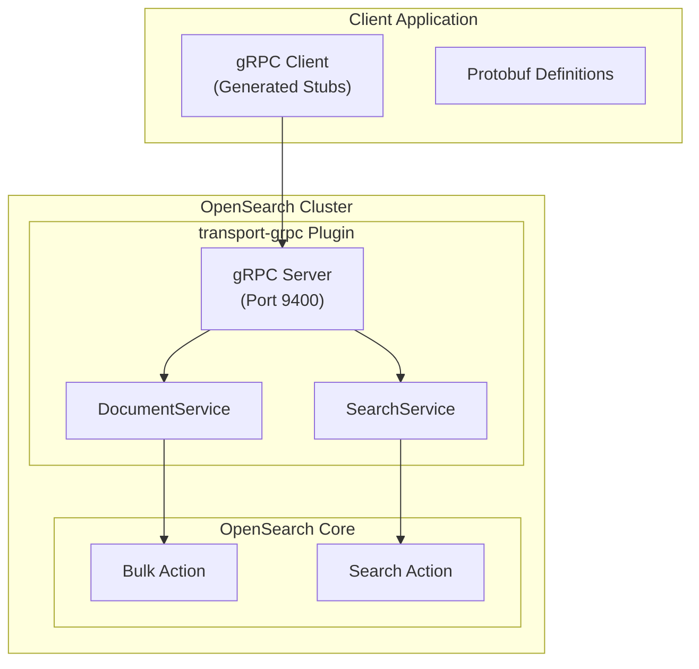
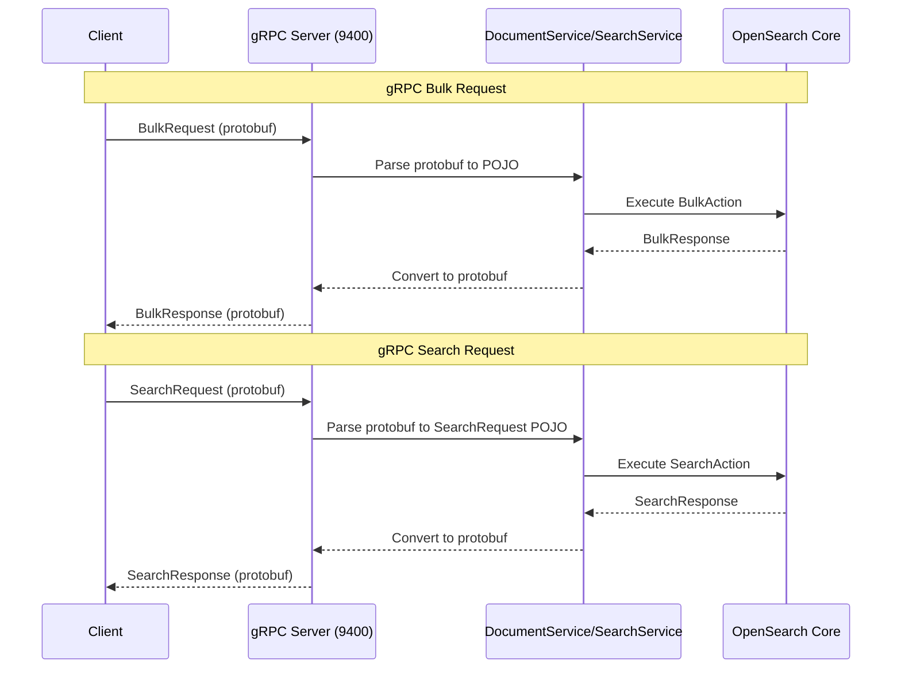

# gRPC/Protobuf Transport

## Summary

gRPC/Protobuf Transport introduces an experimental high-performance data transport layer for OpenSearch v3.0.0 using protocol buffers over gRPC. This feature provides a binary interface alternative to the traditional HTTP/JSON APIs, offering improved serialization efficiency and strongly-typed contracts.

Key benefits:
- **Performance**: Binary protocol buffers reduce serialization overhead compared to JSON
- **Type safety**: Strongly-typed protobuf contracts ensure API consistency
- **Efficiency**: gRPC's HTTP/2 foundation enables multiplexing and header compression
- **Parity**: Maintains functional parity with existing HTTP REST APIs

## Details

### Architecture



### Data Flow



### Components

| Component | Description |
|-----------|-------------|
| `transport-grpc` Plugin | OpenSearch plugin that bootstraps the gRPC server |
| gRPC Server | Listens on port 9400 (default) for gRPC requests |
| DocumentService | gRPC service handling document operations (Bulk, Index) |
| SearchService | gRPC service handling search operations |
| opensearch-protobufs | Published protobuf definitions for OpenSearch APIs |

### Supported Operations

| Service | Operation | Description |
|---------|-----------|-------------|
| DocumentService | Bulk | Batch index, create, update, delete operations |
| SearchService | Search | Query execution with MatchAll, Term, Terms, MatchNone queries |

### Configuration

| Setting | Description | Default |
|---------|-------------|---------|
| `grpc.port` | Port for gRPC server | `9400` |
| `tests.opensearch.aux.transport.types` | Enable experimental gRPC transport | N/A |

### Usage Examples

#### Enable gRPC Transport Plugin

```bash
# Start OpenSearch with gRPC plugin
./gradlew run -PinstalledPlugins="['transport-grpc']" \
  -Dtests.opensearch.aux.transport.types="[experimental-transport-grpc]"
```

#### Bulk Request via gRPC

```bash
grpcurl -import-path /path/to/protobufs \
  -proto document_service.proto \
  -plaintext localhost:9400 \
  -d '{
    "index": "my_index",
    "request_body": [
      {
        "index": {"id": "1", "index": "my_index"},
        "doc": "eyJ0aXRsZSI6Ik9wZW5TZWFyY2ggQmFzaWNzIn0="
      },
      {
        "create": {"id": "2", "index": "my_index"},
        "doc": "eyJ0aXRsZSI6IkFkdmFuY2VkIFNlYXJjaCJ9"
      }
    ]
  }' \
  org.opensearch.protobufs.services.DocumentService/Bulk
```

#### Search Request via gRPC

```bash
grpcurl -import-path /path/to/protobufs \
  -proto search_service.proto \
  -plaintext localhost:9400 \
  -d '{
    "request_body": {
      "query": {
        "match_all": {}
      },
      "size": 10
    }
  }' \
  org.opensearch.protobufs.services.SearchService/Search
```

#### Term Query via gRPC

```bash
grpcurl -import-path /path/to/protobufs \
  -proto search_service.proto \
  -plaintext localhost:9400 \
  -d '{
    "index": "my_index",
    "request_body": {
      "query": {
        "term": {
          "title": {
            "value": {"string_value": "OpenSearch"},
            "case_insensitive": true
          }
        }
      }
    }
  }' \
  org.opensearch.protobufs.services.SearchService/Search
```

#### Terms Query via gRPC

```bash
grpcurl -import-path /path/to/protobufs \
  -proto search_service.proto \
  -plaintext localhost:9400 \
  -d '{
    "request_body": {
      "query": {
        "terms": {
          "terms_lookup_field_string_array_map": {
            "author": {
              "string_array": {
                "string_array": ["Author1", "Author2"]
              }
            }
          }
        }
      }
    }
  }' \
  org.opensearch.protobufs.services.SearchService/Search
```

### Obtaining Protobufs

The protobuf definitions are available from:
- **Maven Repository**: `org.opensearch:protobufs` (Sonatype snapshots)
- **GitHub**: [opensearch-project/opensearch-protobufs](https://github.com/opensearch-project/opensearch-protobufs)

### Response Format

gRPC responses mirror HTTP API responses with protobuf encoding:

```json
{
  "bulkResponseBody": {
    "errors": false,
    "items": [
      {
        "index": {
          "id": {"string": "1"},
          "index": "my_index",
          "status": 201,
          "result": "created",
          "version": "1"
        }
      }
    ],
    "took": "87"
  }
}
```

## Limitations

- **Experimental**: Feature is experimental and may change in future releases
- **Plugin required**: Requires `transport-grpc` plugin installation
- **Query support**: Initial release supports limited query types (MatchAll, Term, Terms, MatchNone)
- **No aggregations**: Aggregations and suggest not yet supported in gRPC Search API
- **HTTP status codes**: gRPC responses currently use HTTP status codes (future work to convert to gRPC codes)

## Related PRs

| Version | PR | Description |
|---------|-----|-------------|
| v3.0.0 | [#16962](https://github.com/opensearch-project/OpenSearch/pull/16962) | Arrow Flight Server bootstrap logic |
| v3.0.0 | [#17727](https://github.com/opensearch-project/OpenSearch/pull/17727) | DocumentService and Bulk gRPC endpoint v1 |
| v3.0.0 | [#17830](https://github.com/opensearch-project/OpenSearch/pull/17830) | SearchService and Search gRPC endpoint v1 |
| v3.0.0 | [#17888](https://github.com/opensearch-project/OpenSearch/pull/17888) | Terms query support in Search gRPC endpoint |

## Related Issues

- [#16783](https://github.com/opensearch-project/OpenSearch/issues/16783): gRPC Search API tracking issue
- [#16784](https://github.com/opensearch-project/OpenSearch/issues/16784): gRPC Document API tracking issue

## References

- [gRPC APIs Overview](https://docs.opensearch.org/3.0/api-reference/grpc-apis/index/)
- [Bulk (gRPC)](https://docs.opensearch.org/3.0/api-reference/grpc-apis/bulk/)
- [Search (gRPC)](https://docs.opensearch.org/3.0/api-reference/grpc-apis/search/)
- [opensearch-protobufs Repository](https://github.com/opensearch-project/opensearch-protobufs)
- [Additional Plugins](https://docs.opensearch.org/3.0/install-and-configure/additional-plugins/index/)

## Change History

- **v3.0.0** (2026): Initial experimental release with DocumentService (Bulk) and SearchService (Search with MatchAll, Term, Terms, MatchNone queries)
