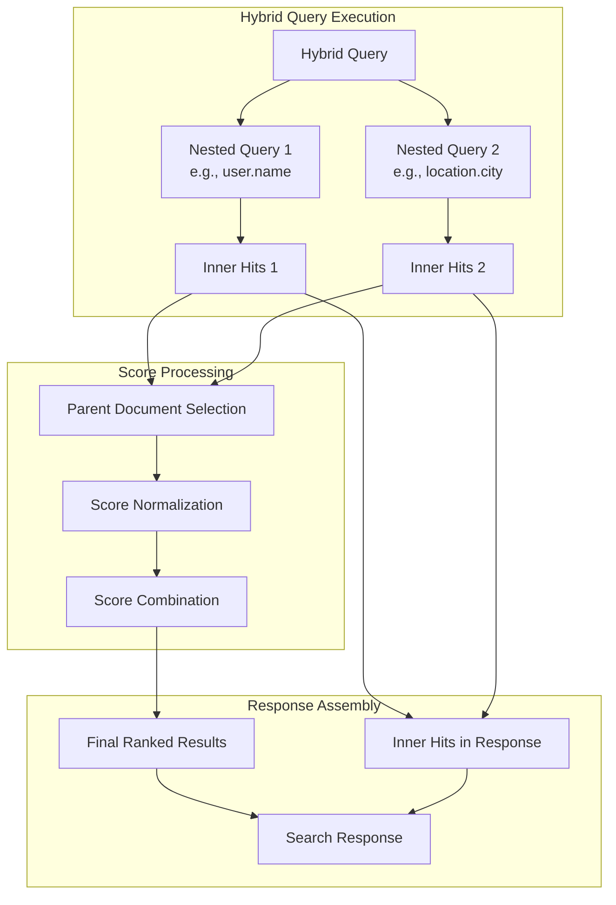
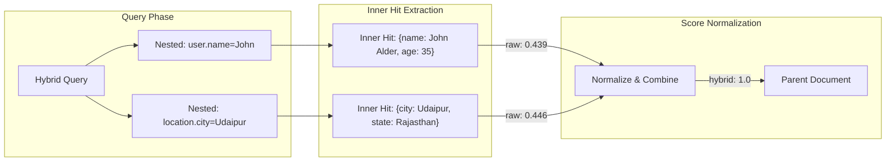

# Inner Hits Support for Hybrid Queries

## Summary

Inner hits support for hybrid queries enables retrieval of matching nested objects or child documents when running hybrid search. This feature provides detailed visibility into which specific parts of a document matched the query, essential for applications that use nested fields or parent-child relationships.

**Key Benefits:**
- Retrieve matching nested objects within hybrid query results
- Support for parent-child document relationships with `has_child` queries
- Full compatibility with sorting, pagination, and explain functionality
- Enables detailed debugging and understanding of hybrid search matches

## Details

### How Inner Hits Work with Hybrid Queries

During hybrid query execution, documents are scored and retrieved as follows:

1. Each subquery selects parent documents based on the relevance of their inner hits
2. The selected parent documents from all subqueries are combined, and their scores are normalized to produce a hybrid score
3. For each parent document, the relevant `inner_hits` are retrieved from the shards and included in the final response

The `inner_hits` section in the response shows the original (raw) scores before normalization, while parent documents show the final hybrid score.

### Architecture



### Data Flow



### Components

| Component | Description |
|-----------|-------------|
| `HybridQueryBuilder.extractInnerHitBuilders()` | Extracts inner hits from all sub-queries within the hybrid query |
| `InnerHitContextBuilder` | Builds context for inner hit retrieval from nested/child documents |
| `NestedQueryBuilder` | Supports `inner_hits` clause for nested field queries |
| `HasChildQueryBuilder` | Supports `inner_hits` clause for parent-child relationships |

### Configuration

Inner hits are configured within each subquery that supports them:

| Parameter | Description | Default |
|-----------|-------------|---------|
| `inner_hits.name` | Custom name for the inner hits field | Field path |
| `inner_hits.from` | Starting offset for pagination | 0 |
| `inner_hits.size` | Number of inner hits to return | 3 |
| `inner_hits.sort` | Sort criteria for inner hits | By score |

### Usage Example

Create an index with nested fields:

```json
PUT /my-nlp-index
{
  "mappings": {
    "properties": {
      "user": {
        "type": "nested",
        "properties": {
          "name": { "type": "text" },
          "age": { "type": "integer" }
        }
      },
      "location": {
        "type": "nested",
        "properties": {
          "city": { "type": "text" },
          "state": { "type": "text" }
        }
      }
    }
  }
}
```

Execute a hybrid query with inner hits:

```json
GET /my-nlp-index/_search?search_pipeline=nlp-search-pipeline
{
  "query": {
    "hybrid": {
      "queries": [
        {
          "nested": {
            "path": "user",
            "query": {
              "match": { "user.name": "John" }
            },
            "score_mode": "sum",
            "inner_hits": {}
          }
        },
        {
          "nested": {
            "path": "location",
            "query": {
              "match": { "location.city": "Udaipur" }
            },
            "inner_hits": {}
          }
        }
      ]
    }
  }
}
```

Response includes inner hits for each nested field:

```json
{
  "hits": [
    {
      "_id": "1",
      "_score": 1.0,
      "inner_hits": {
        "location": {
          "hits": {
            "max_score": 0.44583148,
            "hits": [
              {
                "_nested": { "field": "location", "offset": 1 },
                "_score": 0.44583148,
                "_source": { "city": "Udaipur", "state": "Rajasthan" }
              }
            ]
          }
        },
        "user": {
          "hits": {
            "max_score": 0.4394061,
            "hits": [
              {
                "_nested": { "field": "user", "offset": 0 },
                "_score": 0.4394061,
                "_source": { "name": "John Alder", "age": 35 }
              }
            ]
          }
        }
      }
    }
  ]
}
```

### Sorting Inner Hits

Apply sorting within the `inner_hits` clause:

```json
{
  "nested": {
    "path": "user",
    "query": { "match": { "user.name": "John" } },
    "inner_hits": {
      "sort": [{ "user.age": { "order": "desc" } }]
    }
  }
}
```

### Pagination with Inner Hits

Use `from` and `size` parameters for pagination:

```json
{
  "nested": {
    "path": "user",
    "query": { "match_all": {} },
    "inner_hits": {
      "from": 2,
      "size": 2
    }
  }
}
```

### Parent-Child Support

Inner hits also work with `has_child` queries:

```json
{
  "hybrid": {
    "queries": [
      {
        "has_child": {
          "type": "child",
          "query": { "match": { "text": "child" } },
          "inner_hits": {}
        }
      }
    ]
  }
}
```

## Limitations

- **Multiple inner hits on same path**: Defining multiple inner hits with the same path name will result in an error: `[inner_hits] already contains an entry for key [path]`
- **Score interpretation**: Inner hit scores are raw scores before normalization; parent document scores reflect the final hybrid score
- **Custom naming required**: When using multiple inner hits on different paths, consider using custom names to differentiate them in the response

## Related PRs

| Version | PR | Description |
|---------|-----|-------------|
| v3.0.0 | [neural-search#1253](https://github.com/opensearch-project/neural-search/pull/1253) | Inner hits support with hybrid query |

## References

- [Issue #718](https://github.com/opensearch-project/neural-search/issues/718): Original feature request for inner hits support
- [Inner Hits Documentation](https://docs.opensearch.org/3.0/search-plugins/searching-data/inner-hits/)
- [Hybrid Search Inner Hits Documentation](https://docs.opensearch.org/3.0/vector-search/ai-search/hybrid-search/inner-hits/)
- [Hybrid Query Documentation](https://docs.opensearch.org/3.0/query-dsl/compound/hybrid/)

## Change History

- **v3.0.0**: Initial implementation of inner hits support for hybrid queries
