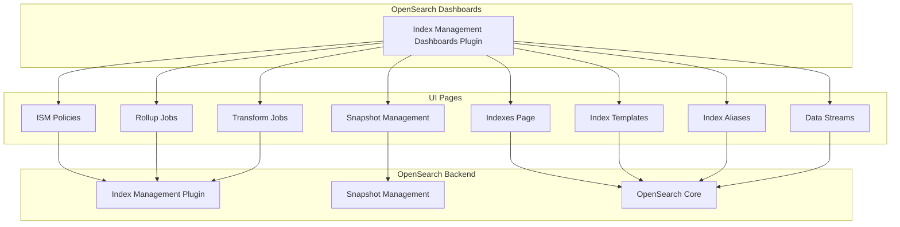

---
tags:
  - index-management-dashboards
---
# Index Management Dashboards

## Summary

Index Management Dashboards is an OpenSearch Dashboards plugin that provides a graphical user interface for managing indexes, policies, rollups, transforms, snapshots, and other index lifecycle operations. It enables users to create, monitor, and manage ISM policies, configure snapshot repositories, and perform index operations without using APIs directly.

## Details

### Architecture

### Components

| Component | Description |
|-----------|-------------|
| Indexes Page | View and manage indexes, apply policies, shrink, force merge |
| ISM Policies | Create and manage Index State Management policies |
| Rollup Jobs | Configure and monitor rollup jobs for data aggregation |
| Transform Jobs | Configure and monitor transform jobs for data transformation |
| Snapshot Management | Manage snapshots, policies, and repositories |
| Index Templates | Create and manage index templates |
| Composable Templates | Create and manage composable index templates |
| Index Aliases | Create and manage index aliases |
| Data Streams | View and manage data streams |
| Notification Settings | Configure notification channels for ISM |

### Features

| Feature | Description |
|---------|-------------|
| Policy Wizard | Visual wizard for creating ISM policies |
| Rollup Configuration | UI for configuring rollup dimensions and metrics |
| Transform Configuration | UI for configuring transform aggregations |
| Snapshot Scheduling | Schedule automatic snapshots with SM policies |
| Multi-Data Source Support | Connect to multiple OpenSearch clusters |
| Notification Integration | Send notifications on policy state changes |

### UI Design Guidelines (v2.17.0+)

| Element | Standard |
|---------|----------|
| Typography | Small font size for paragraph text |
| Headers | H1 on main pages, H2 on modals/flyouts |
| Icons | Plus for create, PlusInCircle for add |
| Buttons | Small size, compressed action bars |
| Layout | EuiPanel for consistent padding |

### Usage Example

#### Accessing Index Management

1. Open OpenSearch Dashboards
2. Navigate to **OpenSearch Plugins** → **Index Management**
3. Select the desired page from the left navigation:
   - **Indices**: View and manage indexes
   - **Policy managed indices**: View indexes with ISM policies
   - **Index policies**: Create and manage ISM policies
   - **Index templates**: Manage index templates
   - **Notification settings**: Configure notifications
   - **Rollup jobs**: Manage rollup jobs
   - **Transform jobs**: Manage transform jobs
   - **Index snapshots**: View and restore snapshots
   - **Snapshot policies**: Create snapshot schedules
   - **Snapshot repositories**: Configure repositories

## Limitations

- Requires Index Management backend plugin to be installed
- Some operations require appropriate security permissions
- Multi-Data Source support requires MDS to be enabled in Dashboards

## Change History

- **v2.19.0** (2025-02-18): Performance improvement using Cat Snapshot API for repository page, bug fixes for snapshot restore alias handling, snapshot policy schedule editing, and index expression display
- **v2.17.0** (2024-09-17): Comprehensive UI/UX improvements implementing "Look and Feel" and "Fit and Finish" design guidelines across all pages, navigation redesign, notification modal, MDS support for Shrink page, history navigation bug fixes
- **v2.16.0** (2024-08-06): Fixed data source persistence across sub-applications when new navigation UX is enabled

## References

### Documentation
- [Index Management Documentation](https://docs.opensearch.org/2.17/dashboards/im-dashboards/index/)
- [Snapshot Management Documentation](https://docs.opensearch.org/2.17/dashboards/sm-dashboards/)
- [Index State Management Documentation](https://docs.opensearch.org/2.17/im-plugin/ism/index/)
- [Index Management Dashboards Plugin Repository](https://github.com/opensearch-project/index-management-dashboards-plugin)

### Pull Requests
| Version | PR | Description | Related Issue |
|---------|-----|-------------|---------------|
| v2.19.0 | [#1242](https://github.com/opensearch-project/index-management-dashboards-plugin/pull/1242) | Use Cat Snapshot API for repository snapshot count | Performance |
| v2.19.0 | [#1193](https://github.com/opensearch-project/index-management-dashboards-plugin/pull/1193) | Fix snapshot restore alias handling | Bug fix |
| v2.19.0 | [#1213](https://github.com/opensearch-project/index-management-dashboards-plugin/pull/1213) | Fix snapshot restore default alias value | Bug fix |
| v2.19.0 | [#1207](https://github.com/opensearch-project/index-management-dashboards-plugin/pull/1207) | Fix snapshot policy schedule editing and index expression display | [#947](https://github.com/opensearch-project/index-management-dashboards-plugin/issues/947) |
| v2.17.0 | [#1106](https://github.com/opensearch-project/index-management-dashboards-plugin/pull/1106) | Navigation redesign |   |
| v2.17.0 | [#1123](https://github.com/opensearch-project/index-management-dashboards-plugin/pull/1123) | ISM pages look and feel |   |
| v2.17.0 | [#1132](https://github.com/opensearch-project/index-management-dashboards-plugin/pull/1132) | Snapshots, datastreams, rollups styling |   |
| v2.17.0 | [#1141](https://github.com/opensearch-project/index-management-dashboards-plugin/pull/1141) | MDS support in Shrink page |   |
| v2.17.0 | [#1143](https://github.com/opensearch-project/index-management-dashboards-plugin/pull/1143) | Notification modal on Indexes page |   |
| v2.17.0 | [#1148](https://github.com/opensearch-project/index-management-dashboards-plugin/pull/1148) | Snapshot Management consistency |   |
| v2.17.0 | [#1150](https://github.com/opensearch-project/index-management-dashboards-plugin/pull/1150) | ISM policy & Composable template styling |   |
| v2.17.0 | [#1153](https://github.com/opensearch-project/index-management-dashboards-plugin/pull/1153) | DataStreams and Rollups styling |   |
| v2.17.0 | [#1154](https://github.com/opensearch-project/index-management-dashboards-plugin/pull/1154) | Indexes and Transform styling |   |
| v2.17.0 | [#1155](https://github.com/opensearch-project/index-management-dashboards-plugin/pull/1155) | Aliases, Templates styling |   |
| v2.17.0 | [#1157](https://github.com/opensearch-project/index-management-dashboards-plugin/pull/1157) | Snapshot Management pages styling |   |
| v2.17.0 | [#1164](https://github.com/opensearch-project/index-management-dashboards-plugin/pull/1164) | Job count in titles |   |
| v2.17.0 | [#1166](https://github.com/opensearch-project/index-management-dashboards-plugin/pull/1166) | History navigation bug fixes |   |
| v2.16.0 | [#1088](https://github.com/opensearch-project/index-management-dashboards-plugin/pull/1088) | Data source persistence across sub-applications | [OpenSearch-Dashboards#7027](https://github.com/opensearch-project/OpenSearch-Dashboards/issues/7027) |
