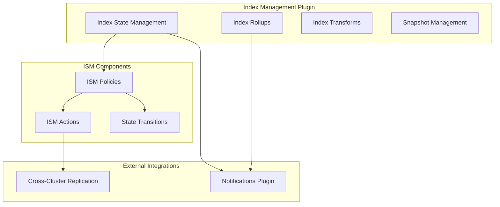
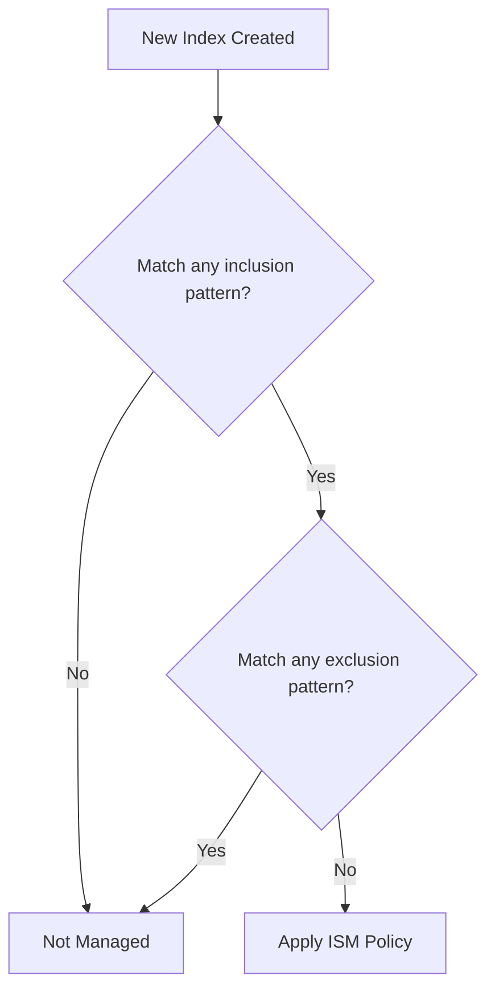

---
tags:
  - index-management
---
# Index Management

## Summary

Index Management is an OpenSearch plugin that automates periodic index operations such as rollovers, deletions, and state transitions. It includes Index State Management (ISM) for policy-based index lifecycle management, Index Rollups for data aggregation, and Index Transforms for data transformation.

## Details

### Architecture



### Components

| Component | Description |
|-----------|-------------|
| Index State Management (ISM) | Automates index lifecycle operations based on policies |
| Index Rollups | Aggregates data from source indexes into rollup indexes |
| Index Transforms | Transforms data from source indexes into new formats |
| Snapshot Management | Automates snapshot creation and deletion |

### ISM Actions

| Action | Description |
|--------|-------------|
| `rollover` | Rolls over an index alias to a new index |
| `delete` | Deletes an index |
| `force_merge` | Force merges index segments |
| `read_only` | Sets index to read-only |
| `replica_count` | Changes replica count |
| `close` | Closes an index |
| `open` | Opens a closed index |
| `snapshot` | Takes a snapshot of an index |
| `shrink` | Shrinks an index |
| `allocation` | Changes index allocation settings |
| `index_priority` | Sets index priority |
| `notification` | Sends notifications |
| `unfollow` | Stops cross-cluster replication (v3.0.0+) |
| `search_only` | Scales down writer shards for Reader/Writer Separation (v3.5.0+) |

### ISM Transition Conditions

| Condition | Description | Since |
|-----------|-------------|-------|
| `min_index_age` | Minimum age of the index since creation | v1.0.0 |
| `min_rollover_age` | Minimum age after rollover | v1.0.0 |
| `min_doc_count` | Minimum document count | v1.0.0 |
| `min_size` | Minimum total primary shard size | v1.0.0 |
| `cron` | Cron expression for scheduled transitions | v1.0.0 |
| `no_alias` | Transition based on alias presence (true=no aliases, false=has aliases) | v3.2.0 |
| `min_state_age` | Minimum time spent in current ISM state | v3.2.0 |

### ISM Template Exclusion Patterns (v3.4.0+)

ISM templates support exclusion patterns prefixed with `-` in the `index_patterns` array. This allows users to define broad inclusion patterns while excluding specific indices from automatic policy management.

**Pattern Matching Rules:**
- Patterns without `-` prefix are inclusion patterns
- Patterns with `-` prefix are exclusion patterns
- An index must match at least one inclusion pattern AND not match any exclusion pattern
- At least one inclusion pattern is required (all-exclusion patterns are rejected)



### Rollup Metrics

| Metric | Description | Since |
|--------|-------------|-------|
| `avg` | Average value | v1.0.0 |
| `sum` | Sum of values | v1.0.0 |
| `min` | Minimum value | v1.0.0 |
| `max` | Maximum value | v1.0.0 |
| `value_count` | Count of values | v1.0.0 |
| `cardinality` | Approximate distinct count using HLL++ sketches | v3.5.0 |

### Multi-Tier Rollups (v3.5.0+)

ISM supports hierarchical data aggregations where rollup indices can serve as source indices for subsequent rollup operations. This enables progressive data summarization (e.g., raw data → 1-minute → 5-minute → 10-minute intervals).


Key features:
- **source_index field**: Optional field in ISMRollup schema for explicit source specification
- **Template variables**: Supports `{{ctx.index}}` and `{{ctx.source_index}}` for dynamic naming
- **Interval validation**: Target intervals must be exact multiples of source intervals
- **Cardinality merging**: HLL++ sketches can be merged across rollup tiers

### Configuration

| Setting | Description | Default |
|---------|-------------|---------|
| `plugins.index_state_management.enabled` | Enable/disable ISM | `true` |
| `plugins.index_state_management.job_interval` | ISM job execution interval | `5` (minutes) |
| `plugins.index_state_management.history.enabled` | Enable ISM history | `true` |
| `plugins.index_state_management.history.max_docs` | Max history documents | `2500000` |
| `plugins.index_state_management.history.max_age` | Max history age | `24h` |
| `plugins.rollup.search.search_source_indices` | Allow searching non-rollup and rollup indices together (v2.18.0+) | `false` |

### Usage Example

#### ISM Policy with Exclusion Patterns (v3.4.0+)

```json
PUT _plugins/_ism/policies/log_lifecycle
{
  "policy": {
    "description": "Manage production logs, exclude test and debug",
    "default_state": "hot",
    "states": [
      {
        "name": "hot",
        "transitions": [
          {
            "state_name": "warm",
            "conditions": { "min_index_age": "7d" }
          }
        ]
      },
      {
        "name": "warm",
        "actions": [{ "read_only": {} }],
        "transitions": [
          {
            "state_name": "delete",
            "conditions": { "min_index_age": "30d" }
          }
        ]
      },
      {
        "name": "delete",
        "actions": [{ "delete": {} }]
      }
    ],
    "ism_template": {
      "index_patterns": ["logs-*", "-logs-test-*", "-logs-*-debug-*"],
      "priority": 100
    }
  }
}
```

This configuration will:
- ✅ Manage: `logs-production-001`, `logs-staging-001`
- ❌ Exclude: `logs-test-001`, `logs-production-debug-001`

#### ISM Policy with Alias-Based and State-Age Transitions (v3.2.0+)

```json
PUT _plugins/_ism/policies/alias_aware_lifecycle
{
  "policy": {
    "description": "Lifecycle policy with alias-aware transitions",
    "default_state": "hot",
    "states": [
      {
        "name": "hot",
        "transitions": [
          {
            "state_name": "archive",
            "conditions": {
              "no_alias": true
            }
          }
        ]
      },
      {
        "name": "archive",
        "transitions": [
          {
            "state_name": "delete",
            "conditions": {
              "min_state_age": "7d"
            }
          }
        ]
      },
      {
        "name": "delete",
        "actions": [{ "delete": {} }]
      }
    ]
  }
}
```

#### ISM Policy with Unfollow Action

```json
PUT _plugins/_ism/policies/ccr_lifecycle
{
  "policy": {
    "description": "Lifecycle policy for CCR follower indexes",
    "default_state": "following",
    "states": [
      {
        "name": "following",
        "transitions": [
          {
            "state_name": "stop_replication",
            "conditions": {
              "min_index_age": "30d"
            }
          }
        ]
      },
      {
        "name": "stop_replication",
        "actions": [
          {
            "unfollow": {}
          }
        ],
        "transitions": [
          {
            "state_name": "read_only"
          }
        ]
      },
      {
        "name": "read_only",
        "actions": [
          {
            "read_only": {}
          }
        ]
      }
    ]
  }
}
```

#### Rollup Job with Target Index Settings

```json
PUT _plugins/_rollup/jobs/sample_rollup
{
  "rollup": {
    "source_index": "sample-data-*",
    "target_index": "sample-rollup",
    "target_index_settings": {
      "number_of_shards": 1,
      "number_of_replicas": 1
    },
    "schedule": {
      "interval": {
        "start_time": 1602100553,
        "period": 1,
        "unit": "Hours"
      }
    },
    "description": "Sample rollup job",
    "enabled": true,
    "page_size": 1000,
    "dimensions": [
      {
        "date_histogram": {
          "source_field": "timestamp",
          "fixed_interval": "1h",
          "timezone": "UTC"
        }
      }
    ],
    "metrics": [
      {
        "source_field": "value",
        "metrics": [
          {"avg": {}},
          {"sum": {}},
          {"max": {}},
          {"min": {}},
          {"value_count": {}}
        ]
      }
    ]
  }
}
```

## Limitations

- ISM policies cannot be applied to system indexes
- The `unfollow` action requires the cross-cluster-replication plugin
- Rollup target index settings only apply when creating a new target index
- ISM jobs do not run when cluster state is red
- Multi-tier rollups require matching `precision_threshold` values across all tiers for cardinality metrics
- The `search_only` action requires Reader/Writer Separation to be enabled on the cluster

## Change History

- **v3.5.0** (2026-02-11): Added multi-tier rollups support (rollup indices as source for subsequent rollups), cardinality metric support using HLL++ sketches, `search_only` ISM action for Reader/Writer Separation, `rename_pattern` parameter for `convert_index_to_remote` action, CI improvements
- **v3.4.0** (2026-01-11): Added ISM template exclusion pattern support using `-` prefix, fixed ISM policy rebinding after removal (auto_manage setting check), fixed SM deletion snapshot pattern parsing for comma-separated values, fixed ExplainSMPolicy serialization for null creation field, fixed rollup start/stop test race conditions
- **v3.3.0** (2026-01-11): Fixed rollup aggregation reduction bug when searching rollup and raw indices together by using ScriptedAvg class, build fixes for upstream OpenSearch changes, dependency updates
- **v3.2.0** (2026-01-10): Added `no_alias` and `min_state_age` transition conditions for ISM, registered ISM history index as System Index descriptor, fixed integration tests and lint errors
- **v3.1.0** (2026-01-10): Fixed false positive notifications in Snapshot Management by suppressing user notifications for internal VersionConflictEngineException errors
- **v3.0.0** (2025-05-06): Added ISM unfollow action for CCR, rollup target index settings, CVE fixes, Java Agent migration
- **v2.18.0** (2024-11-05): Added `plugins.rollup.search.search_source_indices` setting to allow searching non-rollup and rollup indices together, UX improvements (refresh buttons, section header styling), transform API input validation, fixed snapshot status detection, fixed snapshot policy button reload, fixed data source initialization
- **v2.17.0** (2024-09-17): Performance optimization for skip execution check using cluster service instead of NodesInfoRequest, security integration test fixes
- **v2.16.0** (2024-08-06): Build fixes - added SPI Maven publishing support, updated GitHub Actions to Java 21, fixed CVE-2024-4068 (braces package) in dashboards plugin


## References

### Documentation
- [Index State Management Documentation](https://docs.opensearch.org/3.0/im-plugin/ism/index/)
- [ISM Policies Documentation](https://docs.opensearch.org/3.0/im-plugin/ism/policies/)
- [Index Rollups Documentation](https://docs.opensearch.org/3.0/im-plugin/index-rollups/index/)
- [Index Transforms Documentation](https://docs.opensearch.org/3.0/im-plugin/index-transforms/index/)
- [Index Management Security](https://docs.opensearch.org/3.0/im-plugin/security/)

### Pull Requests
| Version | PR | Description | Related Issue |
|---------|-----|-------------|---------------|
| v3.5.0 | [#1533](https://github.com/opensearch-project/index-management/pull/1533) | Adding support for multi-tier rollups in ISM | [#1490](https://github.com/opensearch-project/index-management/issues/1490) |
| v3.5.0 | [#1567](https://github.com/opensearch-project/index-management/pull/1567) | Adding Cardinality as supported metric for Rollups | [#1493](https://github.com/opensearch-project/index-management/issues/1493) |
| v3.5.0 | [#1560](https://github.com/opensearch-project/index-management/pull/1560) | Add search_only ISM action for Reader/Writer Separation | [#1531](https://github.com/opensearch-project/index-management/issues/1531) |
| v3.5.0 | [#1568](https://github.com/opensearch-project/index-management/pull/1568) | Add optional rename_pattern parameter to convert_index_to_remote action | [#1426](https://github.com/opensearch-project/index-management/issues/1426) |
| v3.5.0 | [#1573](https://github.com/opensearch-project/index-management/pull/1573) | Change min version for supporting source index in ISM rollups to 3.5.0 | |
| v3.5.0 | [#1572](https://github.com/opensearch-project/index-management/pull/1572) | Improve CI speed by refactoring RollupActionIT | |
| v3.4.0 | [#1509](https://github.com/opensearch-project/index-management/pull/1509) | Supporting Exclusion pattern in index pattern in ISM | [#375](https://github.com/opensearch-project/index-management/issues/375) |
| v3.4.0 | [#1529](https://github.com/opensearch-project/index-management/pull/1529) | Fix race condition in rollup start/stop tests | [#90](https://github.com/opensearch-project/index-management/issues/90) |
| v3.4.0 | [#1525](https://github.com/opensearch-project/index-management/pull/1525) | Fix ISM policy rebinding after removal | [#1524](https://github.com/opensearch-project/index-management/issues/1524) |
| v3.4.0 | [#1507](https://github.com/opensearch-project/index-management/pull/1507) | Fix ExplainSMPolicy serialization for null creation | [#1506](https://github.com/opensearch-project/index-management/issues/1506) |
| v3.4.0 | [#1503](https://github.com/opensearch-project/index-management/pull/1503) | Fix snapshot pattern parsing in SM deletion | [#1502](https://github.com/opensearch-project/index-management/issues/1502) |
| v3.3.0 | [#1460](https://github.com/opensearch-project/index-management/pull/1460) | Using Scripted Avg Class in AvgAggregationBuilder for rollup aggregation fix |   |
| v3.3.0 | [#1491](https://github.com/opensearch-project/index-management/pull/1491) | Fix the build for upstream OpenSearch changes |   |
| v3.3.0 | [#1473](https://github.com/opensearch-project/index-management/pull/1473) | Dependabot: bump 1password/load-secrets-action from 2 to 3 |   |
| v3.2.0 | [#1440](https://github.com/opensearch-project/index-management/pull/1440) | Support for no_alias and min_state_age in ISM Transitions | [#1439](https://github.com/opensearch-project/index-management/issues/1439) |
| v3.2.0 | [#1444](https://github.com/opensearch-project/index-management/pull/1444) | Add history index pattern to System Index descriptors |   |
| v3.2.0 | [#1442](https://github.com/opensearch-project/index-management/pull/1442) | Fix Integration test and lint errors | [#1441](https://github.com/opensearch-project/index-management/issues/1441) |
| v3.1.0 | [#1413](https://github.com/opensearch-project/index-management/pull/1413) | Removed unnecessary user notifications for version conflict exception | [#1371](https://github.com/opensearch-project/index-management/issues/1371) |
| v3.0.0 | [#1198](https://github.com/opensearch-project/index-management/pull/1198) | Adding unfollow action in ISM for CCR |   |
| v3.0.0 | [#1377](https://github.com/opensearch-project/index-management/pull/1377) | Target Index Settings for rollup | [#1376](https://github.com/opensearch-project/index-management/issues/1376) |
| v3.0.0 | [#1388](https://github.com/opensearch-project/index-management/pull/1388) | CVE fix: logback-core upgrade |   |
| v3.0.0 | [#1404](https://github.com/opensearch-project/index-management/pull/1404) | Java Agent migration build fix |   |
| v2.18.0 | [#1268](https://github.com/opensearch-project/index-management/pull/1268) | Allow non-rollup and rollup indices to be searched together | [#1213](https://github.com/opensearch-project/index-management/issues/1213) |
| v2.18.0 | [#1179](https://github.com/opensearch-project/index-management-dashboards-plugin/pull/1179) | Fit and Finish UX changes |   |
| v2.18.0 | [#1182](https://github.com/opensearch-project/index-management-dashboards-plugin/pull/1182) | Replace EuiText with EuiTitle for section headers |   |
| v2.18.0 | [#1191](https://github.com/opensearch-project/index-management-dashboards-plugin/pull/1191) | Setting validation for transform APIs |   |
| v2.18.0 | [#1257](https://github.com/opensearch-project/index-management/pull/1257) | Fixing snapshot bug - partial snapshot detection |   |
| v2.18.0 | [#1187](https://github.com/opensearch-project/index-management-dashboards-plugin/pull/1187) | Create snapshot policy button reload fix |   |
| v2.18.0 | [#1189](https://github.com/opensearch-project/index-management-dashboards-plugin/pull/1189) | Data source initialization fix |   |
| v2.17.0 | [#1219](https://github.com/opensearch-project/index-management/pull/1219) | Skip execution optimization using cluster service | [#1075](https://github.com/opensearch-project/index-management/issues/1075) |
| v2.17.0 | [#1222](https://github.com/opensearch-project/index-management/pull/1222) | Security integration test fixes |   |
| v2.16.0 | [#1207](https://github.com/opensearch-project/index-management/pull/1207) | Add publish in spi build.gradle |   |
| v2.16.0 | [#1208](https://github.com/opensearch-project/index-management/pull/1208) | Fix github action |   |
| v2.16.0 | [#1091](https://github.com/opensearch-project/index-management-dashboards-plugin/pull/1091) | Bumped up braces package version to address CVE-2024-4068 |   |

### Issues (Design / RFC)
- [Issue #1490](https://github.com/opensearch-project/index-management/issues/1490): Feature request for multi-tier rollups
- [Issue #1493](https://github.com/opensearch-project/index-management/issues/1493): Feature request for cardinality metric in rollups
- [Issue #1531](https://github.com/opensearch-project/index-management/issues/1531): Feature request for search_only ISM action
- [Issue #1426](https://github.com/opensearch-project/index-management/issues/1426): Feature request for rename_pattern in convert_index_to_remote
- [Issue #375](https://github.com/opensearch-project/index-management/issues/375): Feature request for ISM template exclusion patterns
- [Issue #1439](https://github.com/opensearch-project/index-management/issues/1439): Feature request for no_alias and min_state_age
- [Issue #726](https://github.com/opensearch-project/index-management/issues/726): Unfollow action feature request
- [Issue #1075](https://github.com/opensearch-project/index-management/issues/1075): ISM listener blocking Cluster Applier thread
- [Issue #1213](https://github.com/opensearch-project/index-management/issues/1213): Feature request for mixed rollup/non-rollup search
- [Issue #1371](https://github.com/opensearch-project/index-management/issues/1371): False positive notifications in Snapshot Management
