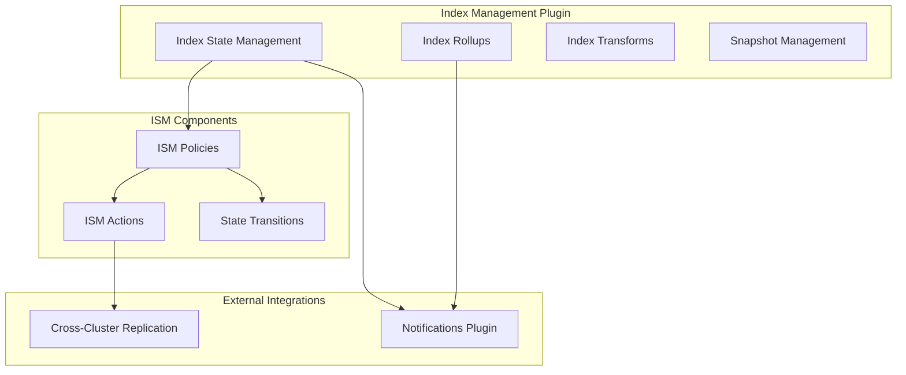

# Index Management

## Summary

Index Management is an OpenSearch plugin that automates periodic index operations such as rollovers, deletions, and state transitions. It includes Index State Management (ISM) for policy-based index lifecycle management, Index Rollups for data aggregation, and Index Transforms for data transformation.

## Details

### Architecture



### Components

| Component | Description |
|-----------|-------------|
| Index State Management (ISM) | Automates index lifecycle operations based on policies |
| Index Rollups | Aggregates data from source indexes into rollup indexes |
| Index Transforms | Transforms data from source indexes into new formats |
| Snapshot Management | Automates snapshot creation and deletion |

### ISM Actions

| Action | Description |
|--------|-------------|
| `rollover` | Rolls over an index alias to a new index |
| `delete` | Deletes an index |
| `force_merge` | Force merges index segments |
| `read_only` | Sets index to read-only |
| `replica_count` | Changes replica count |
| `close` | Closes an index |
| `open` | Opens a closed index |
| `snapshot` | Takes a snapshot of an index |
| `shrink` | Shrinks an index |
| `allocation` | Changes index allocation settings |
| `index_priority` | Sets index priority |
| `notification` | Sends notifications |
| `unfollow` | Stops cross-cluster replication (v3.0.0+) |

### Configuration

| Setting | Description | Default |
|---------|-------------|---------|
| `plugins.index_state_management.enabled` | Enable/disable ISM | `true` |
| `plugins.index_state_management.job_interval` | ISM job execution interval | `5` (minutes) |
| `plugins.index_state_management.history.enabled` | Enable ISM history | `true` |
| `plugins.index_state_management.history.max_docs` | Max history documents | `2500000` |
| `plugins.index_state_management.history.max_age` | Max history age | `24h` |

### Usage Example

#### ISM Policy with Unfollow Action

```json
PUT _plugins/_ism/policies/ccr_lifecycle
{
  "policy": {
    "description": "Lifecycle policy for CCR follower indexes",
    "default_state": "following",
    "states": [
      {
        "name": "following",
        "transitions": [
          {
            "state_name": "stop_replication",
            "conditions": {
              "min_index_age": "30d"
            }
          }
        ]
      },
      {
        "name": "stop_replication",
        "actions": [
          {
            "unfollow": {}
          }
        ],
        "transitions": [
          {
            "state_name": "read_only"
          }
        ]
      },
      {
        "name": "read_only",
        "actions": [
          {
            "read_only": {}
          }
        ]
      }
    ]
  }
}
```

#### Rollup Job with Target Index Settings

```json
PUT _plugins/_rollup/jobs/sample_rollup
{
  "rollup": {
    "source_index": "sample-data-*",
    "target_index": "sample-rollup",
    "target_index_settings": {
      "number_of_shards": 1,
      "number_of_replicas": 1
    },
    "schedule": {
      "interval": {
        "start_time": 1602100553,
        "period": 1,
        "unit": "Hours"
      }
    },
    "description": "Sample rollup job",
    "enabled": true,
    "page_size": 1000,
    "dimensions": [
      {
        "date_histogram": {
          "source_field": "timestamp",
          "fixed_interval": "1h",
          "timezone": "UTC"
        }
      }
    ],
    "metrics": [
      {
        "source_field": "value",
        "metrics": [
          {"avg": {}},
          {"sum": {}},
          {"max": {}},
          {"min": {}},
          {"value_count": {}}
        ]
      }
    ]
  }
}
```

## Limitations

- ISM policies cannot be applied to system indexes
- The `unfollow` action requires the cross-cluster-replication plugin
- Rollup target index settings only apply when creating a new target index
- ISM jobs do not run when cluster state is red

## Related PRs

| Version | PR | Description |
|---------|-----|-------------|
| v3.0.0 | [#1198](https://github.com/opensearch-project/index-management/pull/1198) | Adding unfollow action in ISM for CCR |
| v3.0.0 | [#1377](https://github.com/opensearch-project/index-management/pull/1377) | Target Index Settings for rollup |
| v3.0.0 | [#1388](https://github.com/opensearch-project/index-management/pull/1388) | CVE fix: logback-core upgrade |
| v3.0.0 | [#1404](https://github.com/opensearch-project/index-management/pull/1404) | Java Agent migration build fix |
| v2.18.0 | [#1257](https://github.com/opensearch-project/index-management/pull/1257) | Fixing snapshot bug - partial snapshot detection |
| v2.18.0 | [#1187](https://github.com/opensearch-project/index-management-dashboards-plugin/pull/1187) | Create snapshot policy button reload fix |
| v2.18.0 | [#1189](https://github.com/opensearch-project/index-management-dashboards-plugin/pull/1189) | Data source initialization fix |
| v2.17.0 | [#1219](https://github.com/opensearch-project/index-management/pull/1219) | Skip execution optimization using cluster service |
| v2.17.0 | [#1222](https://github.com/opensearch-project/index-management/pull/1222) | Security integration test fixes |

## References

- [Index State Management Documentation](https://docs.opensearch.org/3.0/im-plugin/ism/index/)
- [Index Rollups Documentation](https://docs.opensearch.org/3.0/im-plugin/index-rollups/index/)
- [Index Transforms Documentation](https://docs.opensearch.org/3.0/im-plugin/index-transforms/index/)
- [Index Management Security](https://docs.opensearch.org/3.0/im-plugin/security/)
- [Issue #726](https://github.com/opensearch-project/index-management/issues/726): Unfollow action feature request
- [Issue #1075](https://github.com/opensearch-project/index-management/issues/1075): ISM listener blocking Cluster Applier thread

## Change History

- **v3.0.0** (2025-05-06): Added ISM unfollow action for CCR, rollup target index settings, CVE fixes, Java Agent migration
- **v2.18.0** (2024-11-05): Fixed snapshot status detection (partial snapshots now correctly detected as failures), fixed snapshot policy button causing dashboard reload, fixed data source initialization in multi-data-source environments
- **v2.17.0** (2024-09-17): Performance optimization for skip execution check using cluster service instead of NodesInfoRequest, security integration test fixes
