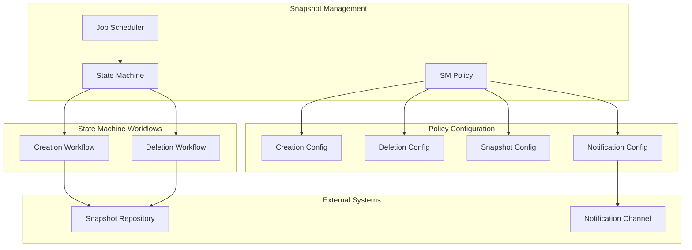
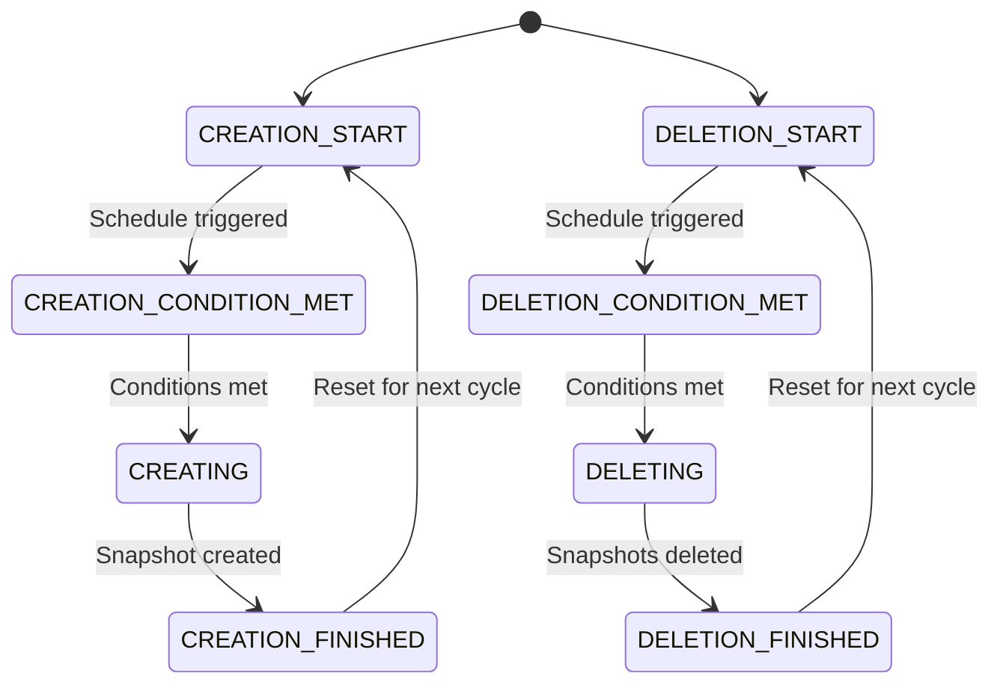

# Snapshot Management

## Summary

Snapshot Management (SM) automates the creation and deletion of OpenSearch snapshots. Part of the Index Management (IM) plugin, SM allows users to define policies that schedule snapshot operations, apply retention conditions, and manage snapshot lifecycle without manual intervention. SM is essential for backup strategies, disaster recovery, and data retention compliance.

## Details

### Architecture



### State Machine Flow



### Components

| Component | Description |
|-----------|-------------|
| `SMPolicy` | Defines snapshot creation/deletion schedules and configurations |
| `SMMetadata` | Stores policy execution state and metadata |
| `SMRunner` | Executes SM policies on schedule |
| `SMStateMachine` | Manages state transitions for creation/deletion workflows |
| `CreatingState` | Handles snapshot creation operations |
| `DeletingState` | Handles snapshot deletion operations |

### Configuration

| Setting | Description | Default |
|---------|-------------|---------|
| `creation.schedule` | Cron schedule for snapshot creation | Required (if creation enabled) |
| `creation.time_limit` | Maximum time for snapshot creation | Optional |
| `deletion.schedule` | Cron schedule for snapshot deletion | Uses creation schedule |
| `deletion.condition.max_age` | Maximum age of snapshots to retain | Optional |
| `deletion.condition.max_count` | Maximum number of snapshots to retain | Optional |
| `deletion.condition.min_count` | Minimum number of snapshots to retain | `1` |
| `deletion.snapshot_pattern` | Pattern to match external snapshots (v3.3.0+) | `null` |
| `snapshot_config.repository` | Snapshot repository name | Required |
| `snapshot_config.indices` | Indices to include in snapshot | `*` |
| `snapshot_config.include_global_state` | Include cluster state in snapshot | `true` |

### Usage Examples

#### Basic SM Policy

```json
POST _plugins/_sm/policies/daily-backup
{
  "description": "Daily backup policy",
  "creation": {
    "schedule": {
      "cron": {
        "expression": "0 0 * * *",
        "timezone": "UTC"
      }
    }
  },
  "deletion": {
    "condition": {
      "max_age": "30d",
      "min_count": 7
    }
  },
  "snapshot_config": {
    "repository": "my-repo",
    "indices": "*"
  }
}
```

#### Deletion-Only Policy (v3.3.0+)

```json
POST _plugins/_sm/policies/cleanup-external
{
  "description": "Cleanup externally created snapshots",
  "deletion": {
    "schedule": {
      "cron": {
        "expression": "0 2 * * *",
        "timezone": "UTC"
      }
    },
    "condition": {
      "max_age": "14d",
      "min_count": 3
    },
    "snapshot_pattern": "external-backup-*"
  },
  "snapshot_config": {
    "repository": "my-repo"
  }
}
```

#### Policy with Notifications

```json
POST _plugins/_sm/policies/monitored-backup
{
  "description": "Backup policy with notifications",
  "creation": {
    "schedule": {
      "cron": {
        "expression": "0 1 * * *",
        "timezone": "UTC"
      }
    },
    "time_limit": "1h"
  },
  "deletion": {
    "condition": {
      "max_age": "7d",
      "max_count": 21,
      "min_count": 7
    }
  },
  "snapshot_config": {
    "repository": "s3-repo",
    "indices": "logs-*",
    "include_global_state": false
  },
  "notification": {
    "channel": {
      "id": "notification-channel-id"
    },
    "conditions": {
      "creation": true,
      "deletion": true,
      "failure": true
    }
  }
}
```

### API Operations

| Operation | Endpoint | Description |
|-----------|----------|-------------|
| Create Policy | `POST _plugins/_sm/policies/{name}` | Create a new SM policy |
| Update Policy | `PUT _plugins/_sm/policies/{name}?if_seq_no=X&if_primary_term=Y` | Update existing policy |
| Get Policy | `GET _plugins/_sm/policies/{name}` | Retrieve policy details |
| Get All Policies | `GET _plugins/_sm/policies` | List all SM policies |
| Delete Policy | `DELETE _plugins/_sm/policies/{name}` | Delete a policy |
| Explain | `GET _plugins/_sm/policies/{name}/_explain` | Get policy execution status |
| Start Policy | `POST _plugins/_sm/policies/{name}/_start` | Enable a stopped policy |
| Stop Policy | `POST _plugins/_sm/policies/{name}/_stop` | Disable a running policy |

## Limitations

- SM does not support concurrent snapshot operations within a single policy
- Snapshot operations are performed asynchronously with retry logic (max 3 retries)
- Large repositories require more memory on the cluster manager node
- Multiple policies with overlapping schedules and indexes may impact performance

## Change History

- **v3.3.0** (2026-01): Added optional creation workflow, snapshot pattern support for deletion, and ISM snapshot global state fix

## References

### Documentation
- [Snapshot Management Documentation](https://docs.opensearch.org/3.0/tuning-your-cluster/availability-and-recovery/snapshots/snapshot-management/)
- [Snapshot Management API](https://docs.opensearch.org/3.0/tuning-your-cluster/availability-and-recovery/snapshots/sm-api/)
- [OpenSearch Dashboards SM](https://docs.opensearch.org/3.0/dashboards/sm-dashboards/)

### Pull Requests
| Version | PR | Description | Related Issue |
|---------|-----|-------------|---------------|
| v3.3.0 | [#1452](https://github.com/opensearch-project/index-management/pull/1452) | Add support for deletion-only policies and snapshot patterns | [#867](https://github.com/opensearch-project/index-management/issues/867) |
| v3.3.0 | [#1480](https://github.com/opensearch-project/index-management/pull/1480) | Exclude global state from ISM snapshot action | [#1479](https://github.com/opensearch-project/index-management/issues/1479) |

### Issues (Design / RFC)
- [Issue #867](https://github.com/opensearch-project/index-management/issues/867): Feature request for deletion-only SM policies
- [Issue #1479](https://github.com/opensearch-project/index-management/issues/1479): Bug report for ISM snapshot global state
