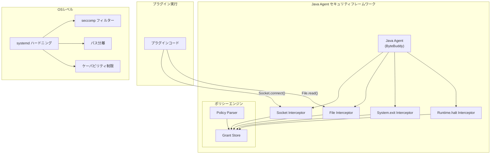
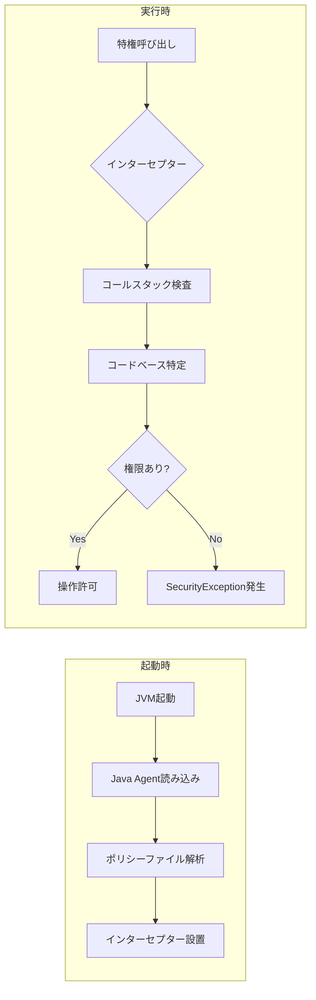

# Java Agent セキュリティフレームワーク

## 概要

OpenSearch 3.0.0では、非推奨となったJava Security Manager (JSM) に代わる新しいJava Agentセキュリティフレームワークが導入されました。このフレームワークはバイトコードインストルメンテーションを使用して特権操作をインターセプトし、セキュリティポリシーを適用することで、プラグインが管理者の明示的な承認なしに不正な操作を実行できないようにします。

主なメリット:
- **将来性**: JDK 17で非推奨となり、JDK 24で削除予定のJSMを置き換え
- **仮想スレッド対応**: JSMとは異なり、Java仮想スレッド（JEP 444）と互換性あり
- **後方互換性**: 同じ`plugin-security.policy`ファイル形式を使用
- **最小限の変更**: プラグイン開発者と管理者は従来のパターンを継続使用可能

## 詳細

### アーキテクチャ



### データフロー



### コンポーネント

| コンポーネント | 説明 |
|---------------|------|
| Java Agent | `-javaagent` JVM引数で読み込まれ、実行時にバイトコードをインストルメントするJAR |
| ByteBuddy | メソッド呼び出しをインターセプトするためのインストルメンテーションライブラリ |
| Policy Parser | `plugin-security.policy`ファイル用のカスタムパーサー（JDK 24で削除されるJDKパーサーを置き換え） |
| Socket Interceptor | ネットワーク権限を適用するため`Socket::connect`呼び出しをインターセプト |
| File Interceptor | ファイルシステム権限を適用するためファイル操作（読み取り、書き込み、削除）をインターセプト |
| System.exit Interceptor | 不正な`System.exit()`呼び出しを防止 |
| Runtime.halt Interceptor | 不正な`Runtime.halt()`呼び出しを防止 |
| systemd ハードニング | seccomp、パス分離、ケーパビリティ制限を使用したOSレベルのサンドボックス |

### 設定

プラグイン開発者は`plugin-security.policy`で権限を定義します:

```
grant {
    permission java.lang.RuntimePermission "shutdownHooks";
    permission java.lang.RuntimePermission "getClassLoader";
    permission java.net.SocketPermission "*" "connect,resolve";
    permission java.io.FilePermission "/tmp/-" "read,write";
};
```

クラスター管理者はプラグインインストール時にプロンプトが表示されます:

```
@@@@@@@@@@@@@@@@@@@@@@@@@@@@@@@@@@@@@@@@@@@@@@@@@@@@@@@@@@@
@     WARNING: plugin requires additional permissions     @
@@@@@@@@@@@@@@@@@@@@@@@@@@@@@@@@@@@@@@@@@@@@@@@@@@@@@@@@@@@
* java.net.SocketPermission * connect,resolve
* java.io.FilePermission /tmp/- read,write
Continue with installation? [y/N]
```

### インターセプト対象の操作

| 操作 | インターセプター | 必要な権限 |
|------|-----------------|-----------|
| Socket接続 | SocketInterceptor | `java.net.SocketPermission` |
| ファイル読み取り | FileInterceptor | `java.io.FilePermission` (read) |
| ファイル書き込み | FileInterceptor | `java.io.FilePermission` (write) |
| ファイル削除 | FileInterceptor | `java.io.FilePermission` (delete) |
| System.exit | ExitInterceptor | `java.lang.RuntimePermission` (exitVM) |
| Runtime.halt | HaltInterceptor | `java.lang.RuntimePermission` (exitVM) |

### systemd ハードニング

systemdを使用するLinuxディストリビューションでは、追加のOSレベル保護が利用可能です:

| ディレクティブ | 目的 |
|---------------|------|
| `SystemCallFilter` | seccompによるカーネルインターフェースの制限 |
| `ReadOnlyPaths` | 重要なシステムファイルへの書き込み防止 |
| `ReadWritePaths` | 必要なディレクトリのみへの書き込み許可 |
| `InaccessiblePaths` | 機密パスへのアクセスブロック |
| `CapabilityBoundingSet` | 危険なLinuxケーパビリティのブロック |
| `PrivateTmp` | 一時ファイルアクセスの分離 |
| `NoNewPrivileges` | 権限昇格の防止 |
| `ProtectSystem` | システムディレクトリの保護 |

### JSMからの移行

JSMから移行するプラグイン開発者向け:

1. `AccessController.doPrivileged()`ブロックの**コード変更は不要**
2. **同じポリシーファイル形式** - 既存の`plugin-security.policy`ファイルはそのまま動作
3. **対象範囲の限定** - ファイルとネットワーク操作のみインターセプト（リフレクション、スレッドコンテキスト等は対象外）

## 制限事項

- **すべてのJSM権限をカバーしていない**: エージェントは高リスク操作（ファイル、ネットワーク、終了）に焦点を当て、リフレクション等の権限はsystemdに委譲
- **systemdハードニングはLinux限定**: 完全な保護にはsystemdを使用するLinuxが必要
- **プロセスレベルのsystemdルール**: systemd保護はプラグイン単位ではなくOpenSearchプロセス全体に適用
- **プラグインへの破壊的変更**: セキュリティ検証の変更により、サードパーティプラグインの更新が必要な場合あり

## 関連PR

| PR | 説明 | マージ日 |
|----|------|---------|
| [#17724](https://github.com/opensearch-project/OpenSearch/pull/17724) | Socket::connect呼び出しをインターセプトする初期Java Agentの作成 | 2025-03-28 |
| [#17746](https://github.com/opensearch-project/OpenSearch/pull/17746) | System::exitをインターセプトするJava Agentの拡張 | 2025-04-01 |
| [#17753](https://github.com/opensearch-project/OpenSearch/pull/17753) | Java Agent用ポリシーパーサーの追加 | 2025-04-07 |
| [#17757](https://github.com/opensearch-project/OpenSearch/pull/17757) | Runtime::haltをインターセプトするJava Agentの拡張 | 2025-04-03 |
| [#17760](https://github.com/opensearch-project/OpenSearch/pull/17760) | File Interceptorと統合テストの追加 | 2025-04-06 |
| [#17861](https://github.com/opensearch-project/OpenSearch/pull/17861) | SecurityManagerの使用をJava Agentに移行 | 2025-04-09 |

## 関連Issue

- [#1687](https://github.com/opensearch-project/OpenSearch/issues/1687): JSM置き換えオプションの議論
- [#17660](https://github.com/opensearch-project/OpenSearch/issues/17660): Socketインターセプション用初期Java Agentの作成
- [#17662](https://github.com/opensearch-project/OpenSearch/issues/17662): SecurityManagerの使用を段階的に廃止
- [#17723](https://github.com/opensearch-project/OpenSearch/issues/17723): System::exitのインターセプト
- [#17755](https://github.com/opensearch-project/OpenSearch/issues/17755): Runtime::haltのインターセプト
- [#17658](https://github.com/opensearch-project/OpenSearch/issues/17658): Fileインターセプター
- [#17659](https://github.com/opensearch-project/OpenSearch/issues/17659): Java Agent用ポリシーパーサー

## 参考資料

- [ブログ: Finding a replacement for JSM in OpenSearch 3.0](https://opensearch.org/blog/finding-a-replacement-for-jsm-in-opensearch-3-0/)
- [JEP 411: Deprecate the Security Manager for Removal](https://openjdk.org/jeps/411)
- [JEP 486: Permanently Disable the Security Manager](https://openjdk.org/jeps/486)
- [JEP 444: Virtual Threads](https://openjdk.org/jeps/444)
- [プラグインインストールドキュメント](https://docs.opensearch.org/3.0/install-and-configure/plugins/)

## 変更履歴

- **v3.0.0** (2025): Java Security ManagerをJava Agentフレームワークに置き換える初期リリース
