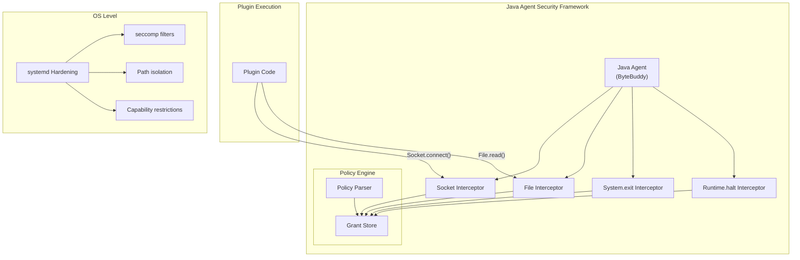
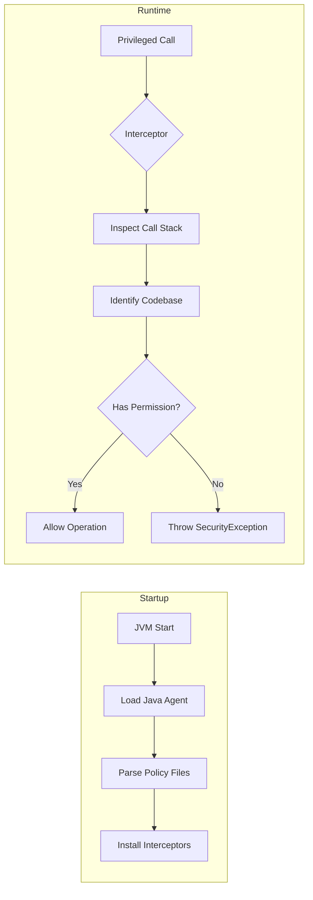

# Java Agent Security Framework

## Summary

OpenSearch 3.0.0 introduces a new Java Agent Security Framework that replaces the deprecated Java Security Manager (JSM). This framework uses bytecode instrumentation to intercept privileged operations and enforce security policies, ensuring plugins cannot perform unauthorized actions without explicit administrator approval.

Key benefits:
- **Future-proof**: Replaces JSM which is deprecated in JDK 17 and scheduled for removal in JDK 24
- **Virtual thread compatible**: Unlike JSM, works with Java virtual threads (JEP 444)
- **Backward compatible**: Uses the same `plugin-security.policy` file format
- **Minimal disruption**: Plugin developers and administrators use familiar patterns

## Details

### Architecture



### Data Flow



### Components

| Component | Description |
|-----------|-------------|
| Java Agent | JAR loaded via `-javaagent` JVM argument that instruments bytecode at runtime |
| ByteBuddy | Instrumentation library used to intercept method calls |
| Policy Parser | Custom parser for `plugin-security.policy` files (replaces JDK parser removed in JDK 24) |
| Socket Interceptor | Intercepts `Socket::connect` calls to enforce network permissions |
| File Interceptor | Intercepts file operations (read, write, delete) to enforce filesystem permissions |
| System.exit Interceptor | Prevents unauthorized calls to `System.exit()` |
| Runtime.halt Interceptor | Prevents unauthorized calls to `Runtime.halt()` |
| systemd Hardening | OS-level sandboxing using seccomp, path isolation, and capability restrictions |

### Configuration

Plugin developers define permissions in `plugin-security.policy`:

```
grant {
    permission java.lang.RuntimePermission "shutdownHooks";
    permission java.lang.RuntimePermission "getClassLoader";
    permission java.net.SocketPermission "*" "connect,resolve";
    permission java.io.FilePermission "/tmp/-" "read,write";
};
```

Cluster administrators are prompted during plugin installation:

```
@@@@@@@@@@@@@@@@@@@@@@@@@@@@@@@@@@@@@@@@@@@@@@@@@@@@@@@@@@@
@     WARNING: plugin requires additional permissions     @
@@@@@@@@@@@@@@@@@@@@@@@@@@@@@@@@@@@@@@@@@@@@@@@@@@@@@@@@@@@
* java.net.SocketPermission * connect,resolve
* java.io.FilePermission /tmp/- read,write
Continue with installation? [y/N]
```

### Intercepted Operations

| Operation | Interceptor | Permission Required |
|-----------|-------------|---------------------|
| Socket connect | SocketInterceptor | `java.net.SocketPermission` |
| File read | FileInterceptor | `java.io.FilePermission` (read) |
| File write | FileInterceptor | `java.io.FilePermission` (write) |
| File delete | FileInterceptor | `java.io.FilePermission` (delete) |
| System.exit | ExitInterceptor | `java.lang.RuntimePermission` (exitVM) |
| Runtime.halt | HaltInterceptor | `java.lang.RuntimePermission` (exitVM) |

### systemd Hardening

For Linux distributions using systemd, additional OS-level protections are available:

| Directive | Purpose |
|-----------|---------|
| `SystemCallFilter` | Restricts kernel interfaces via seccomp |
| `ReadOnlyPaths` | Prevents writes to critical system files |
| `ReadWritePaths` | Allows writes only to necessary directories |
| `InaccessiblePaths` | Blocks access to sensitive paths |
| `CapabilityBoundingSet` | Blocks dangerous Linux capabilities |
| `PrivateTmp` | Isolates temporary file access |
| `NoNewPrivileges` | Prevents privilege escalation |
| `ProtectSystem` | Protects system directories |

### Migration from JSM

For plugin developers migrating from JSM:

1. **No code changes required** for `AccessController.doPrivileged()` blocks
2. **Same policy file format** - existing `plugin-security.policy` files work unchanged
3. **Focused scope** - only file and network operations are intercepted (not reflection, thread context, etc.)

## Limitations

- **Not all JSM permissions covered**: The agent focuses on high-risk operations (file, network, exit). Other permissions like reflection are delegated to systemd
- **Linux-only systemd hardening**: Full protection requires Linux with systemd
- **Process-level systemd rules**: systemd protections apply to the entire OpenSearch process, not per-plugin
- **Breaking change for plugins**: Third-party plugins may need updates due to changes in security verification

## Related PRs

| PR | Description | Merged |
|----|-------------|--------|
| [#17724](https://github.com/opensearch-project/OpenSearch/pull/17724) | Create initial Java Agent to intercept Socket::connect calls | 2025-03-28 |
| [#17746](https://github.com/opensearch-project/OpenSearch/pull/17746) | Enhance Java Agent to intercept System::exit | 2025-04-01 |
| [#17753](https://github.com/opensearch-project/OpenSearch/pull/17753) | Add a policy parser for Java Agent | 2025-04-07 |
| [#17757](https://github.com/opensearch-project/OpenSearch/pull/17757) | Enhance Java Agent to intercept Runtime::halt | 2025-04-03 |
| [#17760](https://github.com/opensearch-project/OpenSearch/pull/17760) | Add File Interceptor and integration tests | 2025-04-06 |
| [#17861](https://github.com/opensearch-project/OpenSearch/pull/17861) | Phase off SecurityManager usage in favor of Java Agent | 2025-04-09 |

## Related Issues

- [#1687](https://github.com/opensearch-project/OpenSearch/issues/1687): Discussion on JSM replacement options
- [#17660](https://github.com/opensearch-project/OpenSearch/issues/17660): Create initial Java Agent for Socket interception
- [#17662](https://github.com/opensearch-project/OpenSearch/issues/17662): Phase off SecurityManager usage
- [#17723](https://github.com/opensearch-project/OpenSearch/issues/17723): Intercept System::exit
- [#17755](https://github.com/opensearch-project/OpenSearch/issues/17755): Intercept Runtime::halt
- [#17658](https://github.com/opensearch-project/OpenSearch/issues/17658): File interceptor
- [#17659](https://github.com/opensearch-project/OpenSearch/issues/17659): Policy parser for Java Agent

## References

- [Blog: Finding a replacement for JSM in OpenSearch 3.0](https://opensearch.org/blog/finding-a-replacement-for-jsm-in-opensearch-3-0/)
- [JEP 411: Deprecate the Security Manager for Removal](https://openjdk.org/jeps/411)
- [JEP 486: Permanently Disable the Security Manager](https://openjdk.org/jeps/486)
- [JEP 444: Virtual Threads](https://openjdk.org/jeps/444)
- [Installing plugins documentation](https://docs.opensearch.org/3.0/install-and-configure/plugins/)

## Change History

- **v3.0.0** (2025): Initial release replacing Java Security Manager with Java Agent framework
