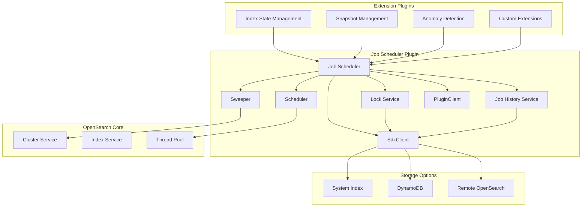
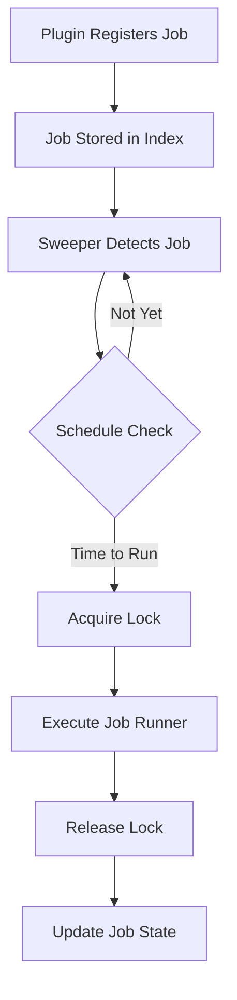

---
tags:
  - job-scheduler
---
# Job Scheduler

## Summary

Job Scheduler is an OpenSearch plugin that provides a framework for building schedules for common cluster management tasks. It enables plugin developers to define and execute periodic jobs using either interval-based scheduling or Unix cron expressions. The plugin includes a sweeper that listens for cluster events, a scheduler that manages job execution timing, and a job history service for tracking execution history. Starting with v3.3.0, the plugin supports configurable remote metadata storage for enhanced deployment flexibility.

## Details

### Architecture



### Data Flow



### Components

| Component | Description |
|-----------|-------------|
| `JobSchedulerPlugin` | Main plugin class that initializes the scheduler framework |
| `JobSweeper` | Listens for cluster events and discovers jobs to execute |
| `ScheduledJobRunner` | Interface for implementing job execution logic |
| `ScheduledJobParameter` | Interface for defining job configuration |
| `LockService` | Interface for distributed locking to prevent concurrent job execution (v3.3.0+) |
| `LockServiceImpl` | Concrete implementation of LockService (v3.3.0+) |
| `JobDetailsService` | Manages job metadata and state |
| `JobHistoryService` | Records job execution history with start/end times (v3.3.0+) |
| `PluginClient` | Client wrapper for executing actions as plugin subject (v3.3.0+) |
| `SdkClient` | Configurable client for remote metadata storage (v3.3.0+) |

### Configuration

| Setting | Description | Default |
|---------|-------------|---------|
| `plugins.jobscheduler.jitter_limit` | Maximum delay multiplier for job execution time to balance load | Dynamic |
| `plugins.jobscheduler.request_timeout` | Background sweep search timeout | Dynamic |
| `plugins.jobscheduler.retry_count` | Retry count for exponential backoff policy | Dynamic |
| `plugins.jobscheduler.sweeper.backoff_millis` | Initial wait period for exponential backoff (ms) | Dynamic |
| `plugins.jobscheduler.sweeper.page_size` | Number of search hits to return per sweep | Dynamic |
| `plugins.jobscheduler.sweeper.period` | Initial delay before background sweep execution (supports seconds since v3.2.0) | Dynamic |
| `plugins.jobscheduler.history.enabled` | Enable job history tracking (v3.3.0+) | `false` |
| `plugins.jobscheduler.remote_metadata_type` | Remote metadata storage type (v3.3.0+) | (empty) |
| `plugins.jobscheduler.remote_metadata_endpoint` | Remote metadata endpoint URL (v3.3.0+) | (empty) |
| `plugins.jobscheduler.remote_metadata_region` | Remote metadata AWS region (v3.3.0+) | (empty) |
| `plugins.jobscheduler.remote_metadata_service_name` | Remote metadata service name (v3.3.0+) | (empty) |
| `plugins.jobscheduler.tenant_aware` | Enable multi-tenancy support (v3.3.0+) | `false` |

### REST APIs (v3.2.0+)

| Endpoint | Method | Description |
|----------|--------|-------------|
| `/_plugins/_job_scheduler/api/jobs` | GET | List all scheduled jobs in the cluster |
| `/_plugins/_job_scheduler/api/jobs?by_node` | GET | List scheduled jobs grouped by node |
| `/_plugins/_job_scheduler/api/locks` | GET | List all job locks |
| `/_plugins/_job_scheduler/api/locks/{lock_id}` | GET | Get a specific lock by ID |

### Usage Example

To build a plugin that uses Job Scheduler, implement the `ScheduledJobParameter` and `ScheduledJobRunner` interfaces:

```java
// Define job parameters
public class MyJobParameter implements ScheduledJobParameter {
    private String jobName;
    private Schedule schedule;
    private boolean isEnabled;
    
    @Override
    public String getName() { return jobName; }
    
    @Override
    public Schedule getSchedule() { return schedule; }
    
    @Override
    public boolean isEnabled() { return isEnabled; }
    
    @Override
    public Long getLockDurationSeconds() { return 60L; }
}

// Define job runner
public class MyJobRunner implements ScheduledJobRunner {
    @Override
    public void runJob(ScheduledJobParameter job, JobExecutionContext context) {
        // Acquire lock
        LockService lockService = context.getLockService();
        lockService.acquireLock(job, context, ActionListener.wrap(
            lock -> {
                // Execute job logic
                // ...
                // Release lock
                lockService.release(lock, ActionListener.wrap(
                    released -> logger.info("Job completed"),
                    e -> logger.error("Failed to release lock", e)
                ));
            },
            e -> logger.error("Failed to acquire lock", e)
        ));
    }
}
```

### Schedule Formats

Job Scheduler supports two schedule formats:

1. **Interval-based**: Run every N time units (supports Seconds since v3.2.0, Minutes, Hours, Days)
   ```json
   {
     "schedule": {
       "interval": {
         "period": 30,
         "unit": "Seconds"
       }
     }
   }
   ```

2. **Cron expression**: Unix cron syntax
   ```json
   {
     "schedule": {
       "cron": {
         "expression": "0 12 * * ?",
         "timezone": "UTC"
       }
     }
   }
   ```

## Limitations

- Job execution is distributed across cluster nodes; the locking mechanism prevents duplicate execution but adds overhead
- Long-running jobs should implement proper timeout handling
- Job state is stored in OpenSearch indexes, subject to cluster availability
- Job history records are stored indefinitely; manual cleanup may be required (v3.3.0+)
- Remote metadata storage (DynamoDB) requires pre-created tables before plugin startup (v3.3.0+)

## Change History

- **v3.3.0** (2025): Added Job History Service for tracking job execution history; Refactored LockService to interface with LockServiceImpl; Implemented IdentityAwarePlugin for improved security integration; Added remote metadata storage support via SdkClient (DynamoDB, remote OpenSearch); Added multi-tenancy support
- **v3.2.0** (2025): Added REST APIs for listing scheduled jobs and locks; Added support for second-level interval scheduling; Made LockService non-final for better extensibility; Fixed date serialization in transport actions
- **v3.1.0** (2025): Added CHANGELOG and changelog_verifier workflow for iterative release note assembly; Removed Guava dependency to reduce jar hell and dependency conflicts in extending plugins
- **v3.0.0** (2025): CI/CD improvements, JPMS compatibility fixes, conditional demo certificate downloads
- **v2.18.0** (2024-11-05): Return LockService from createComponents for Guice injection, enabling shared lock service across plugins
- **v2.17.0** (2024-09-17): Fixed system index compatibility with v1 templates in LockService and JobDetailsService


## References

### Documentation
- [Official Documentation](https://docs.opensearch.org/3.0/monitoring-your-cluster/job-scheduler/index/)
- [Job Scheduler GitHub Repository](https://github.com/opensearch-project/job-scheduler)
- [Sample Extension Plugin](https://github.com/opensearch-project/job-scheduler/tree/main/sample-extension-plugin)
- [opensearch-remote-metadata-sdk](https://github.com/opensearch-project/opensearch-remote-metadata-sdk): SDK for remote metadata storage
- [Keep a Changelog](https://keepachangelog.com/en/1.0.0/): Changelog format specification

### Pull Requests
| Version | PR | Description | Related Issue |
|---------|-----|-------------|---------------|
| v3.3.0 | [#814](https://github.com/opensearch-project/job-scheduler/pull/814) | Job History Service - creates history index recording job execution times | [#808](https://github.com/opensearch-project/job-scheduler/issues/808) |
| v3.3.0 | [#714](https://github.com/opensearch-project/job-scheduler/pull/714) | Make LockService an interface and replace usages of ThreadContext.stashContext | [#238](https://github.com/opensearch-project/job-scheduler/issues/238) |
| v3.3.0 | [#833](https://github.com/opensearch-project/job-scheduler/pull/833) | Create Guice module to bind LockService interface from SPI to LockServiceImpl |   |
| v3.3.0 | [#831](https://github.com/opensearch-project/job-scheduler/pull/831) | Introduce configurable remote metadata client and migrate LockService to SdkClient | [#828](https://github.com/opensearch-project/job-scheduler/issues/828) |
| v3.3.0 | [#810](https://github.com/opensearch-project/job-scheduler/pull/810) | Update delete_backport_branch workflow to include release-chores branches |   |
| v3.2.0 | [#849](https://github.com/opensearch-project/common-utils/pull/849) | Add Seconds as a supported unit for IntervalSchedule |   |
| v3.2.0 | [#786](https://github.com/opensearch-project/job-scheduler/pull/786) | Adds REST API to list jobs with an option to list them per node | [#775](https://github.com/opensearch-project/job-scheduler/issues/775) |
| v3.2.0 | [#796](https://github.com/opensearch-project/job-scheduler/pull/796) | Support defining IntervalSchedule in seconds |   |
| v3.2.0 | [#802](https://github.com/opensearch-project/job-scheduler/pull/802) | Rest API to list all locks with option to get a specific lock |   |
| v3.2.0 | [#792](https://github.com/opensearch-project/job-scheduler/pull/792) | Make Lock service not final |   |
| v3.2.0 | [#801](https://github.com/opensearch-project/job-scheduler/pull/801) | Move info about delay to the schedule portion in List Jobs API |   |
| v3.2.0 | [#793](https://github.com/opensearch-project/job-scheduler/pull/793) | Ensure that dates are serialized in TransportGetScheduledInfoAction |   |
| v3.2.0 | [#790](https://github.com/opensearch-project/job-scheduler/pull/790) | Use Text Blocks when defining multi-line strings |   |
| v3.1.0 | [#778](https://github.com/opensearch-project/job-scheduler/pull/778) | Add CHANGELOG and changelog_verifier workflow | [#777](https://github.com/opensearch-project/job-scheduler/issues/777) |
| v3.1.0 | [#766](https://github.com/opensearch-project/job-scheduler/pull/766) | Increment version to 3.1.0-SNAPSHOT |   |
| v3.1.0 | [#773](https://github.com/opensearch-project/job-scheduler/pull/773) | Remove guava dependency | [#18113](https://github.com/opensearch-project/OpenSearch/issues/18113) |
| v3.0.0 | [#702](https://github.com/opensearch-project/job-scheduler/pull/702) | Enable custom start commands and options to resolve GHA issues | [#698](https://github.com/opensearch-project/job-scheduler/issues/698) |
| v3.0.0 | [#730](https://github.com/opensearch-project/job-scheduler/pull/730) | Fix JS compile issues caused by OpenSearch JPMS Refactoring | [#8110](https://github.com/opensearch-project/OpenSearch/issues/8110) |
| v3.0.0 | [#737](https://github.com/opensearch-project/job-scheduler/pull/737) | Only download demo certs when integTest run with -Dsecurity.enabled=true |   |
| v2.18.0 | [#670](https://github.com/opensearch-project/job-scheduler/pull/670) | Return LockService from createComponents for Guice injection | [#238](https://github.com/opensearch-project/opensearch-plugins/issues/238) |
| v2.17.0 | [#658](https://github.com/opensearch-project/job-scheduler/pull/658) | Fix system index compatibility with v1 templates | [#14984](https://github.com/opensearch-project/OpenSearch/issues/14984) |

### Issues (Design / RFC)
- [Issue #808](https://github.com/opensearch-project/job-scheduler/issues/808): Feature request for Job execution History index
- [Issue #828](https://github.com/opensearch-project/job-scheduler/issues/828): Feature request for configurable client wrapper for remote metadata store
- [Issue #775](https://github.com/opensearch-project/job-scheduler/issues/775): Feature request for REST APIs to list jobs and running jobs
- [Issue #777](https://github.com/opensearch-project/job-scheduler/issues/777): Add a CHANGELOG to assemble release notes as PRs are merged
- [Issue #18113](https://github.com/opensearch-project/OpenSearch/issues/18113): Remove Guava from plugins
- [Issue #698](https://github.com/opensearch-project/job-scheduler/issues/698): GitHub Action Deprecation
- [Issue #715](https://github.com/opensearch-project/job-scheduler/issues/715): Release 3.0 Breaking Changes
- [Issue #14984](https://github.com/opensearch-project/OpenSearch/issues/14984): CreateIndexRequest.mapping() bug with v1 templates
- [Issue #4439](https://github.com/opensearch-project/security/issues/4439): RFC - Strengthen System Index Protection in the Plugin Ecosystem
