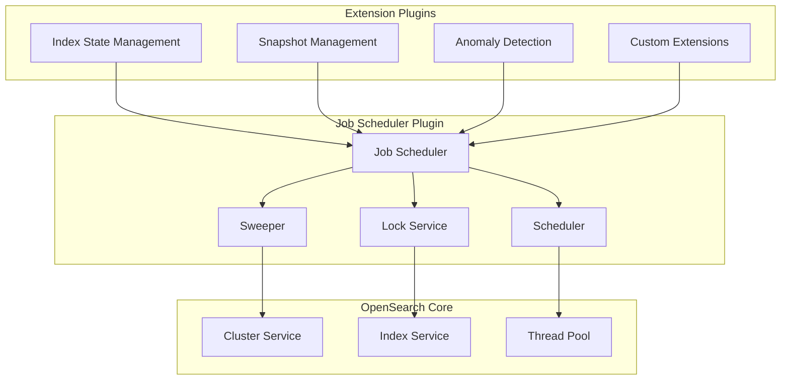
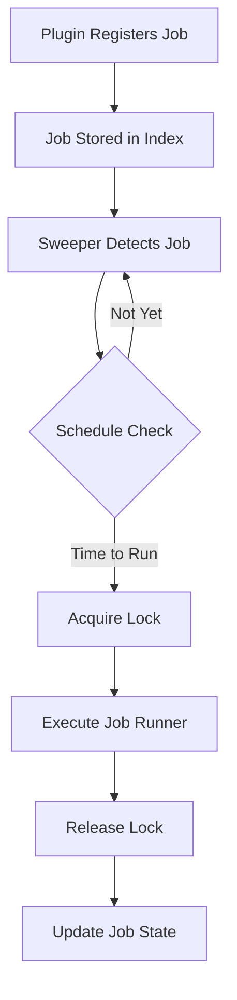

# Job Scheduler

## Summary

Job Scheduler is an OpenSearch plugin that provides a framework for building schedules for common cluster management tasks. It enables plugin developers to define and execute periodic jobs using either interval-based scheduling or Unix cron expressions. The plugin includes a sweeper that listens for cluster events and a scheduler that manages job execution timing.

## Details

### Architecture



### Data Flow



### Components

| Component | Description |
|-----------|-------------|
| `JobSchedulerPlugin` | Main plugin class that initializes the scheduler framework |
| `JobSweeper` | Listens for cluster events and discovers jobs to execute |
| `ScheduledJobRunner` | Interface for implementing job execution logic |
| `ScheduledJobParameter` | Interface for defining job configuration |
| `LockService` | Distributed locking to prevent concurrent job execution |
| `JobDetailsService` | Manages job metadata and state |

### Configuration

| Setting | Description | Default |
|---------|-------------|---------|
| `plugins.jobscheduler.jitter_limit` | Maximum delay multiplier for job execution time to balance load | Dynamic |
| `plugins.jobscheduler.request_timeout` | Background sweep search timeout | Dynamic |
| `plugins.jobscheduler.retry_count` | Retry count for exponential backoff policy | Dynamic |
| `plugins.jobscheduler.sweeper.backoff_millis` | Initial wait period for exponential backoff (ms) | Dynamic |
| `plugins.jobscheduler.sweeper.page_size` | Number of search hits to return per sweep | Dynamic |
| `plugins.jobscheduler.sweeper.period` | Initial delay before background sweep execution | Dynamic |

### Usage Example

To build a plugin that uses Job Scheduler, implement the `ScheduledJobParameter` and `ScheduledJobRunner` interfaces:

```java
// Define job parameters
public class MyJobParameter implements ScheduledJobParameter {
    private String jobName;
    private Schedule schedule;
    private boolean isEnabled;
    
    @Override
    public String getName() { return jobName; }
    
    @Override
    public Schedule getSchedule() { return schedule; }
    
    @Override
    public boolean isEnabled() { return isEnabled; }
    
    @Override
    public Long getLockDurationSeconds() { return 60L; }
}

// Define job runner
public class MyJobRunner implements ScheduledJobRunner {
    @Override
    public void runJob(ScheduledJobParameter job, JobExecutionContext context) {
        // Acquire lock
        LockService lockService = context.getLockService();
        lockService.acquireLock(job, context, ActionListener.wrap(
            lock -> {
                // Execute job logic
                // ...
                // Release lock
                lockService.release(lock, ActionListener.wrap(
                    released -> logger.info("Job completed"),
                    e -> logger.error("Failed to release lock", e)
                ));
            },
            e -> logger.error("Failed to acquire lock", e)
        ));
    }
}
```

### Schedule Formats

Job Scheduler supports two schedule formats:

1. **Interval-based**: Run every N time units
   ```json
   {
     "schedule": {
       "interval": {
         "period": 1,
         "unit": "HOURS"
       }
     }
   }
   ```

2. **Cron expression**: Unix cron syntax
   ```json
   {
     "schedule": {
       "cron": {
         "expression": "0 12 * * ?",
         "timezone": "UTC"
       }
     }
   }
   ```

## Limitations

- Job execution is distributed across cluster nodes; the locking mechanism prevents duplicate execution but adds overhead
- Long-running jobs should implement proper timeout handling
- Job state is stored in OpenSearch indexes, subject to cluster availability

## Related PRs

| Version | PR | Description |
|---------|-----|-------------|
| v3.0.0 | [#702](https://github.com/opensearch-project/job-scheduler/pull/702) | Enable custom start commands and options to resolve GHA issues |
| v3.0.0 | [#730](https://github.com/opensearch-project/job-scheduler/pull/730) | Fix JS compile issues caused by OpenSearch JPMS Refactoring |
| v3.0.0 | [#737](https://github.com/opensearch-project/job-scheduler/pull/737) | Only download demo certs when integTest run with -Dsecurity.enabled=true |
| v2.17.0 | [#658](https://github.com/opensearch-project/job-scheduler/pull/658) | Fix system index compatibility with v1 templates |

## References

- [Job Scheduler GitHub Repository](https://github.com/opensearch-project/job-scheduler)
- [Official Documentation](https://docs.opensearch.org/3.0/monitoring-your-cluster/job-scheduler/index/)
- [Sample Extension Plugin](https://github.com/opensearch-project/job-scheduler/tree/main/sample-extension-plugin)
- [Issue #698](https://github.com/opensearch-project/job-scheduler/issues/698): GitHub Action Deprecation
- [Issue #715](https://github.com/opensearch-project/job-scheduler/issues/715): Release 3.0 Breaking Changes
- [Issue #14984](https://github.com/opensearch-project/OpenSearch/issues/14984): CreateIndexRequest.mapping() bug with v1 templates

## Change History

- **v3.0.0** (2025): CI/CD improvements, JPMS compatibility fixes, conditional demo certificate downloads
- **v2.17.0** (2024-09-17): Fixed system index compatibility with v1 templates in LockService and JobDetailsService
