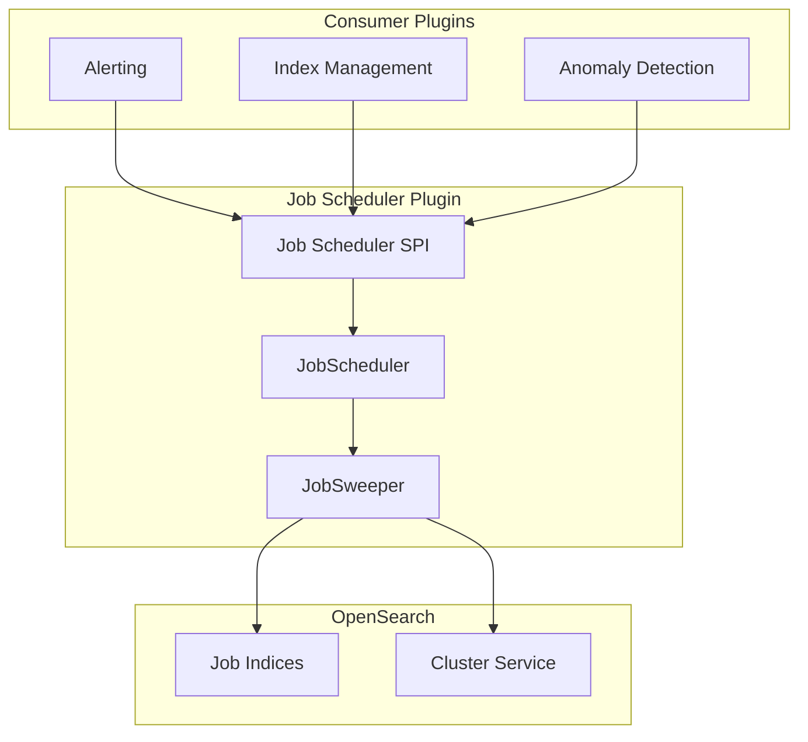

---
tags:
  - job
---
# Job Scheduler

## Summary

Job Scheduler is an OpenSearch plugin that provides a framework for running periodic jobs on the cluster. Other plugins (such as Alerting, Index Management, and Anomaly Detection) register scheduled jobs through the Job Scheduler SPI, and the scheduler handles execution timing, shard-level sweeping, and job lifecycle management.

## Details

### Architecture

### Components

| Component | Description |
|-----------|-------------|
| `JobScheduler` | Core scheduler that manages job execution timing |
| `JobSweeper` | Periodically sweeps job indices to discover and schedule jobs across shards |
| `Job Scheduler SPI` | Service Provider Interface that consumer plugins implement to register jobs |
| `JobDocVersion` | Tracks document version for optimistic concurrency control |

### Job Sweeping

The `JobSweeper` iterates over all registered job indices, querying each shard for job metadata documents using `search_after` pagination. It compares discovered jobs against its in-memory state and schedules new or updated jobs accordingly.

Key sweep parameters:
- Sweep uses `_shards` preference with `_primary` to target specific shards
- Pagination via `search_after` sorted by `_seq_no` (changed from `_id` in v3.6.0)
- Configurable page size via `sweepPageMaxSize`
- Retry with configurable backoff via `sweepSearchBackoff`

## Limitations

- Job Scheduler relies on the cluster state to determine shard routing; during cluster instability, sweeps may be incomplete.
- Each consumer plugin maintains its own job index; Job Scheduler does not consolidate job storage.

## Change History

- **v3.6.0**: Fixed sweep query sort field from `_id` to `_seq_no` to support clusters with `indices.id_field_data.enabled=false`. Added error handling for search failures during sweep. Updated Gradle Shadow plugin API usage to replace deprecated `project.shadow.component()`.

## References

### Pull Requests
| Version | PR | Description |
|---------|-----|-------------|
| v3.6.0 | https://github.com/opensearch-project/job-scheduler/pull/896 | Fix sort field in sweep query (`_id` → `_seq_no`) |
| v3.6.0 | https://github.com/opensearch-project/job-scheduler/pull/884 | Update shadow plugin deprecated API |
