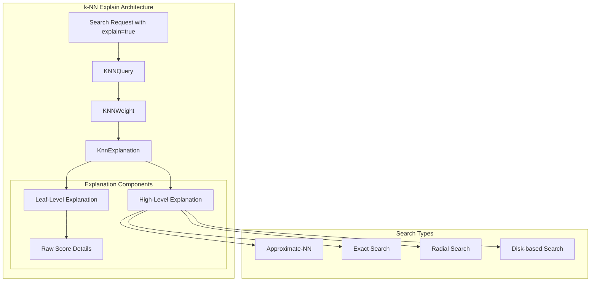
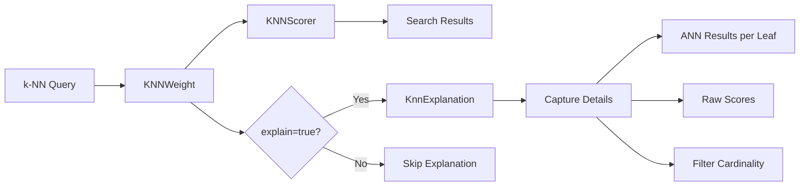

# k-NN Explain API

## Summary

The k-NN Explain API provides detailed scoring explanations for k-NN (k-Nearest Neighbor) queries in OpenSearch. When enabled with the `explain=true` parameter, it reveals how scores are calculated, normalized, and combined in k-NN searches. This feature helps users understand and optimize their vector search results by showing the scoring process, including score normalization techniques, raw scores from the native library, and the type of search executed.

## Details

### Architecture



### Data Flow



### Components

| Component | Description |
|-----------|-------------|
| `KnnExplanation` | Core class that captures explain query details including ANN results per leaf, raw scores, and KNN scorer cache |
| `KNNWeight.explain()` | Method that generates the explanation for a document, including high-level and leaf-level details |
| `SpaceType.explainScoreTranslation()` | Returns the score translation formula string for each space type |
| `DocAndScoreQuery` | Modified to delegate explain calls to KNNWeight for proper explanation generation |

### Configuration

The Explain API requires no special configuration. It is enabled per-query using the standard `explain` parameter.

| Parameter | Description | Default |
|-----------|-------------|---------|
| `explain` | Enable detailed scoring explanation | `false` |

### Usage Example

#### Basic k-NN Query with Explain

```json
GET my-knn-index/_search?explain=true
{
  "query": {
    "knn": {
      "my_vector": {
        "vector": [2, 3, 5, 7],
        "k": 2
      }
    }
  }
}
```

#### Radial Search with Explain

```json
GET my-knn-index/_search?explain=true
{
  "query": {
    "knn": {
      "my_vector": {
        "vector": [7.1, 8.3],
        "max_distance": 2
      }
    }
  }
}
```

#### Example Response

```json
{
  "hits": {
    "hits": [
      {
        "_id": "1",
        "_score": 0.98039204,
        "_explanation": {
          "value": 0.98039204,
          "description": "the type of knn search executed was Approximate-NN",
          "details": [
            {
              "value": 0.98039204,
              "description": "the type of knn search executed at leaf was Approximate-NN with vectorDataType = FLOAT, spaceType = l2 where score is computed as `1 / (1 + rawScore)` from:",
              "details": [
                {
                  "value": 0.020000057,
                  "description": "rawScore, returned from FAISS library",
                  "details": []
                }
              ]
            }
          ]
        }
      }
    ]
  }
}
```

### Supported Search Types

| Search Type | High-Level Description | Leaf-Level Details |
|-------------|------------------------|-------------------|
| Approximate-NN | `the type of knn search executed was Approximate-NN` | Shows vectorDataType, spaceType, score formula, raw score |
| Exact Search | `the type of knn search executed was Approximate-NN` | Explains why exact search was used (filteredIds <= K, threshold, no engine files) |
| Radial Search | `the type of knn search executed was Radial with the radius of X` | Shows search type at leaf level |
| Disk-based Search | `the type of knn search executed was Disk-based and the first pass k was X` | Shows dimension, oversample factor, rescoring status |

### Score Translation Formulas

| Space Type | Formula |
|------------|---------|
| L2 | `1 / (1 + rawScore)` |
| L1 | `1 / (1 + rawScore)` |
| LINF | `1 / (1 + rawScore)` |
| HAMMING | `1 / (1 + rawScore)` |
| COSINESIMIL | `Math.max((2.0F - rawScore) / 2.0F, 0.0F)` |
| INNER_PRODUCT | `-rawScore + 1` (for negative raw scores) or `1 / (1 + rawScore)` (for non-negative) |

## Limitations

- Only supported for the Faiss engine; Lucene engine returns generic explanations
- Nested field k-NN searches do not return detailed explanations
- The explain operation is resource-intensive; use sparingly in production environments
- Score calculation explanation is currently added only for ANN search

## Related PRs

| Version | PR | Description |
|---------|-----|-------------|
| v3.0.0 | [#2403](https://github.com/opensearch-project/k-NN/pull/2403) | Added Explain API support for Exact/ANN/Radial/Disk based KNN search on Faiss Engine |

## References

- [Issue #875](https://github.com/opensearch-project/k-NN/issues/875): Original feature request - Explain API not compatible with k-NN queries
- [k-NN query explain documentation](https://docs.opensearch.org/3.0/query-dsl/specialized/k-nn/k-nn-explain/): Official documentation
- [Explain API documentation](https://docs.opensearch.org/3.0/api-reference/search-apis/explain/): General Explain API reference

## Change History

- **v3.0.0** (2025-04-15): Initial implementation - Added Explain API support for Exact/ANN/Radial/Disk based k-NN search on Faiss engine
