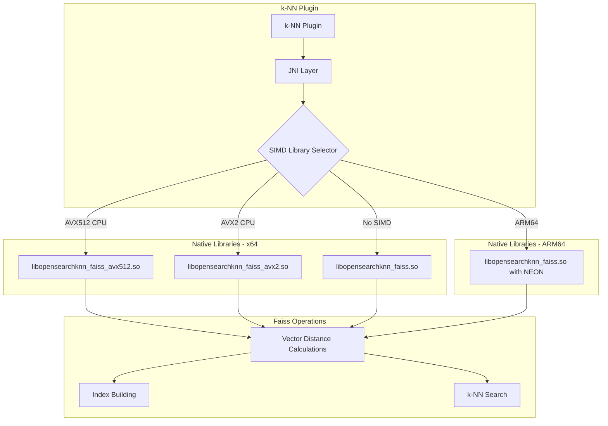
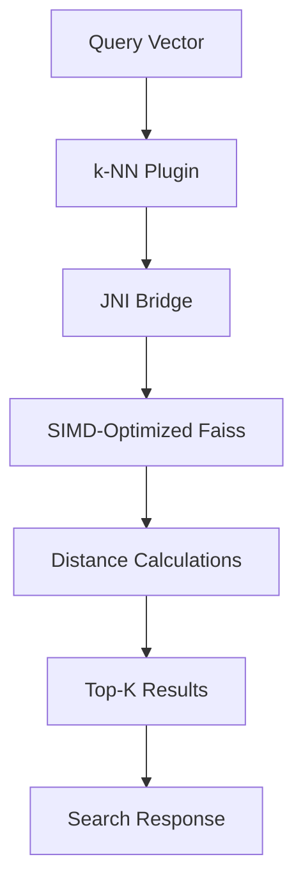

---
tags:
  - indexing
  - k-nn
  - performance
  - search
---

# k-NN AVX512 SIMD Support

## Summary

The k-NN plugin supports AVX512 SIMD (Single Instruction Multiple Data) instructions for the Faiss engine, enabling hardware-accelerated vector operations on compatible x64 processors. This feature significantly improves vector search and indexing performance by leveraging modern CPU capabilities to process multiple data points simultaneously.

## Details

### Architecture



### Data Flow



### Components

| Component | Description |
|-----------|-------------|
| `libopensearchknn_faiss_avx512.so` | Faiss library with AVX512 SIMD instructions for maximum performance |
| `libopensearchknn_faiss_avx2.so` | Faiss library with AVX2 SIMD instructions |
| `libopensearchknn_faiss.so` | Non-optimized Faiss library (fallback) |
| SIMD Library Selector | Runtime component that detects CPU capabilities and loads appropriate library |

### Configuration

| Setting | Type | Description | Default |
|---------|------|-------------|---------|
| `knn.faiss.avx512.disabled` | Static | Disable AVX512 library and fall back to AVX2 or non-optimized | `false` |
| `knn.faiss.avx2.disabled` | Static | Disable AVX2 library and fall back to non-optimized | `false` |

### Supported Platforms

| Platform | Architecture | SIMD Support |
|----------|--------------|--------------|
| Linux | x64 | AVX512, AVX2, or none (auto-detected) |
| Linux | ARM64 | NEON (always enabled) |
| macOS | x64 | AVX2 only (AVX512 not available on Mac hardware) |
| Windows | x64 | Not supported |

### Usage Example

AVX512 is automatically enabled when the hardware supports it. No configuration is required.

To verify SIMD support, check the OpenSearch logs at startup:

```
[INFO ][o.o.k.j.JNIService] Loading native library: libopensearchknn_faiss_avx512.so
```

To disable AVX512 (e.g., for testing or compatibility):

```yaml
# opensearch.yml
knn.faiss.avx512.disabled: true
```

### Building with SIMD Support

```bash
# Build OpenSearch k-NN with SIMD
./gradlew build -Davx2.enabled=true -Davx512.enabled=true

# Run with SIMD
./gradlew run -Davx2.enabled=true -Davx512.enabled=true

# Build JNI libraries directly
cd jni
cmake . -DAVX2_ENABLED=true -DAVX512_ENABLED=true
make -j4
```

### Performance Characteristics

| SIMD Level | Bits per Operation | Floats per Operation | Relative Performance |
|------------|-------------------|---------------------|---------------------|
| AVX512 | 512 | 16 | Highest |
| AVX2 | 256 | 8 | Medium |
| None | 32-64 | 1-2 | Baseline |

SIMD optimization is most effective when:
- Vector dimensions are multiples of 8
- Large datasets require many distance calculations
- Workloads are CPU-bound rather than I/O-bound

## Limitations

- AVX512 is only available on Linux x64 platforms
- Windows does not support SIMD optimization for Faiss
- macOS does not support AVX512 due to hardware limitations
- Vector dimensions should be multiples of 8 for optimal SIMD utilization
- Settings are static and require cluster restart to change
- ARM64 platforms use NEON instructions (cannot be disabled)

## Change History

- **v2.18.0** (2024-10-22): Added AVX512 SIMD support for Faiss engine on x64 Linux
- **v2.13.0**: Initial SIMD support with AVX2 (x64) and NEON (ARM64)

## Related Features
- [Neural Search](../neural-search/neural-search-agentic-search.md)
- [Search Relevance](../search-relevance/dashboards-observability-search-relevance-ci-tests.md)

## References

### Documentation
- [k-NN Index Documentation](https://docs.opensearch.org/2.18/search-plugins/knn/knn-index/#simd-optimization-for-the-faiss-engine): Official SIMD documentation
- [k-NN Settings](https://docs.opensearch.org/2.18/search-plugins/knn/settings/): Configuration reference

### Blog Posts
- [Blog: Boosting k-NN exact search performance](https://opensearch.org/blog/boosting-k-nn-exact-search/): Performance analysis with SIMD

### Pull Requests
| Version | PR | Description | Related Issue |
|---------|-----|-------------|---------------|
| v2.18.0 | [#2110](https://github.com/opensearch-project/k-NN/pull/2110) | Add AVX512 support to k-NN for FAISS library | [#2056](https://github.com/opensearch-project/k-NN/issues/2056) |
| v2.13.0 | - | Initial SIMD support with AVX2 and NEON |   |

### Issues (Design / RFC)
- [Issue #2056](https://github.com/opensearch-project/k-NN/issues/2056): Feature request for FAISS AVX512 support
