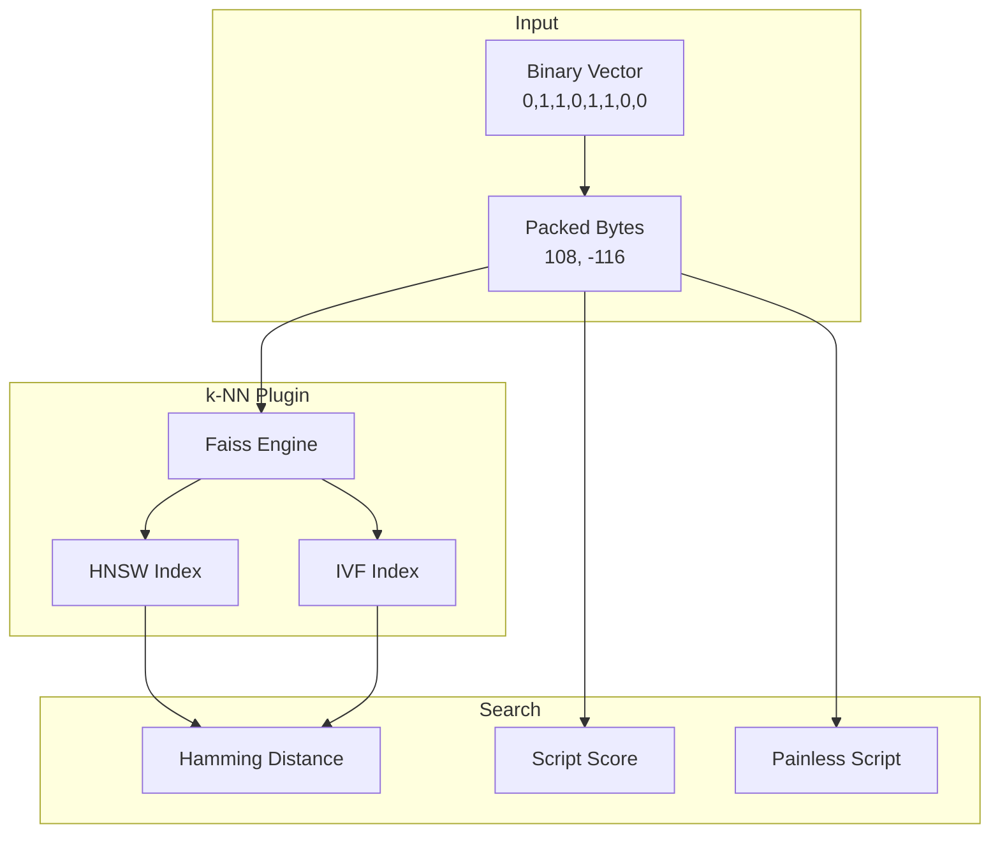

---
tags:
  - k-nn
---
# k-NN Binary Vector Support

## Summary

Binary vector support in OpenSearch k-NN enables efficient storage and search of binary embeddings using Hamming distance. This feature reduces memory requirements by up to 32x compared to float32 vectors, making large-scale vector search more economical while maintaining high recall performance.

## Details

### Architecture



### Components

| Component | Description |
|-----------|-------------|
| Binary Data Type | New `data_type: binary` for knn_vector fields |
| Hamming Space Type | Distance metric counting differing bits between vectors |
| Faiss Binary Index | Native support for binary HNSW and IVF indexes |
| Script Scoring | `hammingbit` space type for exact binary search |
| Painless Extensions | Hamming distance function for custom scoring |

### Configuration

| Setting | Description | Default |
|---------|-------------|---------|
| `data_type` | Vector data type (`float`, `byte`, `binary`) | `float` |
| `space_type` | Distance metric (must be `hamming` for binary) | `l2` |
| `dimension` | Vector dimension (must be multiple of 8 for binary) | Required |

### Usage Example

#### Create Index with Binary Vectors

```json
PUT /binary-index
{
  "settings": {
    "index": { "knn": true }
  },
  "mappings": {
    "properties": {
      "my_vector": {
        "type": "knn_vector",
        "dimension": 768,
        "data_type": "binary",
        "method": {
          "name": "hnsw",
          "space_type": "hamming",
          "engine": "faiss",
          "parameters": {
            "ef_construction": 128,
            "m": 24
          }
        }
      }
    }
  }
}
```

#### Ingest Binary Vectors

Binary vectors must be packed into int8 bytes. Each byte represents 8 bits:

```python
import numpy as np

bit_array = [0, 1, 1, 0, 1, 1, 0, 0, 1, 0, 0, 0, 1, 1, 0, 0]
bit_array_np = np.array(bit_array, dtype=np.uint8)
byte_array = np.packbits(bit_array_np).astype(np.int8).tolist()
# Result: [108, -116]
```

```json
PUT /binary-index/_doc/1
{
  "my_vector": [108, -116]
}
```

#### Search Binary Vectors

```json
GET /binary-index/_search
{
  "query": {
    "knn": {
      "my_vector": {
        "vector": [108, -116],
        "k": 10
      }
    }
  }
}
```

### IVF with Training

For IVF method, a training step is required:

```json
POST _plugins/_knn/models/binary-model/_train
{
  "training_index": "train-index",
  "training_field": "train-field",
  "dimension": 768,
  "data_type": "binary",
  "method": {
    "name": "ivf",
    "engine": "faiss",
    "space_type": "hamming",
    "parameters": {
      "nlist": 4,
      "nprobes": 2
    }
  }
}
```

### Performance Characteristics

| Metric | Float32 vs Binary |
|--------|-------------------|
| Memory Usage | ~32x reduction |
| Storage | ~97% reduction |
| Indexing Speed | Comparable |
| Query Latency | Comparable |
| Recall | ~97% (depends on data) |

## Limitations

- Only supported with Faiss engine
- Only Hamming distance space type is available
- Dimension must be a multiple of 8
- Not supported with Nmslib or Lucene engines
- Converting float vectors to binary requires quantization, which may affect recall
- Radial search with binary vectors requires additional configuration

## Change History

- **v2.16.0** (2024-08-06): Initial implementation
  - Binary format support with HNSW method in Faiss
  - Binary format support with IVF method in Faiss
  - Script scoring support for binary vectors
  - Painless script support for Hamming distance

## References

### Documentation

- [k-NN vector field type - Binary vectors](https://docs.opensearch.org/latest/field-types/supported-field-types/knn-vector/#binary-k-nn-vectors)
- [Exact k-NN with scoring script](https://docs.opensearch.org/latest/search-plugins/knn/knn-score-script/)
- [k-NN Painless extensions](https://docs.opensearch.org/latest/search-plugins/knn/painless-functions/)

### Pull Requests

| Version | PR | Description |
|---------|-----|-------------|
| v2.16.0 | [#1781](https://github.com/opensearch-project/k-NN/pull/1781) | Add binary format support with HNSW method in Faiss Engine |
| v2.16.0 | [#1784](https://github.com/opensearch-project/k-NN/pull/1784) | Add binary format support with IVF method in Faiss Engine |
| v2.16.0 | [#1826](https://github.com/opensearch-project/k-NN/pull/1826) | Add script scoring support for knn field with binary data type |
| v2.16.0 | [#1839](https://github.com/opensearch-project/k-NN/pull/1839) | Add painless script support for hamming with binary vector data type |

### Related Issues

- [#1767](https://github.com/opensearch-project/k-NN/issues/1767) - [RFC] Binary vector support

### Blog Posts

- [Optimize your OpenSearch costs using binary vectors](https://opensearch.org/blog/lower-your-cost-on-opensearch-using-binary-vectors/)
