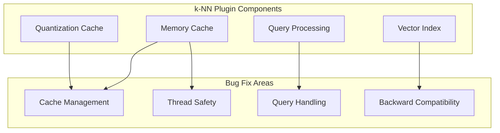

# k-NN Bug Fixes

## Summary

This document tracks bug fixes for the OpenSearch k-NN plugin across releases. The k-NN plugin enables approximate k-nearest neighbor (k-NN) search on vector data. These fixes address issues in caching, thread safety, query handling, and backward compatibility.

## Details

### Architecture

### Bug Categories

| Category | Description | Impact |
|----------|-------------|--------|
| Cache Management | Quantization state cache, native memory cache | Performance, memory usage |
| Thread Safety | Concurrent search, race conditions | Stability, correctness |
| Query Handling | Nested queries, efficient filters, rescoring | Search accuracy |
| Backward Compatibility | Mode/compression settings, index versions | Upgrade safety |

### Key Bug Fixes

#### Quantization State Cache

The quantization state cache had two issues:
1. **Scale mismatch**: Cache limit was in KB but objects were weighted in bytes, causing the effective limit to be 0.005% instead of 5% of JVM heap
2. **Thread safety**: Check-then-update logic wasn't properly guarded, causing redundant disk reads

#### Native Memory Cache Race Condition

A race condition between search threads and cache clear operations could cause:
- `IndexAllocation-Reference is already closed` exceptions
- Deadlocks due to unreleased read locks when exceptions occurred

#### High-Dimensional Vector Rescoring

For disk-based vector search with dimensions > 1000, rescoring wasn't enabled by default for 32x, 16x, and 8x compression levels, significantly impacting recall.

#### Nested Vector Query with Efficient Filter

When using nested vector queries with nested efficient filters, the parent filter was incorrectly set due to double nesting, causing incorrect search results.

#### Concurrent Search Thread Safety

`IndexInput` in LuceneOnFaiss was shared across multiple search threads, causing potential data corruption since `IndexInput` is not thread-safe.

#### Mode/Compression Backward Compatibility

Using `mode` and `compression` parameters on indices created before v2.17.0 caused Faiss index factory parsing errors.

### Configuration

| Setting | Description | Default |
|---------|-------------|---------|
| `knn.quantization.state.cache.size.limit` | Quantization state cache size limit | 5% of JVM heap |
| `index.knn` | Enable k-NN for the index | `true` |

## Limitations

- Mode and compression parameters cannot be used on indices created before v2.17.0
- Nested efficient filters require specific query structure (filter inside knn, not double-nested)

## Related PRs

| Version | PR | Description |
|---------|-----|-------------|
| v3.1.0 | [#2666](https://github.com/opensearch-project/k-NN/pull/2666) | Fix quantization cache scale and thread safety |
| v3.1.0 | [#2671](https://github.com/opensearch-project/k-NN/pull/2671) | Fix rescoring for dimensions > 1000 |
| v3.1.0 | [#2692](https://github.com/opensearch-project/k-NN/pull/2692) | Honor slice count for non-quantization cases |
| v3.1.0 | [#2702](https://github.com/opensearch-project/k-NN/pull/2702) | Block derived source if index.knn is false |
| v3.1.0 | [#2719](https://github.com/opensearch-project/k-NN/pull/2719) | Avoid opening graph file if already loaded |
| v3.1.0 | [#2722](https://github.com/opensearch-project/k-NN/pull/2722) | Block mode/compression for pre-2.17.0 indices |
| v3.1.0 | [#2728](https://github.com/opensearch-project/k-NN/pull/2728) | Fix RefCount and ClearCache race conditions |
| v3.1.0 | [#2739](https://github.com/opensearch-project/k-NN/pull/2739) | Fix LuceneOnFaiss to use sliced IndexInput |
| v3.1.0 | [#2641](https://github.com/opensearch-project/k-NN/pull/2641) | Fix nested vector query with efficient filter |

## References

- [Issue #2665](https://github.com/opensearch-project/k-NN/issues/2665): Quantization cache limit bug
- [Issue #2619](https://github.com/opensearch-project/k-NN/issues/2619): NativeMemoryCacheManager race condition
- [Issue #2708](https://github.com/opensearch-project/k-NN/issues/2708): Faiss 16x on_disk vectors issue
- [Issue #2511](https://github.com/opensearch-project/k-NN/issues/2511): Nested knn query with efficient filter bug
- [k-NN Documentation](https://docs.opensearch.org/3.0/vector-search/api/knn/): k-NN API reference

## Change History

- **v3.1.0** (2026-01-10): Added 9 bug fixes for quantization cache, rescoring, thread safety, nested queries, memory cache race conditions, backward compatibility, graph loading, and slice count handling
