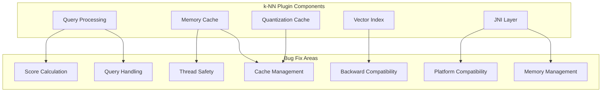

# k-NN Bug Fixes

## Summary

This document tracks bug fixes for the OpenSearch k-NN plugin across releases. The k-NN plugin enables approximate k-nearest neighbor (k-NN) search on vector data. These fixes address issues in caching, thread safety, query handling, memory management, platform compatibility, and backward compatibility.

## Details

### Architecture

### Bug Categories

| Category | Description | Impact |
|----------|-------------|--------|
| Cache Management | Quantization state cache, native memory cache | Performance, memory usage |
| Thread Safety | Concurrent search, race conditions | Stability, correctness |
| Query Handling | Nested queries, efficient filters, rescoring, byte vectors | Search accuracy |
| Backward Compatibility | Mode/compression settings, index versions | Upgrade safety |
| Memory Management | JNI local references, derived source handling | Memory leaks, stability |
| Platform Compatibility | AVX2 detection across platforms | Cross-platform support |
| Score Calculation | Cosine similarity score translation | Score correctness |

### Key Bug Fixes

#### Quantization State Cache (v3.1.0)

The quantization state cache had two issues:
1. **Scale mismatch**: Cache limit was in KB but objects were weighted in bytes, causing the effective limit to be 0.005% instead of 5% of JVM heap
2. **Thread safety**: Check-then-update logic wasn't properly guarded, causing redundant disk reads

#### Native Memory Cache Race Condition (v3.1.0)

A race condition between search threads and cache clear operations could cause:
- `IndexAllocation-Reference is already closed` exceptions
- Deadlocks due to unreleased read locks when exceptions occurred

#### High-Dimensional Vector Rescoring (v3.1.0)

For disk-based vector search with dimensions > 1000, rescoring wasn't enabled by default for 32x, 16x, and 8x compression levels, significantly impacting recall.

#### Nested Vector Query with Efficient Filter (v3.1.0)

When using nested vector queries with nested efficient filters, the parent filter was incorrectly set due to double nesting, causing incorrect search results.

#### Concurrent Search Thread Safety (v3.1.0)

`IndexInput` in LuceneOnFaiss was shared across multiple search threads, causing potential data corruption since `IndexInput` is not thread-safe.

#### Mode/Compression Backward Compatibility (v3.1.0)

Using `mode` and `compression` parameters on indices created before v2.17.0 caused Faiss index factory parsing errors.

#### MDC Check NPE for Byte Vectors (v3.3.0)

Byte vector queries with filters failed when filter docs exceeded k due to null byteVector in MDC check. Fixed by using queryVector length when byteVector is null.

#### Cosine Score Range in LuceneOnFaiss (v3.3.0)

When memory optimized search was enabled with cosine similarity, scores could exceed 1.0 (expected range [0, 1)). The fix ensures proper score translation from inner product to cosine similarity.

#### JNI Local Reference Leak (v3.3.0)

`Convert2dJavaObjectArrayAndStoreToFloatVector` didn't delete local references, causing memory leaks during indexing operations.

#### Derived Source Deserialization (v3.3.0)

Non-JSON `_source` fields caused deserialization exceptions in `KNN10010DerivedSourceStoredFieldsWriter`, leading to red index status.

#### AVX2 Detection on Other Platforms (v3.3.0)

NullPointerException occurred when detecting AVX2 support on platforms other than Linux, Mac, and Windows.

#### Radial Search for Byte Vectors (v3.3.0)

Radial search was not working for byte[] vectors with FAISS engine.

#### MMR Doc ID Issue (v3.3.0)

MMR reranking used internal Lucene doc IDs instead of unique doc IDs, causing issues in multi-node clusters where doc IDs can be -1.

#### Nested Exact Search Rescoring (v3.3.0)

Rescoring logic for nested exact search was incorrect, affecting search accuracy.

#### Integer Overflow in Distance Calculation (v3.3.0)

Distance calculation estimation overflowed for high filter cardinality when multiplying dimension by filter docs cardinality.

### Configuration

| Setting | Description | Default |
|---------|-------------|---------|
| `knn.quantization.state.cache.size.limit` | Quantization state cache size limit | 5% of JVM heap |
| `index.knn` | Enable k-NN for the index | `true` |
| `index.knn.memory_optimized_search` | Enable memory optimized search | `false` |

## Limitations

- Mode and compression parameters cannot be used on indices created before v2.17.0
- Nested efficient filters require specific query structure (filter inside knn, not double-nested)
- Derived source feature requires valid JSON documents
- AVX2 optimizations may not be available on unsupported platforms

## Related PRs

| Version | PR | Description |
|---------|-----|-------------|
| v3.3.0 | [#2867](https://github.com/opensearch-project/k-NN/pull/2867) | Use queryVector length if present in MDC check |
| v3.3.0 | [#2882](https://github.com/opensearch-project/k-NN/pull/2882) | Fix derived source deserialization bug on invalid documents |
| v3.3.0 | [#2892](https://github.com/opensearch-project/k-NN/pull/2892) | Fix invalid cosine score range in LuceneOnFaiss |
| v3.3.0 | [#2836](https://github.com/opensearch-project/k-NN/pull/2836) | Allows k to be nullable to fix filter bug |
| v3.3.0 | [#2903](https://github.com/opensearch-project/k-NN/pull/2903) | Fix integer overflow for distance computation estimation |
| v3.3.0 | [#2912](https://github.com/opensearch-project/k-NN/pull/2912) | Fix AVX2 detection on other platforms |
| v3.3.0 | [#2905](https://github.com/opensearch-project/k-NN/pull/2905) | Fix byte[] radial search for FAISS |
| v3.3.0 | [#2911](https://github.com/opensearch-project/k-NN/pull/2911) | Use unique doc ID for MMR rerank |
| v3.3.0 | [#2916](https://github.com/opensearch-project/k-NN/pull/2916) | Fix local ref leak in JNI |
| v3.3.0 | [#2921](https://github.com/opensearch-project/k-NN/pull/2921) | Fix rescoring logic for nested exact search |
| v3.1.0 | [#2666](https://github.com/opensearch-project/k-NN/pull/2666) | Fix quantization cache scale and thread safety |
| v3.1.0 | [#2671](https://github.com/opensearch-project/k-NN/pull/2671) | Fix rescoring for dimensions > 1000 |
| v3.1.0 | [#2692](https://github.com/opensearch-project/k-NN/pull/2692) | Honor slice count for non-quantization cases |
| v3.1.0 | [#2702](https://github.com/opensearch-project/k-NN/pull/2702) | Block derived source if index.knn is false |
| v3.1.0 | [#2719](https://github.com/opensearch-project/k-NN/pull/2719) | Avoid opening graph file if already loaded |
| v3.1.0 | [#2722](https://github.com/opensearch-project/k-NN/pull/2722) | Block mode/compression for pre-2.17.0 indices |
| v3.1.0 | [#2728](https://github.com/opensearch-project/k-NN/pull/2728) | Fix RefCount and ClearCache race conditions |
| v3.1.0 | [#2739](https://github.com/opensearch-project/k-NN/pull/2739) | Fix LuceneOnFaiss to use sliced IndexInput |
| v3.1.0 | [#2641](https://github.com/opensearch-project/k-NN/pull/2641) | Fix nested vector query with efficient filter |

## References

- [Issue #2866](https://github.com/opensearch-project/k-NN/issues/2866): Filter ANN Search with Byte[] not working
- [Issue #2880](https://github.com/opensearch-project/k-NN/issues/2880): Derived Source deserialization exception on doc 4xx
- [Issue #2887](https://github.com/opensearch-project/k-NN/issues/2887): Cosine similarity score range issue with memory optimized search
- [Issue #2901](https://github.com/opensearch-project/k-NN/issues/2901): Integer overflow for efficient filtering
- [Issue #2788](https://github.com/opensearch-project/k-NN/issues/2788): AVX2 detection NPE on other platforms
- [Issue #2864](https://github.com/opensearch-project/k-NN/issues/2864): Radial search for byte[] FAISS
- [Issue #2895](https://github.com/opensearch-project/k-NN/issues/2895): Nested exact search rescoring issue
- [Issue #2665](https://github.com/opensearch-project/k-NN/issues/2665): Quantization cache limit bug
- [Issue #2619](https://github.com/opensearch-project/k-NN/issues/2619): NativeMemoryCacheManager race condition
- [Issue #2708](https://github.com/opensearch-project/k-NN/issues/2708): Faiss 16x on_disk vectors issue
- [Issue #2511](https://github.com/opensearch-project/k-NN/issues/2511): Nested knn query with efficient filter bug
- [k-NN Documentation](https://docs.opensearch.org/3.0/vector-search/api/knn/): k-NN API reference

## Change History

- **v3.3.0** (2026-01-11): Added 10 bug fixes for MDC check NPE, derived source deserialization, cosine score range, filter k nullable, integer overflow, AVX2 detection, radial search for byte vectors, MMR doc ID, JNI local ref leak, and nested exact search rescoring
- **v3.1.0** (2026-01-10): Added 9 bug fixes for quantization cache, rescoring, thread safety, nested queries, memory cache race conditions, backward compatibility, graph loading, and slice count handling
