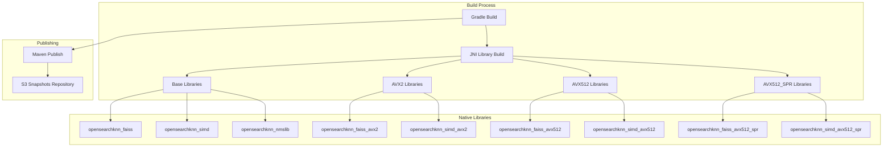

# k-NN Build Infrastructure

## Summary

The k-NN plugin build infrastructure manages the compilation and packaging of native libraries (FAISS, NMSLIB, SIMD) for vector search operations. It includes support for multiple CPU instruction sets (AVX2, AVX512, AVX512_SPR) and integrates with the OpenSearch CI/CD pipeline for snapshot publishing.

## Details

### Architecture



### Components

| Component | Description |
|-----------|-------------|
| `scripts/build.sh` | Main build script for compiling native libraries |
| `build.gradle` | Gradle configuration for plugin build and publishing |
| `build-tools/repositories.gradle` | Maven repository configuration |
| `plugin-security.policy` | Security permissions for native library loading |

### Native Libraries

| Library | Description | AVX Variants |
|---------|-------------|--------------|
| `opensearchknn_faiss` | FAISS vector search library | Base, AVX2, AVX512, AVX512_SPR |
| `opensearchknn_simd` | SIMD-optimized operations | Base, AVX2, AVX512, AVX512_SPR |
| `opensearchknn_nmslib` | NMSLIB vector search library | Base only |
| `opensearchknn_common` | Common utilities | Base only |

### Configuration

| Setting | Description | Default |
|---------|-------------|---------|
| `knn_libs` | Libraries to build | `opensearchknn_faiss,opensearchknn_simd` |
| `avx2.enabled` | Enable AVX2 build | `false` |
| `avx512.enabled` | Enable AVX512 build | `false` |
| `avx512_spr.enabled` | Enable AVX512 Sapphire Rapids build | `false` |
| `nproc.count` | Number of parallel build processes | `1` |

### Build Commands

```bash
# Build base libraries (no AVX optimization)
./gradlew :buildJniLib -Pknn_libs=opensearchknn_faiss,opensearchknn_simd \
    -Davx512.enabled=false -Davx512_spr.enabled=false -Davx2.enabled=false

# Build with AVX2 optimization
./gradlew :buildJniLib -Pknn_libs=opensearchknn_faiss,opensearchknn_simd \
    -Davx2.enabled=true -Davx512.enabled=false -Davx512_spr.enabled=false

# Build with AVX512 optimization
./gradlew :buildJniLib -Pknn_libs=opensearchknn_faiss,opensearchknn_simd \
    -Davx512.enabled=true -Davx512_spr.enabled=false

# Build with AVX512 Sapphire Rapids optimization
./gradlew :buildJniLib -Pknn_libs=opensearchknn_faiss,opensearchknn_simd \
    -Davx512_spr.enabled=true
```

### Maven Repository Configuration

The k-NN plugin uses the OpenSearch S3 repository for snapshot publishing:

```groovy
repositories {
    mavenLocal()
    maven { url "https://ci.opensearch.org/ci/dbc/snapshots/maven/" }
    mavenCentral()
    maven { url "https://plugins.gradle.org/m2/" }
}
```

### Security Permissions

The plugin requires runtime permissions to load native libraries:

```
permission java.lang.RuntimePermission "loadLibrary.opensearchknn_nmslib";
permission java.lang.RuntimePermission "loadLibrary.opensearchknn_faiss";
permission java.lang.RuntimePermission "loadLibrary.opensearchknn_common";
permission java.lang.RuntimePermission "loadLibrary.opensearchknn_simd";
permission java.lang.RuntimePermission "loadLibrary.opensearchknn_simd_avx2";
permission java.lang.RuntimePermission "loadLibrary.opensearchknn_simd_avx512";
permission java.lang.RuntimePermission "loadLibrary.opensearchknn_simd_avx512_spr";
permission java.lang.RuntimePermission "loadLibrary.opensearchknn_faiss_avx2";
permission java.lang.RuntimePermission "loadLibrary.opensearchknn_faiss_avx512";
permission java.lang.RuntimePermission "loadLibrary.opensearchknn_faiss_avx512_spr";
```

## Limitations

- SIMD and AVX optimizations are only available on x64 architectures
- AVX512 Sapphire Rapids requires compatible Intel processors
- NMSLIB does not have AVX-optimized variants
- S3 snapshot publishing requires AWS credentials (handled by CI/CD)

## Change History

- **v3.4.0** (2026-01-11): Added SIMD library to build configurations; migrated to S3 snapshots repository

## References

### Pull Requests
| Version | PR | Description | Related Issue |
|---------|-----|-------------|---------------|
| v3.4.0 | [#3025](https://github.com/opensearch-project/k-NN/pull/3025) | Include opensearchknn_simd in build configurations |   |
| v3.4.0 | [#2943](https://github.com/opensearch-project/k-NN/pull/2943) | Onboard to S3 snapshots |   |

### Issues (Design / RFC)
- [Issue #5360](https://github.com/opensearch-project/opensearch-build/issues/5360): Migration from Sonatype snapshots repo to ci.opensearch.org snapshots repo
