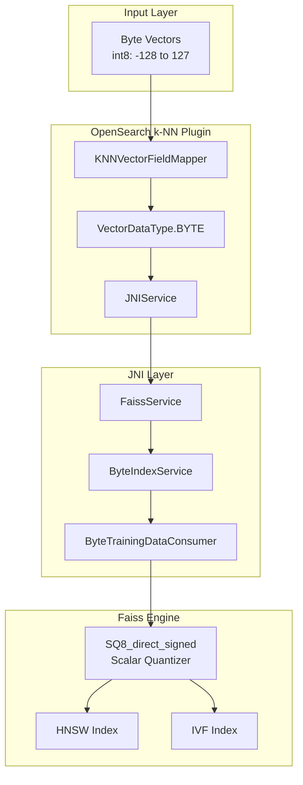
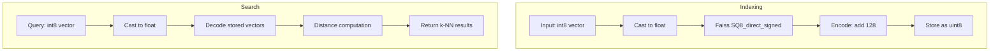

---
tags:
  - indexing
  - k-nn
  - search
---

# k-NN Byte Vector Support

## Summary

The k-NN byte vector support feature enables OpenSearch to index and search vectors using signed 8-bit integers (byte values ranging from -128 to 127) with the Faiss engine. This provides significant memory savings (up to 75%) compared to float vectors while maintaining high search quality, making it ideal for large-scale vector search applications where memory efficiency is critical.

## Details

### Architecture



### Data Flow



### Components

| Component | Description |
|-----------|-------------|
| `VectorDataType.BYTE` | Enum value for byte vector data type |
| `ByteIndexService` | Faiss index service handling byte vector operations |
| `ByteTrainingDataConsumer` | Consumes training data for IVF byte indexes |
| `BinaryTrainingDataConsumer` | Separated consumer for binary vectors |
| `OffHeapByteVectorTransfer` | Transfers byte vectors to native memory |
| `SQ8_direct_signed` | Faiss scalar quantizer for signed byte encoding |

### Configuration

| Setting | Description | Default | Supported Values |
|---------|-------------|---------|------------------|
| `data_type` | Vector data type for the field | `float` | `float`, `byte`, `binary` |
| `method.name` | Algorithm for k-NN search | - | `hnsw`, `ivf` |
| `method.engine` | Search engine | - | `faiss` (required for byte) |
| `method.space_type` | Distance metric | `l2` | `l2`, `innerproduct` |

### Supported Algorithms

| Algorithm | Training Required | Use Case |
|-----------|-------------------|----------|
| HNSW | No | General purpose, high recall |
| IVF | Yes | Large-scale datasets with clustering |

### Usage Example

#### Creating Index with HNSW

```json
PUT my-byte-index
{
  "settings": {
    "index": {
      "knn": true
    }
  },
  "mappings": {
    "properties": {
      "my_vector": {
        "type": "knn_vector",
        "dimension": 768,
        "data_type": "byte",
        "method": {
          "name": "hnsw",
          "space_type": "l2",
          "engine": "faiss",
          "parameters": {
            "ef_construction": 256,
            "m": 16
          }
        }
      }
    }
  }
}
```

#### Creating Index with IVF (Training Required)

```json
// Step 1: Create training index
PUT train-index
{
  "settings": { "index": { "knn": true } },
  "mappings": {
    "properties": {
      "train_field": {
        "type": "knn_vector",
        "dimension": 768,
        "data_type": "byte",
        "method": {
          "name": "hnsw",
          "engine": "faiss"
        }
      }
    }
  }
}

// Step 2: Ingest training data
// Step 3: Train model
POST /_plugins/_knn/models/{model_id}/_train
{
  "training_index": "train-index",
  "training_field": "train_field",
  "dimension": 768,
  "description": "IVF byte model",
  "method": {
    "name": "ivf",
    "engine": "faiss",
    "space_type": "l2",
    "parameters": {
      "nlist": 128,
      "nprobes": 8
    }
  }
}

// Step 4: Create index from model
PUT my-ivf-byte-index
{
  "settings": { "index": { "knn": true } },
  "mappings": {
    "properties": {
      "my_vector": {
        "type": "knn_vector",
        "model_id": "{model_id}"
      }
    }
  }
}
```

#### Indexing Documents

```json
PUT my-byte-index/_doc/1
{
  "my_vector": [-126, 28, 127, 0, 10, -45, 12, -110, ...]
}
```

#### Searching

```json
GET my-byte-index/_search
{
  "size": 10,
  "query": {
    "knn": {
      "my_vector": {
        "vector": [-1, 45, -100, 125, -128, -8, 5, 10, ...],
        "k": 10
      }
    }
  }
}
```

### Performance Benchmarks

Based on OpenSearch Benchmark tests:

| Metric | Float Vectors | Byte Vectors | Improvement |
|--------|---------------|--------------|-------------|
| Memory Usage | 100% | ~25-28% | 72-75% reduction |
| Indexing Throughput | Baseline | 13-107% higher | Significant gain |
| Search Latency | Baseline | Similar or better | Comparable |
| Recall@100 | Baseline | 1-9% lower | Minimal loss |

## Limitations

- Vector values must be within signed byte range [-128, 127]
- Encoders (SQ, PQ) cannot be combined with byte data type
- External quantization required before ingestion
- Some recall loss compared to float vectors
- SIMD optimization (AVX2/NEON) recommended for best performance
- Not supported with Lucene engine for Faiss-specific features

## Change History

- **v2.17.0** (2024-09-17): Initial implementation with HNSW and IVF support for Faiss byte vectors

## Related Features
- [Neural Search](../neural-search/agentic-search.md)
- [Search Relevance](../search-relevance/ci-tests.md)

## References

### Documentation
- [k-NN Vector Quantization Documentation](https://docs.opensearch.org/2.17/search-plugins/knn/knn-vector-quantization/)
- [k-NN Vector Field Type](https://docs.opensearch.org/2.17/field-types/supported-field-types/knn-vector/)
- [Faiss ScalarQuantizer Documentation](https://faiss.ai/cpp_api/struct/structfaiss_1_1ScalarQuantizer.html)

### Blog Posts
- [Blog: Introducing byte vector support for Faiss](https://opensearch.org/blog/faiss-byte-vector/)

### Pull Requests
| Version | PR | Description | Related Issue |
|---------|-----|-------------|---------------|
| v2.17.0 | [#1823](https://github.com/opensearch-project/k-NN/pull/1823) | Add HNSW support for Faiss byte vector | [#1659](https://github.com/opensearch-project/k-NN/issues/1659) |
| v2.17.0 | [#2002](https://github.com/opensearch-project/k-NN/pull/2002) | Add IVF support for Faiss byte vector | [#1659](https://github.com/opensearch-project/k-NN/issues/1659) |

### Issues (Design / RFC)
- [Issue #1659](https://github.com/opensearch-project/k-NN/issues/1659): Original feature request
