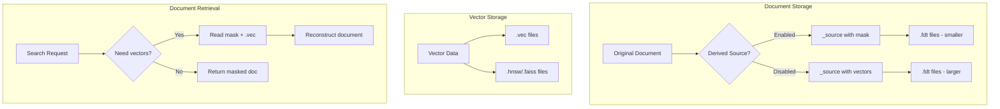
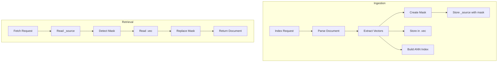
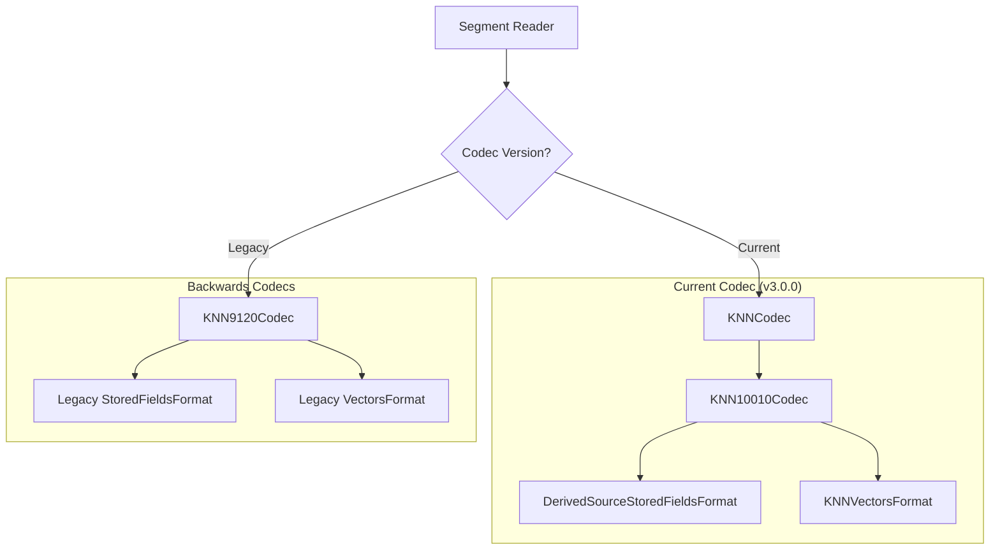
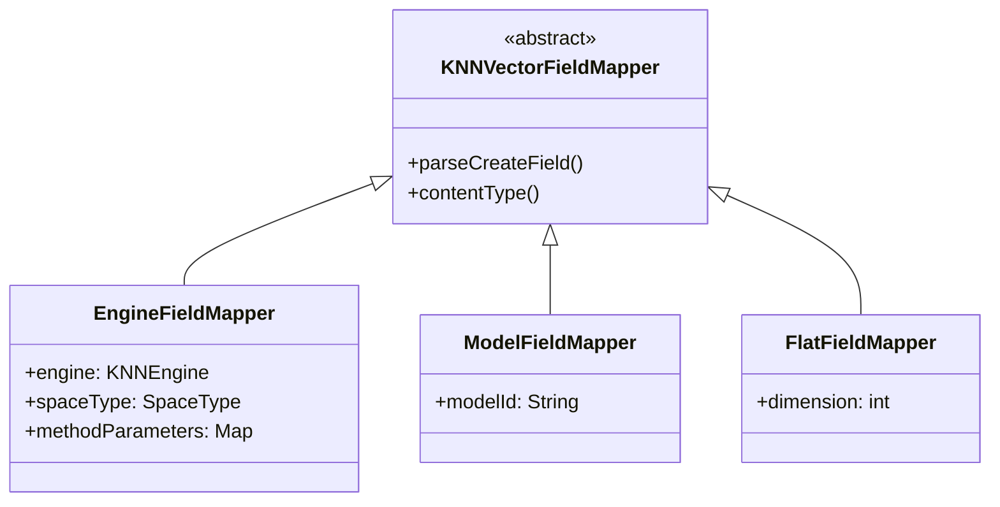

---
tags:
  - k-nn
---
# k-NN Derived Source & Codec Refactoring

## Summary

The k-NN plugin's derived source feature enables significant storage savings by avoiding duplicate storage of vector data in the `_source` field. Instead of storing vectors in both `_source` and the vector index files, derived source stores a compact mask in `_source` and reconstructs vectors on-demand from the FlatVectorsFormat files (.vec). This can reduce storage by up to 50% or more for vector-heavy workloads. The codec refactoring introduces a `backwards_codecs` package for managing legacy codecs and consolidates field mappers into a unified `EngineFieldMapper`.

## Details

### Architecture



### Data Flow



### Components

| Component | Description |
|-----------|-------------|
| `KNN10010DerivedSourceStoredFieldsFormat` | Custom StoredFieldsFormat that intercepts _source reads/writes |
| `EngineFieldMapper` | Unified field mapper for FAISS, Lucene, and NMSLIB engines |
| `ModelFieldMapper` | Field mapper for pre-trained model configurations |
| `FlatFieldMapper` | Field mapper for non-ANN vector indexing |
| `backwards_codecs` package | Contains read-only legacy codecs for backward compatibility |
| `KNN9120Codec` | Legacy codec for reading pre-3.0 segments |

### Configuration

| Setting | Description | Default |
|---------|-------------|---------|
| `index.knn.derived_source.enabled` | Enable derived source for vector fields | `false` |
| `index.knn.derived_source.translog.enabled` | Enable derived source in translog | `true` (when derived_source enabled) |

### Usage Example

```json
PUT my-knn-index
{
  "settings": {
    "index": {
      "knn": true,
      "knn.derived_source.enabled": true
    }
  },
  "mappings": {
    "properties": {
      "my_vector": {
        "type": "knn_vector",
        "dimension": 128,
        "method": {
          "name": "hnsw",
          "space_type": "l2",
          "engine": "faiss",
          "parameters": {
            "ef_construction": 256,
            "m": 16
          }
        }
      },
      "title": {
        "type": "text"
      }
    }
  }
}
```

### Storage Comparison

Based on experiments with 10K 128-dimensional vectors:

| Configuration | Total Size | _source Size | Savings |
|---------------|------------|--------------|---------|
| Default | 24.3 MB | 14.6 MB | - |
| ZSTD Compression | 18.3 MB | 8.64 MB | 25% |
| Derived Source | ~12 MB | ~0.5 MB | 50%+ |

### Codec Architecture



### Field Mapper Hierarchy



## Limitations

- Derived source requires all vector fields to support reconstruction from .vec files
- Operation-based recovery may be slower with derived source enabled
- Nested document handling requires segment-level migration during merges
- NMSLIB engine is blocked for new index creation in v3.0.0+
- Deprecated index-level settings (`ef_construction`, `m`, `space_type`) are removed

## Change History

- **v3.0.0** (2025-05-13): Initial implementation - derived source mask approach, codec refactoring, field mapper consolidation, NMSLIB deprecation, removal of deprecated settings


## References

### Documentation
- [Documentation: k-NN vector field type](https://docs.opensearch.org/3.0/field-types/supported-field-types/knn-vector/)
- [Documentation: Source field - Derived source](https://docs.opensearch.org/3.0/field-types/metadata-fields/source/#derived-source)
- [Documentation: Breaking changes](https://docs.opensearch.org/3.0/breaking-changes/)

### Blog Posts
- [Blog: Save up to 2x on storage with derived source](https://opensearch.org/blog/save-up-to-2x-on-storage-with-derived-source/)

### Pull Requests
| Version | PR | Description | Related Issue |
|---------|-----|-------------|---------------|
| v3.0.0 | [#2606](https://github.com/opensearch-project/k-NN/pull/2606) | Switch derived source from field attributes to segment attribute |   |
| v3.0.0 | [#2612](https://github.com/opensearch-project/k-NN/pull/2612) | Migrate derived source from filter to mask | [#2377](https://github.com/opensearch-project/k-NN/issues/2377) |
| v3.0.0 | [#2646](https://github.com/opensearch-project/k-NN/pull/2646) | Consolidate MethodFieldMapper and LuceneFieldMapper into EngineFieldMapper | [#2640](https://github.com/opensearch-project/k-NN/issues/2640) |
| v3.0.0 | [#2541](https://github.com/opensearch-project/k-NN/pull/2541) | Small Refactor Post Lucene 10.0.1 upgrade |   |
| v3.0.0 | [#2546](https://github.com/opensearch-project/k-NN/pull/2546) | Refactor codec to leverage backwards_codecs | [#2539](https://github.com/opensearch-project/k-NN/issues/2539) |
| v3.0.0 | [#2573](https://github.com/opensearch-project/k-NN/pull/2573) | Blocking Index Creation using NMSLIB |   |
| v3.0.0 | [#2575](https://github.com/opensearch-project/k-NN/pull/2575) | Improve Streaming Compatibility Issue for MethodComponentContext |   |
| v3.0.0 | [#2564](https://github.com/opensearch-project/k-NN/pull/2564) | 3.0.0 Breaking Changes For KNN |   |

### Issues (Design / RFC)
- [Issue #2377](https://github.com/opensearch-project/k-NN/issues/2377): RFC - Derived Source for Vectors
- [Issue #2539](https://github.com/opensearch-project/k-NN/issues/2539): Introduce backwards_codecs to manage older codecs
- [Issue #2631](https://github.com/opensearch-project/k-NN/issues/2631): Merge MethodFieldMapper and LuceneFieldMapper into EngineFieldMapper
- [Issue #2640](https://github.com/opensearch-project/k-NN/issues/2640): Remove doc values for lucene engine
