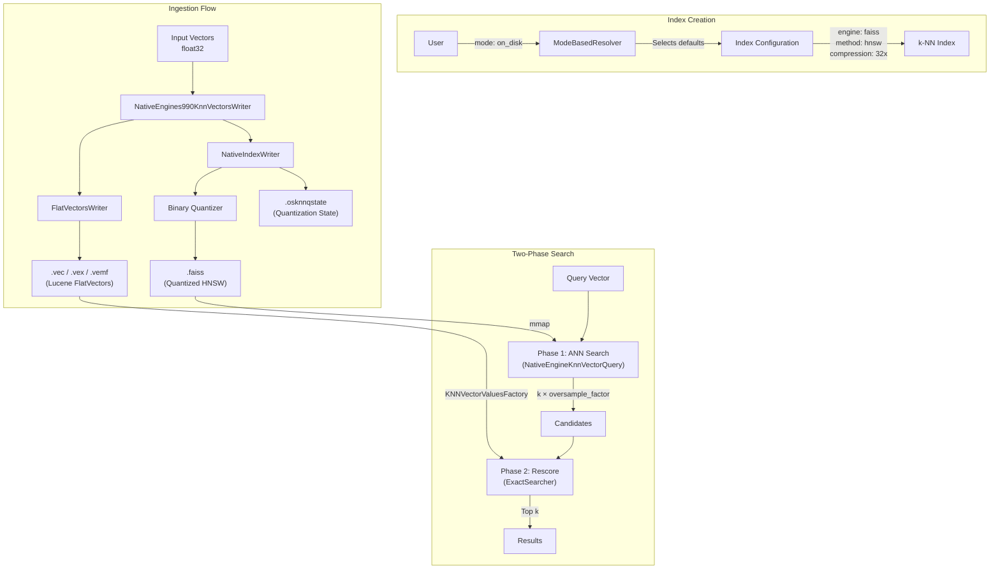
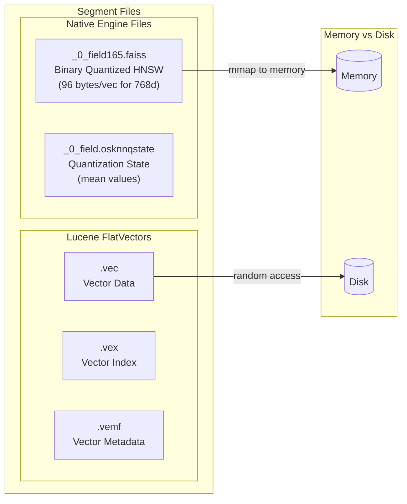
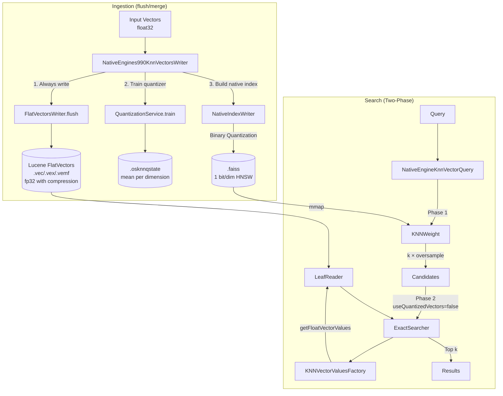
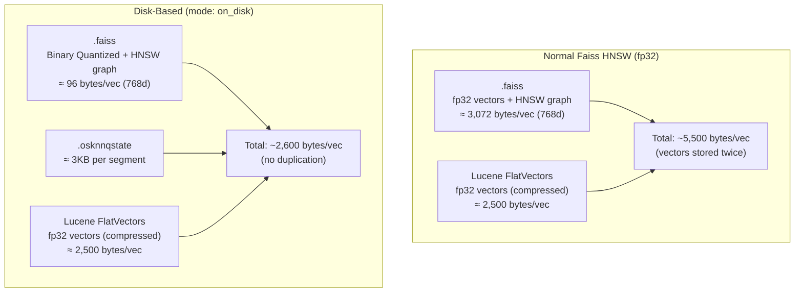

---
tags:
  - k-nn
---
# Disk-Based Vector Search

## Summary

Disk-based vector search is a k-NN feature that enables efficient vector search in low-memory environments by using binary quantization to compress vectors and storing full-precision vectors on disk. The feature uses a two-phase search approach: first searching a compressed in-memory index, then rescoring results using full-precision vectors loaded from disk. This provides significant memory savings (up to 32x compression) while maintaining high recall through automatic rescoring.

## Details

### Architecture



### File Structure



### Data Flow (Detailed)



### Storage Comparison: Normal vs Disk-Based

Disk-based mode can result in **smaller total disk usage** compared to normal fp32 HNSW. Here's why:



#### Why Disk-Based Uses Less Disk Space

| Aspect | Normal Faiss HNSW | Disk-Based |
|--------|-------------------|------------|
| `.faiss` file | fp32 vectors (3,072 B/vec) + HNSW | Binary Quantized (96 B/vec) + HNSW |
| Lucene FlatVectors | fp32 vectors (compressed) | fp32 vectors (compressed) |
| Vector duplication | **Yes** - stored in both `.faiss` and Lucene | **No** - fp32 only in Lucene |
| Compression on `.faiss` | ❌ None (mmap requires raw format) | ✅ 32x via Binary Quantization |
| Compression on Lucene | ✅ Codec-level compression | ✅ Codec-level compression |

**Key insight**: In normal mode, full-precision vectors are stored **twice** (in `.faiss` for HNSW traversal and in Lucene FlatVectors for exact scoring). In disk-based mode, `.faiss` only contains the compressed quantized vectors, eliminating this duplication.

#### Estimated Disk Usage (768 dimensions, 1M vectors)

| Mode | .faiss | Lucene FlatVectors | Total |
|------|--------|-------------------|-------|
| Normal fp32 HNSW | ~3.0 GB | ~2.5 GB | **~5.5 GB** |
| Disk-Based (32x) | ~0.1 GB | ~2.5 GB | **~2.6 GB** |

This represents approximately **50% disk savings** with disk-based mode.

### Components

| Component | Description |
|-----------|-------------|
| `ModeBasedResolver` | Resolves KNN method context based on Mode and CompressionLevel, selecting appropriate engine, method, and parameters |
| `Mode` | Enum defining workload modes: `ON_DISK`, `IN_MEMORY`, `NOT_CONFIGURED` |
| `CompressionLevel` | Enum defining compression levels with associated encoders and rescore contexts |
| `RescoreContext` | Contains oversample factor and manages rescoring behavior |
| `KNNVectorFieldMapper` | Extended to support mode and compression_level parameters |
| `KNNQueryBuilder` | Integrated with rescore context resolution for automatic rescoring |
| `NativeEngines990KnnVectorsWriter` | Writes both FlatVectors (Lucene) and Native index (.faiss) during flush/merge |
| `FlatVectorsWriter` | Lucene component that writes full-precision vectors to `.vec/.vex/.vemf` files |
| `NativeIndexWriter` | Builds and writes the quantized HNSW index to `.faiss` file |
| `NativeEngineKnnVectorQuery` | Orchestrates two-phase search with optional rescoring |
| `ExactSearcher` | Performs exact distance computation using full-precision vectors from Lucene |
| `KNNVectorValuesFactory` | Factory to retrieve vector values from Lucene's `LeafReader` |

### File Extensions

| Extension | Description | Storage | Compression |
|-----------|-------------|---------|-------------|
| `.faiss` | Native HNSW index (Faiss engine) | mmap to memory | Binary Quantization (32x) |
| `.osknnqstate` | Quantization state (mean values per dimension) | Disk | None |
| `.vec` | Lucene vector data | Disk | Codec-level |
| `.vex` | Lucene vector index | Disk | Codec-level |
| `.vemf` | Lucene vector metadata | Disk | Codec-level |

### Configuration

| Setting | Description | Default |
|---------|-------------|--------|
| `mode` | Workload mode for the vector field | Not configured |
| `compression_level` | Compression ratio (x1, x2, x4, x8, x16, x32) | `32x` for on_disk mode |
| `space_type` | Distance function (l2, innerproduct, cosine) | l2 |
| `rescore.oversample_factor` | Multiplier for candidate retrieval during search | Based on compression level |

#### Compression Level Details

| Level | Encoder | Memory Reduction | Default Oversample Factor |
|-------|---------|------------------|---------------------------|
| x1 | None | 1x | 1.0 |
| x2 | FP16 Scalar Quantization | 2x | 1.0 |
| x4 | Lucene SQ | 4x | 1.0 |
| x8 | QFrame bit encoder | 8x | 1.5 |
| x16 | QFrame bit encoder | 16x | 2.0 |
| x32 | Binary Quantization | 32x | 3.0 |

### Usage Example

#### Basic On-Disk Index

```json
PUT my-vector-index
{
  "settings": {
    "index": {
      "knn": true
    }
  },
  "mappings": {
    "properties": {
      "my_vector_field": {
        "type": "knn_vector",
        "dimension": 768,
        "space_type": "innerproduct",
        "mode": "on_disk"
      }
    }
  }
}
```

#### Fine-Tuned Configuration

```json
PUT my-vector-index
{
  "settings": {
    "index": {
      "knn": true
    }
  },
  "mappings": {
    "properties": {
      "my_vector_field": {
        "type": "knn_vector",
        "dimension": 768,
        "space_type": "innerproduct",
        "mode": "on_disk",
        "compression_level": "16x",
        "method": {
          "params": {
            "ef_construction": 512
          }
        }
      }
    }
  }
}
```

#### Search with Custom Rescore

```json
GET my-vector-index/_search
{
  "query": {
    "knn": {
      "my_vector_field": {
        "vector": [1.5, 2.5, 3.5, ...],
        "k": 10,
        "method_parameters": {
          "ef_search": 512
        },
        "rescore": {
          "oversample_factor": 10.0
        }
      }
    }
  }
}
```

### Binary Quantization Algorithm

The online binary quantization works as follows:

1. **Calculate mean per dimension**: For each dimension j, compute the mean across all vectors
2. **Quantize vectors**: For each dimension, if the value exceeds the mean, set to 1; otherwise set to 0
3. **Store as bits**: Pack 8 dimensions into 1 byte, achieving 32x compression for float32 vectors

This approach requires no pretraining and can begin ingestion immediately.

## Limitations

- Only works with `float` data type
- Radial search is not supported
- Performance varies by dataset (text embeddings generally perform better than image embeddings)
- Higher compression levels may require tuning oversample_factor for optimal recall
- Training support for mode/compression has limitations with the quantization framework

## Change History

- **v2.19.0**: Added method parameter override support for training-based indices
- **v2.18.0**: Bug fixes for segments without vector fields
- **v2.17.0**: Initial implementation with mode/compression parameters, binary quantization, and two-phase rescoring


## References

### Documentation
- [Documentation: Disk-based vector search](https://docs.opensearch.org/latest/search-plugins/knn/disk-based-vector-search/)
- [Documentation: k-NN vector quantization](https://docs.opensearch.org/latest/search-plugins/knn/knn-vector-quantization/)

### Blog Posts
- [Blog: Reduce costs with disk-based vector search](https://opensearch.org/blog/reduce-cost-with-disk-based-vector-search/)

### Pull Requests
| Version | PR | Description | Related Issue |
|---------|-----|-------------|---------------|
| v2.17.0 | [#2034](https://github.com/opensearch-project/k-NN/pull/2034) | Introduce mode and compression param resolution |   |
| v2.17.0 | [#1984](https://github.com/opensearch-project/k-NN/pull/1984) | k-NN query rescore support for native engines |   |
| v2.17.0 | [#2044](https://github.com/opensearch-project/k-NN/pull/2044) | Add spaceType as top level parameter | [#1949](https://github.com/opensearch-project/k-NN/issues/1949) |
| v2.17.0 | [#2200](https://github.com/opensearch-project/k-NN/pull/2200) | Add CompressionLevel calculation for PQ |   |
| v2.18.0 | [#2281](https://github.com/opensearch-project/k-NN/pull/2281) | Fix bug when segment has no vector field for disk-based search |   |
| v2.19.0 | [#2290](https://github.com/opensearch-project/k-NN/pull/2290) | Allow method parameter override for training based indices | [#2246](https://github.com/opensearch-project/k-NN/issues/2246) |

### Issues (Design / RFC)
- [RFC: Disk-based Mode Design (#1949)](https://github.com/opensearch-project/k-NN/issues/1949): Design document for mode parameter
- [RFC: Optimized Disk-Based Vector Search (#1779)](https://github.com/opensearch-project/k-NN/issues/1779): Original feature proposal with benchmarks
- [RFC: Two-phased Search Re-score Design (#1861)](https://github.com/opensearch-project/k-NN/issues/1861): Rescoring implementation design
