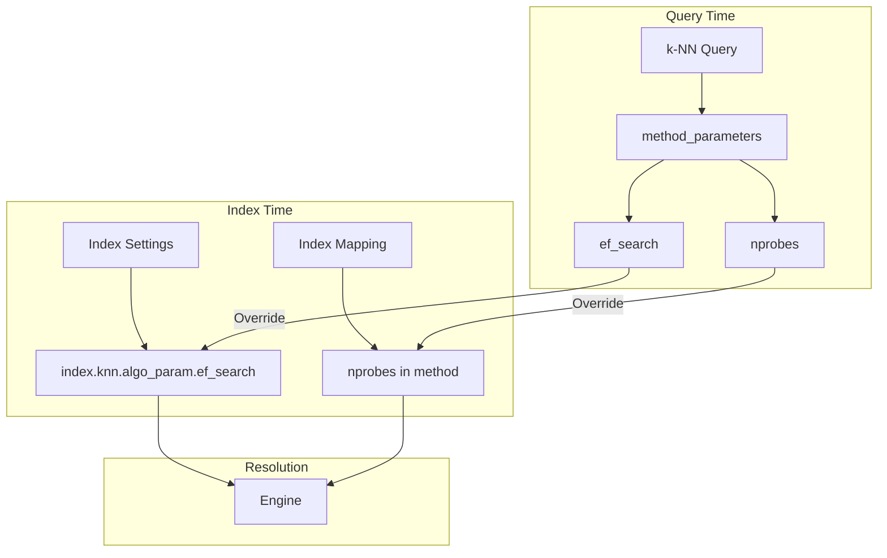

---
tags:
  - k-nn
---
# k-NN Dynamic Query Parameters

## Summary

Dynamic query parameters allow users to specify search algorithm parameters like `ef_search` and `nprobes` at query time rather than only at index creation. This enables per-query tuning of the accuracy vs. latency trade-off without modifying index settings.

## Details

### Architecture



### Parameters

| Parameter | Method | Description | Default |
|-----------|--------|-------------|---------|
| `ef_search` | HNSW | Number of vectors to examine for finding top k neighbors. Higher values improve recall at cost of latency. | Index setting or engine default |
| `nprobes` | IVF | Number of buckets to examine for finding top k neighbors. Higher values improve recall at cost of latency. | Value set at index creation |

### Engine Support Matrix

| Engine | ef_search | nprobes | Radial Query with ef_search |
|--------|-----------|---------|----------------------------|
| Lucene | ✓ | - | No |
| FAISS | ✓ | ✓ | Yes |
| NMSLIB | ✓ | - | No |

### Usage Examples

#### Basic k-NN Query with ef_search

```json
GET my-knn-index/_search
{
  "size": 10,
  "query": {
    "knn": {
      "my_vector": {
        "vector": [1.5, 2.5, 3.5],
        "k": 10,
        "method_parameters": {
          "ef_search": 200
        }
      }
    }
  }
}
```

#### IVF Query with nprobes

```json
GET my-ivf-index/_search
{
  "size": 10,
  "query": {
    "knn": {
      "my_vector": {
        "vector": [1.5, 2.5, 3.5],
        "k": 10,
        "method_parameters": {
          "nprobes": 10
        }
      }
    }
  }
}
```

#### Neural Search with method_parameters

```json
GET my-neural-index/_search
{
  "query": {
    "neural": {
      "passage_embedding": {
        "query_text": "example query",
        "model_id": "my-model-id",
        "k": 10,
        "method_parameters": {
          "ef_search": 150
        }
      }
    }
  }
}
```

### Engine-Specific Behavior

#### Lucene
- Uses `max(k, ef_search)` as the effective ef_search value
- If `ef_search > k`, use the `size` parameter to limit final results

#### FAISS
- Query-time `ef_search` overrides `index.knn.algo_param.ef_search`
- Query-time `nprobes` overrides the value set during index creation
- Supports radial search with `ef_search`

#### NMSLIB
- Query-time `ef_search` overrides `index.knn.algo_param.ef_search`
- Does not support radial search with `ef_search`

## Limitations

- `ef_search` only works with HNSW method
- `nprobes` only works with IVF method
- Radial search with `ef_search` is only supported on FAISS engine
- Values must be positive integers
- Higher values increase search latency

## Change History

- **v2.16.0** (2024-08-06): Initial implementation of dynamic query parameters (`ef_search`, `nprobes`) for k-NN and neural search queries

## References

### Documentation

- [Approximate k-NN search](https://docs.opensearch.org/latest/search-plugins/knn/approximate-knn/)
- [k-NN index](https://docs.opensearch.org/latest/search-plugins/knn/knn-index/)

### Pull Requests

| Version | PR | Description |
|---------|-----|-------------|
| v2.16.0 | [k-NN#1783](https://github.com/opensearch-project/k-NN/pull/1783) | Adds ef_search as query parameter for Lucene, FAISS, and NMSLIB |
| v2.16.0 | [k-NN#1790](https://github.com/opensearch-project/k-NN/pull/1790) | Support ef_search parameter in radial search FAISS engine |
| v2.16.0 | [k-NN#1792](https://github.com/opensearch-project/k-NN/pull/1792) | Adds nprobes as query parameter |
| v2.16.0 | [neural-search#814](https://github.com/opensearch-project/neural-search/pull/814) | Adds method_parameters in neural search query |

### Related Issues

- [k-NN#1537](https://github.com/opensearch-project/k-NN/issues/1537) - Feature request: Enable setting ef_search parameter as part of k-NN Query
