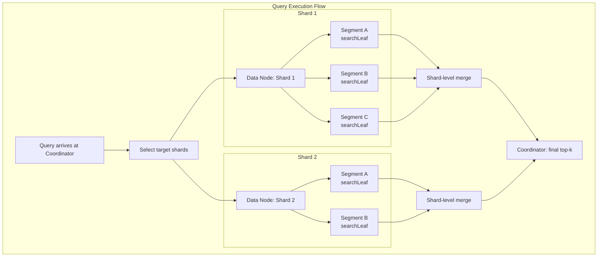
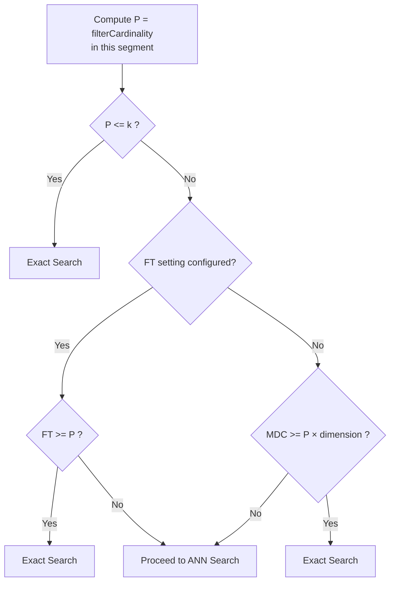
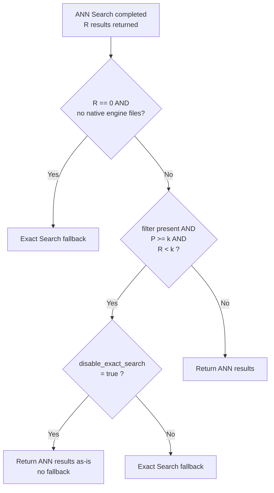

---
tags:
  - k-nn
---
# k-NN Efficient Filtering

## Summary

Efficient Filtering is a "filter-while-search" mechanism for k-NN vector search that applies filters during the ANN graph traversal rather than before (pre-filtering) or after (post-filtering). The algorithm intelligently decides at the segment level whether to perform ANN search with filter IDs or fall back to exact search, balancing recall and latency. Supported for Lucene (v2.4+), Faiss HNSW (v2.9+), and Faiss IVF (v2.10+).

## Details

### Processing Unit: Segment

All filtering decisions are made per Lucene segment, not per shard or per index. The `KNNWeight.searchLeaf(LeafReaderContext, int)` method is invoked independently for each segment within a shard. This means different segments in the same shard can use different search strategies (ANN vs Exact) depending on their local filter cardinality.

### Faiss Engine: Fallback Decision Logic

For each segment, `searchLeaf()` performs a two-phase decision:

#### Phase 1: Pre-ANN Decision (`isFilteredExactSearchPreferred`)

Evaluated only when a filter is present. If any condition is true, ANN search is skipped entirely and exact search runs immediately.

#### Phase 2: Post-ANN Decision (`isExactSearchRequire`)

After ANN search completes, the results are evaluated for a potential fallback.

### Decision Variables

| Variable | Description | Scope |
|----------|-------------|-------|
| N | Total documents in the segment | Segment |
| P | Documents matching the filter in the segment (filterCardinality) | Segment |
| k | Requested number of nearest neighbors | Query |
| R | Number of results returned by ANN search | Segment |
| FT | `knn.advanced.filtered_exact_search_threshold` index setting | Index |
| MDC | `MAX_DISTANCE_COMPUTATIONS` constant in `KNNConstants.java` | Hardcoded |
| dimension | Query vector dimensionality | Query |

### Lucene Engine: Filtering Behavior

Lucene uses its own `KnnVectorQuery` implementation (Apache Lucene), which also operates per segment:

- `P < k` → Exact search (pre-filtering)
- `P / N < threshold` → Exact search (Lucene internal threshold)
- Otherwise → HNSW graph traversal with filter applied during traversal

The Lucene engine does not use `KNNWeight.isFilteredExactSearchPreferred()` or `isExactSearchRequire()`. Its filtering logic is entirely within the Lucene library.

### Configuration

| Setting | Description | Default | Version |
|---------|-------------|---------|---------|
| `knn.advanced.filtered_exact_search_threshold` | Per-index threshold (FT). When set, if FT >= P, exact search is used instead of ANN. Overrides the MDC-based heuristic. | Not set (-1) | v2.9+ |
| `index.knn.faiss.efficient_filter.disable_exact_search` | Disables Phase 2 fallback (post-ANN exact search) for Faiss. Phase 1 decisions are unaffected. | `false` | v3.5.0+ |

### Behavioral Implications

- **Shard count matters**: More shards → fewer docs per segment → smaller P → more likely to trigger exact search → higher recall but potentially higher latency per query
- **force_merge effect**: Merging to 1 segment creates a large segment where P is larger relative to k, making ANN search more likely
- **High-dimensional vectors**: MDC comparison uses `P × dimension`, so higher dimensions make exact search less likely when FT is not set
- **Phase 2 only disabled by `disable_exact_search`**: The v3.5.0 setting only suppresses the post-ANN fallback. Phase 1 exact search (P <= k, FT threshold, MDC threshold) still applies regardless

## Limitations

- MDC (`MAX_DISTANCE_COMPUTATIONS`) is a hardcoded constant and cannot be tuned by users
- NMSLIB engine does not support efficient filtering (NMSLIB is deprecated as of v2.19.0)
- Lucene engine filtering thresholds are internal to the Lucene library and not configurable from OpenSearch
- The `disable_exact_search` setting only affects Faiss engine Phase 2 fallback

## Change History

- **v3.5.0** (2026-02-11): Added `index.knn.faiss.efficient_filter.disable_exact_search` setting to disable post-ANN exact search fallback (PR #3022, Issue #2936)
- **v3.1.0** (2025-07-15): Bug fix for nested vector query with efficient filter (PR #2641)
- **v2.10.0** (2024-03-12): Added efficient filtering support for Faiss IVF algorithm; performance improvements for restrictive filters (Issue #1049)
- **v2.9.0** (2023-07-25): Initial efficient filtering support for Faiss HNSW algorithm (Issue #903)
- **v2.4.0** (2022-11-15): Lucene engine efficient filtering via `KnnVectorQuery` (Lucene 9.4)

## References

### Documentation
- [Efficient k-NN Filtering](https://docs.opensearch.org/latest/vector-search/filter-search-knn/efficient-knn-filtering/): Official documentation
- [k-NN Search with Filters](https://docs.opensearch.org/latest/vector-search/filter-search-knn/): Filtering overview

### Blog Posts
- [Efficient filtering in OpenSearch vector engine](https://opensearch.org/blog/efficient-filters-in-knn/): Technical deep-dive with benchmarks

### Source Code
- `KNNWeight.java`: `searchLeaf()`, `isFilteredExactSearchPreferred()`, `isExactSearchRequire()`, `isFilteredExactSearchRequireAfterANNSearch()`
- `KNNConstants.java`: `MAX_DISTANCE_COMPUTATIONS`
- `ExactSearcher.java`: Exact search implementation
- `KNNSettings.java`: `ADVANCED_FILTERED_EXACT_SEARCH_THRESHOLD`, `INDEX_KNN_FAISS_EFFICIENT_FILTER_DISABLE_EXACT_SEARCH`

### Pull Requests
| Version | PR | Description | Related Issue |
|---------|-----|-------------|---------------|
| v3.5.0 | [#3022](https://github.com/opensearch-project/k-NN/pull/3022) | Index setting to disable exact search after ANN with Faiss efficient filters | [#2936](https://github.com/opensearch-project/k-NN/issues/2936) |
| v3.1.0 | [#2641](https://github.com/opensearch-project/k-NN/pull/2641) | Fix nested vector query with efficient filter | |

### Issues (Design / RFC)
- [Issue #903](https://github.com/opensearch-project/k-NN/issues/903): Efficient filtering meta issue
- [Issue #1049](https://github.com/opensearch-project/k-NN/issues/1049): Filters enhancement for restrictive filters
- [Issue #2936](https://github.com/opensearch-project/k-NN/issues/2936): Disable exact search fallback setting
