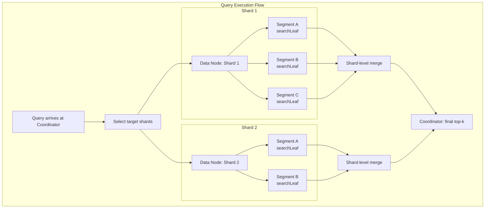
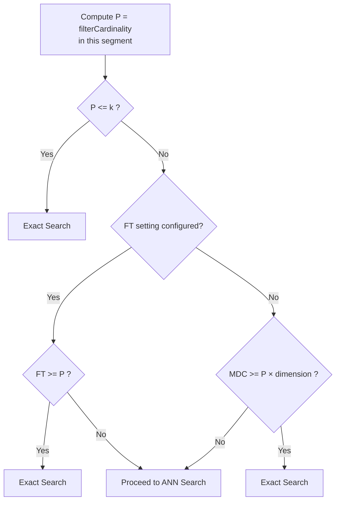
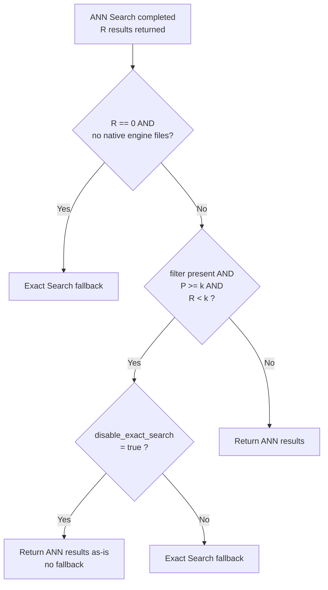

---
tags:
  - k-nn
---
# k-NN Efficient Filtering

## Summary

Efficient Filtering is a "filter-while-search" mechanism for k-NN vector search that applies filters during the ANN graph traversal rather than before (pre-filtering) or after (post-filtering). The algorithm intelligently decides at the segment level whether to perform ANN search with filter IDs or fall back to exact search, balancing recall and latency. Supported for Lucene (v2.4+), Faiss HNSW (v2.9+), and Faiss IVF (v2.10+).

## Details

### Processing Unit: Segment

All filtering decisions are made per Lucene segment, not per shard or per index. The `KNNWeight.searchLeaf(LeafReaderContext, int)` method is invoked independently for each segment within a shard. This means different segments in the same shard can use different search strategies (ANN vs Exact) depending on their local filter cardinality.



### Faiss Engine: Fallback Decision Logic

For each segment, `searchLeaf()` performs a two-phase decision:

#### Phase 1: Pre-ANN Decision (`isFilteredExactSearchPreferred`)

Evaluated only when a filter is present. If any condition is true, ANN search is skipped entirely and exact search runs immediately.



#### Phase 2: Post-ANN Decision (`isExactSearchRequire`)

After ANN search completes, the results are evaluated for a potential fallback.



### Decision Variables

| Variable | Description | Scope |
|----------|-------------|-------|
| N | Total documents in the segment | Segment |
| P | Documents matching the filter in the segment (filterCardinality) | Segment |
| k | Requested number of nearest neighbors | Query |
| R | Number of results returned by ANN search | Segment |
| FT | `knn.advanced.filtered_exact_search_threshold` index setting | Index |
| MDC | `MAX_DISTANCE_COMPUTATIONS` constant in `KNNConstants.java` | Hardcoded |
| dimension | Query vector dimensionality | Query |

### Lucene Engine: Filtering Behavior

Lucene uses its own `KnnVectorQuery` implementation (Apache Lucene), which also operates per segment:

- `P < k` → Exact search (pre-filtering)
- `P / N < threshold` → Exact search (Lucene internal threshold)
- Otherwise → HNSW graph traversal with filter applied during traversal

The Lucene engine does not use `KNNWeight.isFilteredExactSearchPreferred()` or `isExactSearchRequire()`. Its filtering logic is entirely within the Lucene library.

### Configuration

| Setting | Description | Default | Version |
|---------|-------------|---------|---------|
| `knn.advanced.filtered_exact_search_threshold` | Per-index threshold (FT). When set, if FT >= P, exact search is used instead of ANN. Overrides the MDC-based heuristic. | Not set (-1) | v2.9+ |
| `index.knn.faiss.efficient_filter.disable_exact_search` | Disables Phase 2 fallback (post-ANN exact search) for Faiss. Phase 1 decisions are unaffected. | `false` | v3.5.0+ |

### Behavioral Implications

- **Shard count matters**: More shards → fewer docs per segment → smaller P → more likely to trigger exact search → higher recall but potentially higher latency per query
- **force_merge effect**: Merging to 1 segment creates a large segment where P is larger relative to k, making ANN search more likely
- **High-dimensional vectors**: MDC comparison uses `P × dimension`, so higher dimensions make exact search less likely when FT is not set
- **Phase 2 only disabled by `disable_exact_search`**: The v3.5.0 setting only suppresses the post-ANN fallback. Phase 1 exact search (P <= k, FT threshold, MDC threshold) still applies regardless

### MDC Threshold Examples

`MAX_DISTANCE_COMPUTATIONS` (MDC) = 2,048,000 is hardcoded. Phase 1 uses `P × dimension` as the estimated distance computation cost. The following table shows the maximum P (filter cardinality per segment) that triggers exact search for common dimensions:

| Dimension | Max P for Exact Search | Typical Use Case |
|-----------|----------------------|------------------|
| 128 | 16,000 | Lightweight embeddings |
| 384 | 5,333 | MiniLM, small sentence transformers |
| 768 | 2,666 | BERT-base, most sentence transformers |
| 1024 | 2,000 | Large language model embeddings |
| 1536 | 1,333 | OpenAI text-embedding-ada-002 |

When FT (`filtered_exact_search_threshold`) is explicitly set, it overrides this MDC-based calculation and compares directly against P.

### Scenario-Based Analysis

The following scenarios illustrate how the filtering decision logic behaves under different conditions. All scenarios assume Faiss HNSW engine with default settings unless noted.

#### Scenario 1: Highly Restrictive Filter — Phase 1 Exact Search

```
Index: 1M docs, 1 shard, 1 segment (force_merge), dimension=768
Filter: category = "rare_item" → P = 500
Query: k = 10
```

Decision flow:
1. P (500) <= k (10)? → No
2. FT set? → No (default -1)
3. MDC (2,048,000) >= P × dim (500 × 768 = 384,000)? → Yes → **Exact Search**

Result: Phase 1 triggers exact search. 500 distance computations — completes in sub-millisecond. This is the ideal case: small P, fast exact search, perfect recall.

#### Scenario 2: Moderate Filter on Large Segment — ANN Search

```
Index: 10M docs, 1 shard, 1 segment (force_merge), dimension=768
Filter: status = "active" → P = 5M (50%)
Query: k = 10
```

Decision flow:
1. P (5M) <= k (10)? → No
2. FT set? → No
3. MDC (2,048,000) >= P × dim (5M × 768 = 3.84B)? → No → **ANN Search**

ANN search runs with filter IDs passed to HNSW traversal. With 50% filter match rate, most graph neighbors pass the filter, so ANN easily finds k=10 results. No Phase 2 fallback.

#### Scenario 3: Phase 2 Fallback — The Latency Spike Case

```
Index: 5M docs, 1 shard, 1 segment (force_merge), dimension=768
Filter: tag = "niche_topic" → P = 100,000 (2%)
Query: k = 10, ef_search = 100
```

Decision flow:
1. P (100K) <= k (10)? → No
2. FT set? → No
3. MDC (2,048,000) >= P × dim (100K × 768 = 76.8M)? → No → **ANN Search**

ANN search runs, but with only 2% filter match rate, HNSW traversal visits 100 nodes (ef_search=100) and on average only ~2 match the filter. Result: R = 7 (< k = 10).

Phase 2 check:
- R (7) == 0 AND no native files? → No
- Filter present AND P (100K) >= k (10) AND R (7) < k (10)? → **Yes → Exact Search fallback**

Exact search scans all 100,000 matching documents × 768 dimensions. This is the worst case: ANN was attempted but wasted time, then a full exact scan runs on a large candidate set. Latency can reach seconds.

Mitigation options:
- Increase `ef_search` (e.g., 512) to improve ANN's chance of finding k results
- Set `disable_exact_search: true` to accept R=7 results without fallback
- Set `filtered_exact_search_threshold: 100000` to force Phase 1 exact search (avoids wasted ANN attempt)

#### Scenario 4: Multi-Shard with Mixed Behavior

```
Index: 10M docs, 10 shards, ~3 segments per shard, dimension=768
Filter: region = "jp" → ~5% match rate
Query: k = 10
```

Each segment has ~333K docs, with ~16,650 filter matches (P ≈ 16,650).

Per-segment decision:
1. P (16,650) <= k (10)? → No
2. FT set? → No
3. MDC (2,048,000) >= P × dim (16,650 × 768 = 12.8M)? → No → **ANN Search**

ANN runs on each segment. With 5% match rate and ef_search=100, some segments may return R < 10 (Phase 2 fallback), while others return R >= 10 (no fallback). The overall query latency is determined by the slowest segment.

If 3 out of 30 segments trigger Phase 2 fallback with P ≈ 16,650 each, those segments add ~tens of milliseconds each. Total impact is moderate because per-segment P is small.

Compare with force_merge (1 segment per shard): P ≈ 50,000 per segment. Phase 2 fallback on a single segment would scan 50K docs — more expensive per fallback but fewer segments to process.

#### Scenario 5: disable_exact_search Tradeoff

```
Same as Scenario 3, but with:
  index.knn.faiss.efficient_filter.disable_exact_search: true
```

Phase 1: Same as Scenario 3 → ANN Search.
ANN returns R = 7.

Phase 2 check:
- P (100K) >= k (10) AND R (7) < k (10)? → Yes, but `disable_exact_search = true` → **No fallback**

Result: Returns 7 results instead of 10. Latency is stable (ANN only). Recall is imperfect but acceptable for many use cases (semantic search, recommendations).

Note: Phase 1 decisions are unaffected. If P were <= k (e.g., P = 8), exact search would still run regardless of this setting.

#### Scenario 6: New Segment Without Graph — Phase 2 Safety Net

```
Index: actively ingesting, new segment just flushed
New segment: 5,000 docs, no HNSW graph built yet (native engine files missing)
Filter: none
Query: k = 10
```

Phase 1: No filter → skipped entirely.
ANN search: No native engine files → returns R = 0.

Phase 2 check:
- R (0) == 0 AND no native engine files? → **Yes → Exact Search fallback**

This is a safety mechanism ensuring queries still return results from segments that haven't built their graph index yet (e.g., during active ingestion before merge/flush completes the graph build).

### Exact Search Cost Model

When exact search is triggered (either Phase 1 or Phase 2), `ExactSearcher.searchLeaf()` executes:

- If P <= k: `scoreAllDocs()` — scores every matched document, returns all results sorted by score. No heap overhead.
- If P > k: `searchTopK()` — uses a min-heap of size k. Each of the P documents is scored and compared against the heap minimum. Batched via `VectorScorer.bulk()`.

In both cases, the dominant cost is **P × distance_computation**. The distance computation cost depends on the vector data type and dimension:

| Vector Type | Cost per Distance Computation | Notes |
|-------------|------------------------------|-------|
| float32 | O(dimension) FP multiply-add | SIMD-accelerated (AVX2/AVX512/NEON) |
| byte (int8) | O(dimension) integer ops | Lower cost per operation |
| binary | O(dimension/8) bitwise ops | Significantly cheaper |
| Quantized (ADC) | O(dimension) with lookup table | Pre-computed sub-quantizer distances |

## Limitations

- MDC (`MAX_DISTANCE_COMPUTATIONS`) is a hardcoded constant and cannot be tuned by users
- NMSLIB engine does not support efficient filtering (NMSLIB is deprecated as of v2.19.0)
- Lucene engine filtering thresholds are internal to the Lucene library and not configurable from OpenSearch
- The `disable_exact_search` setting only affects Faiss engine Phase 2 fallback

## Change History

- **v3.5.0** (2026-02-11): Added `index.knn.faiss.efficient_filter.disable_exact_search` setting to disable post-ANN exact search fallback (PR #3022, Issue #2936)
- **v3.1.0** (2025-07-15): Bug fix for nested vector query with efficient filter (PR #2641)
- **v2.10.0** (2024-03-12): Added efficient filtering support for Faiss IVF algorithm; performance improvements for restrictive filters (Issue #1049)
- **v2.9.0** (2023-07-25): Initial efficient filtering support for Faiss HNSW algorithm (Issue #903)
- **v2.4.0** (2022-11-15): Lucene engine efficient filtering via `KnnVectorQuery` (Lucene 9.4)

## References

### Documentation
- [Efficient k-NN Filtering](https://docs.opensearch.org/latest/vector-search/filter-search-knn/efficient-knn-filtering/): Official documentation
- [k-NN Search with Filters](https://docs.opensearch.org/latest/vector-search/filter-search-knn/): Filtering overview

### Blog Posts
- [Efficient filtering in OpenSearch vector engine](https://opensearch.org/blog/efficient-filters-in-knn/): Technical deep-dive with benchmarks

### Source Code
- `KNNWeight.java`: `searchLeaf()`, `isFilteredExactSearchPreferred()`, `isExactSearchRequire()`, `isFilteredExactSearchRequireAfterANNSearch()`
- `KNNConstants.java`: `MAX_DISTANCE_COMPUTATIONS`
- `ExactSearcher.java`: Exact search implementation
- `KNNSettings.java`: `ADVANCED_FILTERED_EXACT_SEARCH_THRESHOLD`, `INDEX_KNN_FAISS_EFFICIENT_FILTER_DISABLE_EXACT_SEARCH`

### Pull Requests
| Version | PR | Description | Related Issue |
|---------|-----|-------------|---------------|
| v3.5.0 | [#3022](https://github.com/opensearch-project/k-NN/pull/3022) | Index setting to disable exact search after ANN with Faiss efficient filters | [#2936](https://github.com/opensearch-project/k-NN/issues/2936) |
| v3.1.0 | [#2641](https://github.com/opensearch-project/k-NN/pull/2641) | Fix nested vector query with efficient filter | |

### Issues (Design / RFC)
- [Issue #903](https://github.com/opensearch-project/k-NN/issues/903): Efficient filtering meta issue
- [Issue #1049](https://github.com/opensearch-project/k-NN/issues/1049): Filters enhancement for restrictive filters
- [Issue #2936](https://github.com/opensearch-project/k-NN/issues/2936): Disable exact search fallback setting
