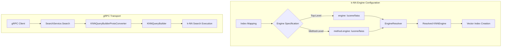
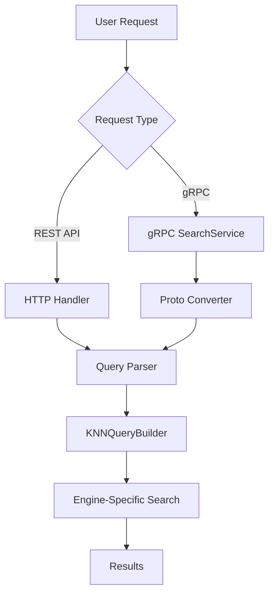

# k-NN Engine Enhancements

## Summary

The k-NN plugin provides flexible engine configuration options for vector search workloads. Users can specify the k-NN engine (Lucene, FAISS, or NMSLIB) at either the top level of the field mapping or within the method definition. Additionally, the plugin supports gRPC transport for high-performance k-NN queries using Protocol Buffers.

## Details

### Architecture



### Data Flow



### Components

| Component | Description |
|-----------|-------------|
| `EngineResolver` | Resolves the k-NN engine from top-level and method-level configurations |
| `KNNEngine` | Enum representing supported engines: LUCENE, FAISS, NMSLIB (deprecated), UNDEFINED |
| `KNNVectorFieldMapper` | Field mapper that processes engine configuration during index creation |
| `KNNQueryBuilderProtoConverter` | Converts Protocol Buffer k-NN queries to OpenSearch query builders |
| `QueryBuilderProtoConverterRegistry` | SPI registry for extensible query conversion |

### Configuration

| Setting | Description | Default |
|---------|-------------|---------|
| `engine` (top-level) | k-NN engine at field mapping level | `undefined` (resolved based on context) |
| `method.engine` | k-NN engine within method definition | `undefined` |
| `compression_level` | Vector compression level (affects engine selection) | `1x` |
| `mode` | Vector workload mode (`in_memory` or `on_disk`) | `in_memory` |

### Engine Resolution Rules

The `EngineResolver` applies the following logic:

1. **User-configured engine takes precedence**: If specified at top-level or method-level
2. **Conflict detection**: If both are specified with different values, throws error
3. **Training requirement**: Training operations require FAISS engine
4. **Compression constraint**: 4x compression requires Lucene engine
5. **Default fallback**: FAISS is the default engine when not specified

### Usage Example

**Top-level engine configuration:**
```json
PUT my-index
{
  "settings": {
    "index": {
      "knn": true
    }
  },
  "mappings": {
    "properties": {
      "my_vector": {
        "type": "knn_vector",
        "dimension": 128,
        "engine": "lucene",
        "space_type": "cosinesimil"
      }
    }
  }
}
```

**Method-level engine configuration:**
```json
PUT my-index
{
  "settings": {
    "index": {
      "knn": true
    }
  },
  "mappings": {
    "properties": {
      "my_vector": {
        "type": "knn_vector",
        "dimension": 128,
        "method": {
          "name": "hnsw",
          "engine": "faiss",
          "space_type": "l2",
          "parameters": {
            "ef_construction": 128,
            "m": 16
          }
        }
      }
    }
  }
}
```

**gRPC k-NN query:**
```json
{
  "index": "my-index",
  "request_body": {
    "query": {
      "knn": {
        "my_vector": {
          "vector": [0.1, 0.2, 0.3, ...],
          "k": 10,
          "filter": {
            "term": { "category": "electronics" }
          }
        }
      }
    },
    "size": 10
  }
}
```

## Limitations

- NMSLIB engine is deprecated since v2.19.0 and will be removed in v3.0.0
- Top-level engine parameter requires OpenSearch v3.2.0+
- gRPC k-NN queries are experimental
- 4x compression only supports Lucene engine
- Training operations only support FAISS engine
- Conflicting engine specifications (top-level vs method-level) cause mapping errors

## Change History

- **v3.3.0** (2026-01-11): Added top-level engine parameter and gRPC transport support for k-NN queries

## References

### Documentation
- [k-NN Vector Documentation](https://docs.opensearch.org/3.0/field-types/supported-field-types/knn-vector/): Official k-NN vector field documentation
- [Methods and Engines](https://docs.opensearch.org/3.0/field-types/supported-field-types/knn-methods-engines/): k-NN methods and engines reference
- [gRPC Search API](https://docs.opensearch.org/3.0/api-reference/grpc-apis/search/): gRPC Search API documentation
- [gRPC APIs Overview](https://docs.opensearch.org/3.0/api-reference/grpc-apis/index/): gRPC APIs overview

### Pull Requests
| Version | PR | Description | Related Issue |
|---------|-----|-------------|---------------|
| v3.3.0 | [#2736](https://github.com/opensearch-project/k-NN/pull/2736) | Added engine as a top-level optional parameter | [#2534](https://github.com/opensearch-project/k-NN/issues/2534) |
| v3.3.0 | [#2833](https://github.com/opensearch-project/k-NN/pull/2833) | Migrate k-NN plugin to use GRPC transport-grpc SPI interface |   |

### Issues (Design / RFC)
- [Issue #2534](https://github.com/opensearch-project/k-NN/issues/2534): Make engine top level field mapping parameter
- [Issue #2816](https://github.com/opensearch-project/k-NN/issues/2816): Add GRPC support for k-NN queries
