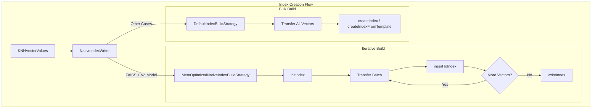
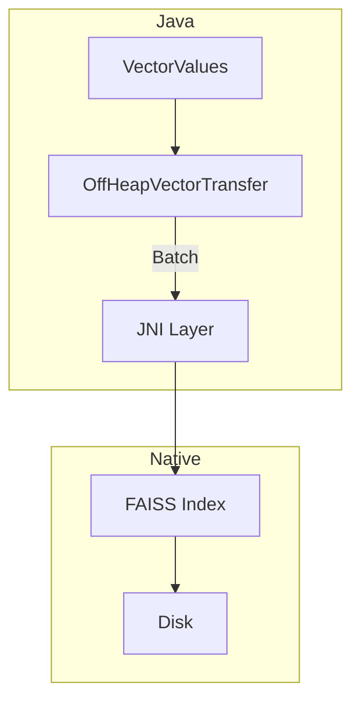
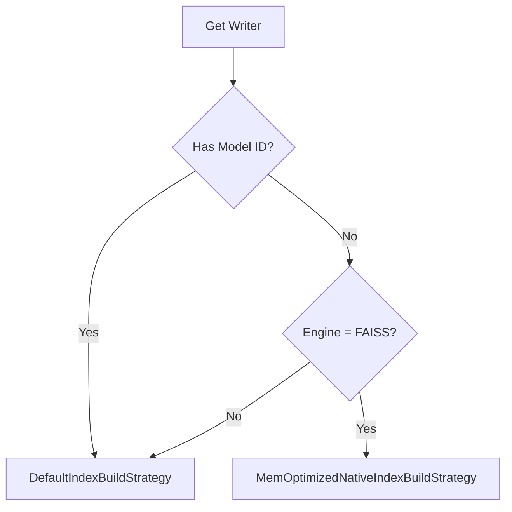

# k-NN Iterative Graph Build

## Summary

The k-NN Iterative Graph Build feature enables memory-optimized index construction for FAISS-based k-NN indexes in OpenSearch. Instead of loading all vectors into memory before building the graph, vectors are transferred and indexed in batches, significantly reducing peak memory consumption during indexing operations. This is particularly beneficial for large-scale vector datasets where memory constraints are a concern.

## Details

### Architecture



### Data Flow



### Components

| Component | Description |
|-----------|-------------|
| `NativeIndexBuildStrategy` | Interface defining the contract for index building strategies |
| `MemOptimizedNativeIndexBuildStrategy` | Implements iterative graph build for FAISS, transferring vectors in batches |
| `DefaultIndexBuildStrategy` | Traditional bulk build strategy, transfers all vectors before building |
| `NativeIndexWriter` | Orchestrates index creation, selects appropriate strategy based on engine and configuration |
| `OffHeapVectorTransfer` | Abstract class managing vector transfer to off-heap memory with configurable batch sizes |
| `OffHeapFloatVectorTransfer` | Transfers float vectors to off-heap memory |
| `OffHeapByteVectorTransfer` | Transfers byte vectors to off-heap memory |
| `BuildIndexParams` | Value object containing all parameters needed for index construction |

### Configuration

| Setting | Description | Default |
|---------|-------------|---------|
| `knn.memory.circuit_breaker.limit` | Controls the streaming memory limit for vector transfers | 50% of available memory |

The batch size for vector transfers is calculated as:
```
transferLimit = max(1, streamingMemoryLimit / bytesPerVector)
```

### JNI Layer Changes

The JNI layer was refactored to support three-phase index creation:

| Method | Signature | Description |
|--------|-----------|-------------|
| `initIndex` | `(numDocs, dim, parameters) → indexAddress` | Initialize index structure in memory |
| `insertToIndex` | `(ids, vectorAddress, dim, indexAddress, threadCount)` | Add vectors to existing index |
| `writeIndex` | `(indexPath, indexAddress)` | Persist index to disk |

### Usage Example

The iterative build is automatically enabled for FAISS indexes. No configuration changes are required:

```json
PUT /my-vector-index
{
  "settings": {
    "index": {
      "knn": true
    }
  },
  "mappings": {
    "properties": {
      "embedding": {
        "type": "knn_vector",
        "dimension": 768,
        "method": {
          "name": "hnsw",
          "engine": "faiss",
          "parameters": {
            "ef_construction": 128,
            "m": 16
          }
        }
      }
    }
  }
}
```

### Strategy Selection Logic



## Limitations

- Only available for FAISS engine (nmslib and Lucene use default strategy)
- Model-based indexes (using `model_id`) use the traditional bulk build approach
- Binary vector indexes currently use the default build strategy
- The `append` parameter in vector transfer must be managed carefully to avoid memory issues

## Change History

- **v2.17.0** (2024-09-17): Initial implementation of iterative graph build for FAISS indexes

## References

### Documentation
- [k-NN Index Documentation](https://docs.opensearch.org/2.17/search-plugins/knn/knn-index/): Official k-NN index documentation
- [FAISS Documentation](https://github.com/facebookresearch/faiss/wiki): FAISS library documentation

### Pull Requests
| Version | PR | Description |
|---------|-----|-------------|
| v2.17.0 | [#1950](https://github.com/opensearch-project/k-NN/pull/1950) | Integrates FAISS iterative builds with NativeEngines990KnnVectorsFormat |

### Issues (Design / RFC)
- [Issue #1853](https://github.com/opensearch-project/k-NN/issues/1853): RFC - Integrating KNNVectorsFormat in Native Vector Search Engine
- [Issue #1087](https://github.com/opensearch-project/k-NN/issues/1087): Original investigation on KNNVectorsFormat migration
